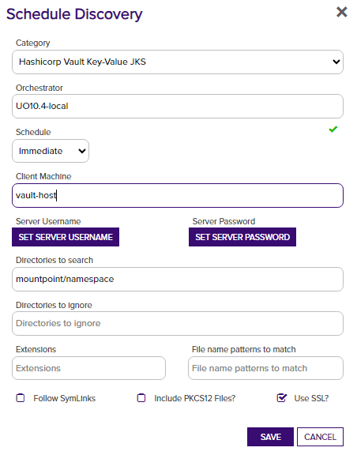
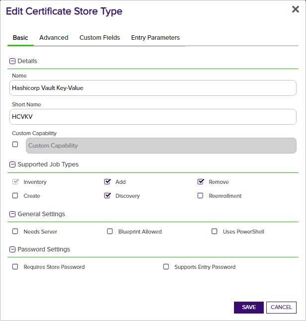
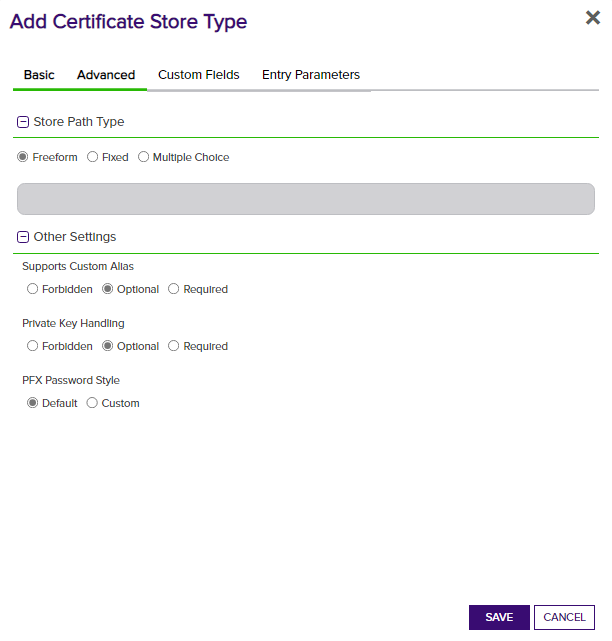
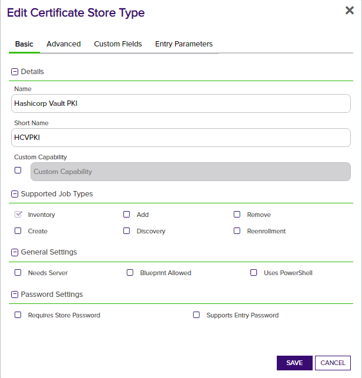

# Orchestrator Extension for Hashicorp Vault

The Hashicorp Vault Orchestrator extension allows you to manage certificates in Hashicorp Vault KeyValue secrets engine and perform inventory on certificates stored in the PKI or Keyfactor secrets engines.

#### Integration status: Production - Ready for use in production environments.

## About the Keyfactor Universal Orchestrator Extension

This repository contains a Universal Orchestrator Extension which is a plugin to the Keyfactor Universal Orchestrator. Within the Keyfactor Platform, Orchestrators are used to manage “certificate stores” &mdash; collections of certificates and roots of trust that are found within and used by various applications.

The Universal Orchestrator is part of the Keyfactor software distribution and is available via the Keyfactor customer portal. For general instructions on installing Extensions, see the “Keyfactor Command Orchestrator Installation and Configuration Guide” section of the Keyfactor documentation. For configuration details of this specific Extension see below in this readme.

The Universal Orchestrator is the successor to the Windows Orchestrator. This Orchestrator Extension plugin only works with the Universal Orchestrator and does not work with the Windows Orchestrator.

## Support for Orchestrator Extension for Hashicorp Vault

Orchestrator Extension for Hashicorp Vault is supported by Keyfactor for Keyfactor customers. If you have a support issue, please open a support ticket with your Keyfactor representative.

###### To report a problem or suggest a new feature, use the **[Issues](../../issues)** tab. If you want to contribute actual bug fixes or proposed enhancements, use the **[Pull requests](../../pulls)** tab.

---

## Keyfactor Version Supported

The minimum version of the Keyfactor Universal Orchestrator Framework needed to run this version of the extension is 10.1

## Platform Specific Notes

The Keyfactor Universal Orchestrator may be installed on either Windows or Linux based platforms. The certificate operations supported by a capability may vary based what platform the capability is installed on. The table below indicates what capabilities are supported based on which platform the encompassing Universal Orchestrator is running.
| Operation | Win | Linux |
|-----|-----|------|
|Supports Management Add|&check; |&check; |
|Supports Management Remove|&check; |&check; |
|Supports Create Store|&check; |&check; |
|Supports Discovery|&check; |&check; |
|Supports Renrollment|  |  |
|Supports Inventory|&check; |&check; |

---

<!-- add integration specific information below -->

This integration for the Keyfactor Universal Orchestrator has been tested against Hashicorp Vault 1.10.  It utilizes the **Key/Value** secrets engine to store certificates issues via Keyfactor Command.

## Use Cases

This integration supports 3 Hashicorp Secrets Engines; PKI, Key-Value store, and the Keyfactor Hashicorp Plugin (Keyfactor Secrets Engine).

### The Key-Value secrets engine

For the Key-Value secrets engine, we have 4 store types that can be used.  

- *HCVKVJKS* - For JKS certificate files, treats each file as it's own store.
- *HCVKVPFX* - For PFX certificate files, treats each file as it's own store.
- *HCVKVP12* - For PKCS12 certificate files, treats each file as it's own store.
- *HCVKVPEM* - For PEM encoded certificates, treats each _path_ as it's own store.  Each certificate exists in a sub-path from the store path.

The following operations are supported by this integration for all of the Key-Value secrets engine types:

1. Discovery - Discovery all file repositories for the type
1. Inventory - Inventory all certificates in the path
1. Management (Add) - Add a certificate to a defined certificate store.
1. Management (Remove) - Remove a certificate from a defined certificate store.
1. Create - Create a new, empty certificate store at the path defined in Store Path.

Excluding *HCVKVPEM*, the discovery process requires that:
1. The entry for the certificate contain the base64 encoded certificate file.
1. The name (key) for the entry ends with the suffix corresponding to the certificate store type:
 1. *HCVKVJKS* - `*_jks` 
 1. *HCVKVPFX* - `*_pfx`
 1. *HCVKVP12* - `*_p12`
 1. *HCVKVPEM* - `certificate`
1. For all except *HCVKVPEM*, there be an entry named `passphrase` that contains the password for the store.
1. For *HCVKVPEM*, there be an entry named `private_key` containing the private key portion of the key-pair.

**Note**: Key/Value secrets that do not include the expected keys will be ignored during inventory scans.

> :warning: *If your mount point is different than the default "kv-v2" and/or enterprise namespaces are used, you should enter the mount point and namespace into the "directories to search" field in order for discovery to work.*

> *refer to the below image for an example*

### The Hashicorp PKI and Keyfactor Plugin secrets engines

Both the Hashicorp PKI and Keyfactor Secrets Engine plugins are designed to allow managing certifications directly on the Hashicorp Vault instance.
The store type for the PKI and/or the Keyfactor secrets engine is the same; `HCVPKI`.
This integration supports the following in order to view your certificates from the platform:

1. Inventory - Return all certificates stored in a path.

[View the repository on Github](https://github.com/Keyfactor/hashicorp-vault-secretsengine) for more information about the Hashicorp Vault Keyfactor Secrets Engine plugin.

## Versioning

The version number of a the Hashicorp Vault Orchestrator Extension can be verified by right clicking on the `Keyfactor.Extensions.Orchestrator.HCV.dll` file in the extensions installation folder, selecting Properties, and then clicking on the Details tab.

## Keyfactor Version Supported

This integration was built on the .NET Core 3.1 target framework and are compatible for use with the Keyfactor Universal Orchestrator and the latest version of the Keyfactor platform.

## Security Considerations

1. It is not necessary to use the Vault root token when creating a Certificate Store for HashicorpVault.  We recommend creating a token with policies that reflect the minimum permissions necessary to perform the intended operations.

## Extension Configuration

### On the Orchestrator Agent Machine

1. Stop the Orchestrator service.
    - The service will be called "KeyfactorOrchestrator-Default" by default.
2. Navigate to the "extensions" sub-folder of your Orchestrator installation directory
    - example: `C:\Program Files\Keyfactor\Keyfactor Orchestrator\extensions`
3. Create a new folder called "HCV" (the name of the folder is not important)
4. Extract the contents of the release zip file into this folder.
5. Re-start the Orchestrator service.

### In the Keyfactor Platform

#### Add a new Certificate Store Type - **Hashicorp Vault Key-Value PEM**

- Log into Keyfactor as Administrator or a user with permissions to add certificate store types.
- Click on the gear icon in the top right and then navigate to the "Certificate Store Types"
- Click "Add" and enter the following information on the first tab:

- Set the following values in the "Basic" tab:
  - **Name:** "Hashicorp Vault Key-Value PEM" (or another preferred name)
  - **Short Name:** "HCVKVPEM"
  - **Supported Job Types** - "Inventory", "Add", "Remove", "Discovery"
    - **NOTE** If you are setting up "`HCVKVJKS`, `HCVKVPFX`, or `HCVKVP12` the supported job types will be "Inventory, Discovery".
  - **Needs Server** - should be checked (true).

- Set the following values on the "Advanced" tab:
  - **Supports Custom Alias** - "Optional"
  - **Private Key Handling** - "Optional"

- Click the "Custom Fields" tab to add the following custom fields:
  - **MountPoint** - type: *string*
  - **SubfolderInventory** - type: *bool* (By default, this is set to false. Not a required field)
  - **IncludeCertChain** - type: *bool* (If true, the available intermediate certificates will also be written to Vault during enrollment)

**Note**
The 3 highlighted fields above will be added automatically by the platform, you will not need to include them when creating the certificate store type.

- Click **Save** to save the new Store Type.

#### Add the Hashicorp Vault Certificate Store - **Key-Value Secrets Engine**

- Navigate to **Locations** > **Certificate Stores** from the main menu
- Click **ADD** to open the new Certificate Store Dialog

In Keyfactor Command create a new Certificate Store that resembles the one below:

- **Client Machine** - Enter an identifier for the client machine.  This could be the Orchestrator host name, or anything else useful.  This value is not used by the extension.
- **Store Path** - This is the path after mount point where the certs will be stored.
  - example: `kv-v2\kf-secrets\certname` would use the path "\kf-secrets"
- **Mount Point** - This is the mount point name for the instance of the Key Value secrets engine.  
  - If left blank, will default to "kv-v2".
  - If your organization utilizes Vault enterprise namespaces, you should include the namespace here.
- **Subfolder Inventory** - Set to 'True' if it is a requirement to inventory secrets at the subfolder/component level. The default, 'False' will inventory secrets stored at the root of the "Store Path", but will not look at secrets in subfolders. **Note** that there is a limit on the number of certificates that can be in a certificate store. In certain environments enabling Subfolder Inventory may exceed this limit and cause inventory job failure. Inventory job results are currently submitted to the Command platform as a single HTTP POST. There is not a specific limit on the number of certificates in a store, rather the limit is based on the size of the actual certificates and the HTTP POST size limit configured on the Command web server.

#### Set the server name and password

- The server name should be the full URL to the instance of Vault that will be accessible by the orchestrator. (example: `http://127.0.0.1:8200`)
- The server password should be the Vault token that will be used for authenticating.

### For the Keyfactor and PKI plugins

- Add a new Certificate Store Type
  - Log into Keyfactor as Administrator or a user with permissions to add certificate store types.
  - Click on the gear icon in the top right and then navigate to the "Certificate Store Types"
  - Click "Add" and enter the following information on the first tab:

- **Name:** "Hashicorp Vault PKI" (or another preferred name)
- **Short Name:** "HCVPKI"
- **Supported Job Types:** "Inventory"

- Set the following values on the "Advanced" tab:
  - **Supports Custom Alias** - "Optional"
  - **Private Key Handling** - "Optional"

- Click the "Custom Fields" tab to add the following custom fields:
  - **MountPoint** - type: *string*
  - **VaultServerUrl** - type: *string*, *required*
  - **VaultToken** - type: *secret*, *required*

- Click **Save** to save the new Store Type.

1. Add the Hashicorp Vault Certificate Store

- Navigate to **Locations** > **Certificate Stores** from the main menu
- Click **ADD** to open the new Certificate Store Dialog

In Keyfactor Command create a new Certificate Store similar to the one below:

- **Client Machine** - Enter the URL for the Vault host machine
- **Store Path** - "/"  
- **Mount Point** - This is the mount point name for the instance of the PKI or Keyfactor secrets engine plugin.
  - If using the PKI plugin, the default in Hashicorp is pki.  If using the Keyfactor plugin, it should correspond to the mount point given when the plugin was enabled.
  - It is possible to have multiple instances of the Keyfactor plugin running simultaneously, so be sure this corresponds to the one you would like to manage.

- **Vault Token** - This is the access token that will be used by the orchestrator for requests to Vault.
- **Vault Server Url** - the full url and port of the Vault server instance

At this point, the certificate store should be created and ready to peform inventory on your certificates stored via the Keyfactor or PKI secrets engine plugin for Hashicorp Vault.

## Testing the Key-Value store

### PFX Enrollment into Vault

**Note**
Enrollment via the platform is only supported by the Key-Value store type

At this point you should be able to enroll a certificate and store it in Vault using the plugin.

1. Navigate to `Enrollment > PFX Enrollment` from the main menu.
1. Fill in some values for the new certificate, then select the "Install into certificate stores" radio button.

1. Select the certificate store we created

1. **Be sure to fill out the Alias!**  This will be the key used to reference the cert in the KeyValue secrets engine.
1. Click "Enroll"

### Vault CLI verification

1. Open a terminal window on the Vault host.

- Make sure the vault is unsealed first

1. Type `vault kv list kv/cert-store` (where "kv/cert-store" is `<mount point>/<store path>`)

- You should see the alias of the newly enrolled certificate

1. To view the details of the certificate, run the command:

- `vault kv get kv/cert-store/testcert.kftrain.lab` where `testcert.kftrain.lab` is the alias you provided.
- You should see the values output in the terminal window

## Notes / Future Enhancements

- For the Key-Value stores we operate on a single version of the Key Value secret (no versioning capabilities through the Orchesterator Extension / Keyfactor).

