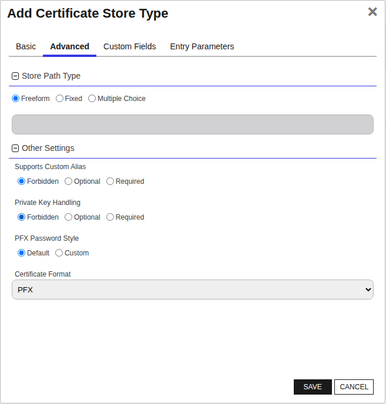
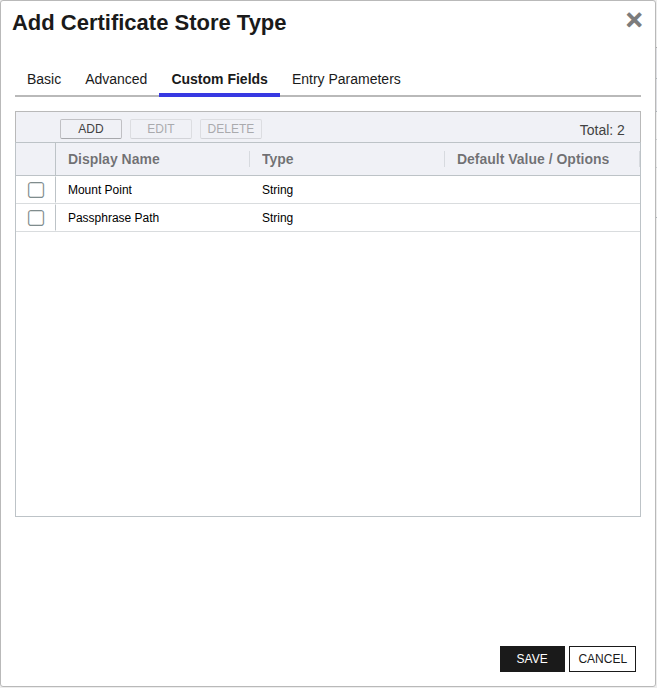
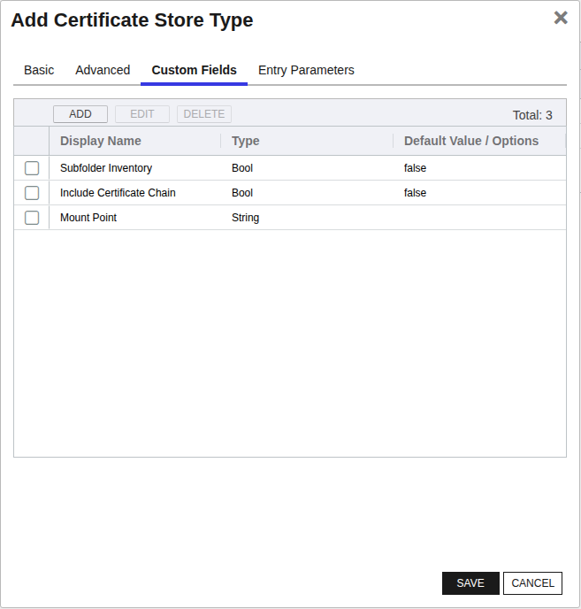
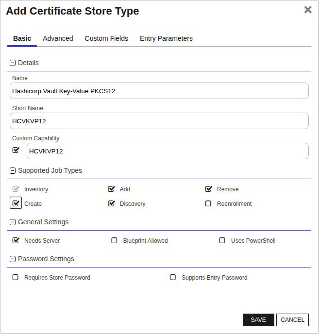
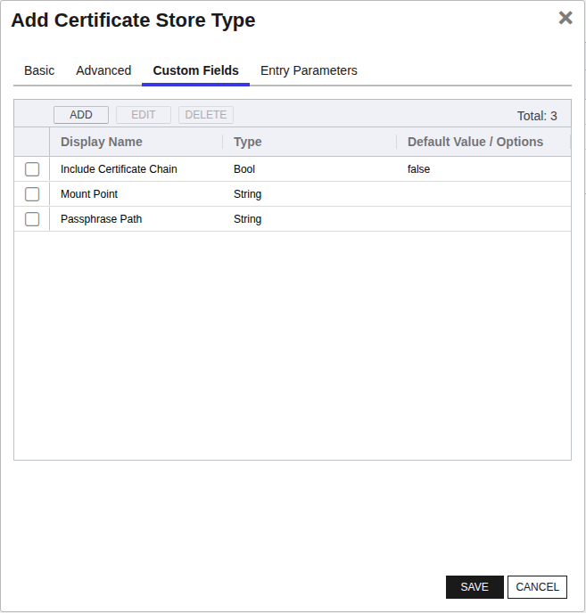
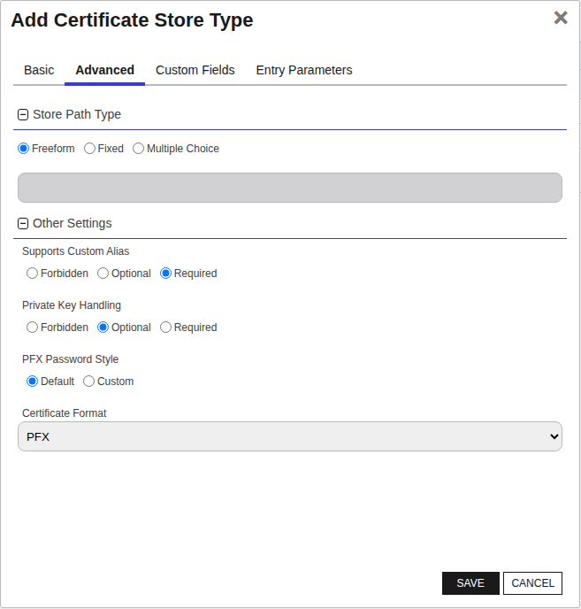

<h1 align="center" style="border-bottom: none">
    Hashicorp Vault Universal Orchestrator Extension
</h1>

<p align="center">
  <!-- Badges -->

<a href="https://github.com/Keyfactor/hashicorp-vault-orchestrator/releases"></a>


</p>

<p align="center">
  <!-- TOC -->
  <a href="#support">
    <b>Support</b>
  </a>
  ·
  <a href="#installation">
    <b>Installation</b>
  </a>
  ·
  <a href="#license">
    <b>License</b>
  </a>
  ·
  <a href="https://github.com/orgs/Keyfactor/repositories?q=orchestrator">
    <b>Related Integrations</b>
  </a>
</p>

## Overview

TODO Overview is a required section

The Hashicorp Vault Universal Orchestrator extension implements 5 Certificate Store Types. Depending on your use case, you may elect to use one, or all of these Certificate Store Types. Descriptions of each are provided below.

- [Hashicorp Vault PKI](#HCVPKI)

- [Hashicorp Vault Key-Value PEM](#HCVKVPEM)

- [Hashicorp Vault Key-Value JKS](#HCVKVJKS)

- [Hashicorp Vault Key-Value PKCS12](#HCVKVP12)

- [Hashicorp Vault Key-Value PFX](#HCVKVPFX)


## Compatibility

This integration is compatible with Keyfactor Universal Orchestrator version 10.4 and later.

## Support
The Hashicorp Vault Universal Orchestrator extension is supported by Keyfactor. If you require support for any issues or have feature request, please open a support ticket by either contacting your Keyfactor representative or via the Keyfactor Support Portal at https://support.keyfactor.com.

> If you want to contribute bug fixes or additional enhancements, use the **[Pull requests](../../pulls)** tab.

## Requirements & Prerequisites

Before installing the Hashicorp Vault Universal Orchestrator extension, we recommend that you install [kfutil](https://github.com/Keyfactor/kfutil). Kfutil is a command-line tool that simplifies the process of creating store types, installing extensions, and instantiating certificate stores in Keyfactor Command.


TODO Requirements is an optional section. If this section doesn't seem necessary on initial glance, please delete it. Refer to the docs on [Confluence](https://keyfactor.atlassian.net/wiki/x/SAAyHg) for more info


## Certificate Store Types

To use the Hashicorp Vault Universal Orchestrator extension, you **must** create the Certificate Store Types required for your use-case. This only needs to happen _once_ per Keyfactor Command instance.

The Hashicorp Vault Universal Orchestrator extension implements 5 Certificate Store Types. Depending on your use case, you may elect to use one, or all of these Certificate Store Types.

### HCVPKI

<details><summary>Click to expand details</summary>


TODO Overview is a required section
TODO Global Store Type Section is an optional section. If this section doesn't seem necessary on initial glance, please delete it. Refer to the docs on [Confluence](https://keyfactor.atlassian.net/wiki/x/SAAyHg) for more info


#### Hashicorp Vault PKI Requirements

TODO Requirements is an optional section. If this section doesn't seem necessary on initial glance, please delete it. Refer to the docs on [Confluence](https://keyfactor.atlassian.net/wiki/x/SAAyHg) for more info


#### Supported Operations

| Operation    | Is Supported                                                                                                           |
|--------------|------------------------------------------------------------------------------------------------------------------------|
| Add          | 🔲 Unchecked        |
| Remove       | 🔲 Unchecked     |
| Discovery    | 🔲 Unchecked  |
| Reenrollment | 🔲 Unchecked |
| Create       | 🔲 Unchecked     |

#### Store Type Creation

##### Using kfutil:
`kfutil` is a custom CLI for the Keyfactor Command API and can be used to create certificate store types.
For more information on [kfutil](https://github.com/Keyfactor/kfutil) check out the [docs](https://github.com/Keyfactor/kfutil?tab=readme-ov-file#quickstart)
   <details><summary>Click to expand HCVPKI kfutil details</summary>

   ##### Using online definition from GitHub:
   This will reach out to GitHub and pull the latest store-type definition
   ```shell
   # Hashicorp Vault PKI
   kfutil store-types create HCVPKI
   ```

   ##### Offline creation using integration-manifest file:
   If required, it is possible to create store types from the [integration-manifest.json](./integration-manifest.json) included in this repo.
   You would first download the [integration-manifest.json](./integration-manifest.json) and then run the following command
   in your offline environment.
   ```shell
   kfutil store-types create --from-file integration-manifest.json
   ```
   </details>


#### Manual Creation
Below are instructions on how to create the HCVPKI store type manually in
the Keyfactor Command Portal
   <details><summary>Click to expand manual HCVPKI details</summary>

   Create a store type called `HCVPKI` with the attributes in the tables below:

   ##### Basic Tab
   | Attribute | Value | Description |
   | --------- | ----- | ----- |
   | Name | Hashicorp Vault PKI | Display name for the store type (may be customized) |
   | Short Name | HCVPKI | Short display name for the store type |
   | Capability | HCVPKI | Store type name orchestrator will register with. Check the box to allow entry of value |
   | Supports Add | 🔲 Unchecked |  Indicates that the Store Type supports Management Add |
   | Supports Remove | 🔲 Unchecked |  Indicates that the Store Type supports Management Remove |
   | Supports Discovery | 🔲 Unchecked |  Indicates that the Store Type supports Discovery |
   | Supports Reenrollment | 🔲 Unchecked |  Indicates that the Store Type supports Reenrollment |
   | Supports Create | 🔲 Unchecked |  Indicates that the Store Type supports store creation |
   | Needs Server | ✅ Checked | Determines if a target server name is required when creating store |
   | Blueprint Allowed | 🔲 Unchecked | Determines if store type may be included in an Orchestrator blueprint |
   | Uses PowerShell | 🔲 Unchecked | Determines if underlying implementation is PowerShell |
   | Requires Store Password | 🔲 Unchecked | Enables users to optionally specify a store password when defining a Certificate Store. |
   | Supports Entry Password | 🔲 Unchecked | Determines if an individual entry within a store can have a password. |

   The Basic tab should look like this:

   

   ##### Advanced Tab
   | Attribute | Value | Description |
   | --------- | ----- | ----- |
   | Supports Custom Alias | Forbidden | Determines if an individual entry within a store can have a custom Alias. |
   | Private Key Handling | Forbidden | This determines if Keyfactor can send the private key associated with a certificate to the store. Required because IIS certificates without private keys would be invalid. |
   | PFX Password Style | Default | 'Default' - PFX password is randomly generated, 'Custom' - PFX password may be specified when the enrollment job is created (Requires the Allow Custom Password application setting to be enabled.) |

   The Advanced tab should look like this:

   

   > For Keyfactor **Command versions 24.4 and later**, a Certificate Format dropdown is available with PFX and PEM options. Ensure that **PFX** is selected, as this determines the format of new and renewed certificates sent to the Orchestrator during a Management job. Currently, all Keyfactor-supported Orchestrator extensions support only PFX.

   ##### Custom Fields Tab
   Custom fields operate at the certificate store level and are used to control how the orchestrator connects to the remote target server containing the certificate store to be managed. The following custom fields should be added to the store type:

   | Name | Display Name | Description | Type | Default Value/Options | Required |
   | ---- | ------------ | ---- | --------------------- | -------- | ----------- |
   | ServerUsername | Server Username | The base URI (and port) to the instance of Hashicorp Vault ex: https://localhost:8200 | Secret |  | ✅ Checked |
   | ServerPassword | Server Password | Vault token that will be used by the Orchestrator integration for authenticating and performing operations in the Vault instance | Secret |  | ✅ Checked |
   | MountPoint | Mount Point | This is the mount point of the instance of the PKI or Keyfactor secrets engine plugin.  If using enterprise namespaces: <namespace>/<mount point> | String |  | ✅ Checked |

   The Custom Fields tab should look like this:

   

   </details>
</details>

### HCVKVPEM

<details><summary>Click to expand details</summary>


TODO Overview is a required section
TODO Global Store Type Section is an optional section. If this section doesn't seem necessary on initial glance, please delete it. Refer to the docs on [Confluence](https://keyfactor.atlassian.net/wiki/x/SAAyHg) for more info


#### Hashicorp Vault Key-Value PEM Requirements

TODO Requirements is an optional section. If this section doesn't seem necessary on initial glance, please delete it. Refer to the docs on [Confluence](https://keyfactor.atlassian.net/wiki/x/SAAyHg) for more info


#### Supported Operations

| Operation    | Is Supported                                                                                                           |
|--------------|------------------------------------------------------------------------------------------------------------------------|
| Add          | ✅ Checked        |
| Remove       | ✅ Checked     |
| Discovery    | ✅ Checked  |
| Reenrollment | 🔲 Unchecked |
| Create       | ✅ Checked     |

#### Store Type Creation

##### Using kfutil:
`kfutil` is a custom CLI for the Keyfactor Command API and can be used to create certificate store types.
For more information on [kfutil](https://github.com/Keyfactor/kfutil) check out the [docs](https://github.com/Keyfactor/kfutil?tab=readme-ov-file#quickstart)
   <details><summary>Click to expand HCVKVPEM kfutil details</summary>

   ##### Using online definition from GitHub:
   This will reach out to GitHub and pull the latest store-type definition
   ```shell
   # Hashicorp Vault Key-Value PEM
   kfutil store-types create HCVKVPEM
   ```

   ##### Offline creation using integration-manifest file:
   If required, it is possible to create store types from the [integration-manifest.json](./integration-manifest.json) included in this repo.
   You would first download the [integration-manifest.json](./integration-manifest.json) and then run the following command
   in your offline environment.
   ```shell
   kfutil store-types create --from-file integration-manifest.json
   ```
   </details>


#### Manual Creation
Below are instructions on how to create the HCVKVPEM store type manually in
the Keyfactor Command Portal
   <details><summary>Click to expand manual HCVKVPEM details</summary>

   Create a store type called `HCVKVPEM` with the attributes in the tables below:

   ##### Basic Tab
   | Attribute | Value | Description |
   | --------- | ----- | ----- |
   | Name | Hashicorp Vault Key-Value PEM | Display name for the store type (may be customized) |
   | Short Name | HCVKVPEM | Short display name for the store type |
   | Capability | HCVKVPEM | Store type name orchestrator will register with. Check the box to allow entry of value |
   | Supports Add | ✅ Checked | Check the box. Indicates that the Store Type supports Management Add |
   | Supports Remove | ✅ Checked | Check the box. Indicates that the Store Type supports Management Remove |
   | Supports Discovery | ✅ Checked | Check the box. Indicates that the Store Type supports Discovery |
   | Supports Reenrollment | 🔲 Unchecked |  Indicates that the Store Type supports Reenrollment |
   | Supports Create | ✅ Checked | Check the box. Indicates that the Store Type supports store creation |
   | Needs Server | ✅ Checked | Determines if a target server name is required when creating store |
   | Blueprint Allowed | 🔲 Unchecked | Determines if store type may be included in an Orchestrator blueprint |
   | Uses PowerShell | 🔲 Unchecked | Determines if underlying implementation is PowerShell |
   | Requires Store Password | 🔲 Unchecked | Enables users to optionally specify a store password when defining a Certificate Store. |
   | Supports Entry Password | 🔲 Unchecked | Determines if an individual entry within a store can have a password. |

   The Basic tab should look like this:

   

   ##### Advanced Tab
   | Attribute | Value | Description |
   | --------- | ----- | ----- |
   | Supports Custom Alias | Required | Determines if an individual entry within a store can have a custom Alias. |
   | Private Key Handling | Optional | This determines if Keyfactor can send the private key associated with a certificate to the store. Required because IIS certificates without private keys would be invalid. |
   | PFX Password Style | Default | 'Default' - PFX password is randomly generated, 'Custom' - PFX password may be specified when the enrollment job is created (Requires the Allow Custom Password application setting to be enabled.) |

   The Advanced tab should look like this:

   

   > For Keyfactor **Command versions 24.4 and later**, a Certificate Format dropdown is available with PFX and PEM options. Ensure that **PFX** is selected, as this determines the format of new and renewed certificates sent to the Orchestrator during a Management job. Currently, all Keyfactor-supported Orchestrator extensions support only PFX.

   ##### Custom Fields Tab
   Custom fields operate at the certificate store level and are used to control how the orchestrator connects to the remote target server containing the certificate store to be managed. The following custom fields should be added to the store type:

   | Name | Display Name | Description | Type | Default Value/Options | Required |
   | ---- | ------------ | ---- | --------------------- | -------- | ----------- |
   | ServerUsername | Server Username | The base URI (and port) to the instance of Hashicorp Vault ex: https://localhost:8200 | Secret |  | ✅ Checked |
   | ServerPassword | Server Password | Vault token that will be used by the Orchestrator integration for authenticating and performing operations in the Vault instance | Secret |  | ✅ Checked |
   | SubfolderInventory | Subfolder Inventory | Should certificates found in sub-paths be included when performing an inventory? | Bool | false | 🔲 Unchecked |
   | IncludeCertChain | Include Certificate Chain | Should the certificate chain be included when performing an enrollment? | Bool | false | 🔲 Unchecked |
   | MountPoint | Mount Point | The base mount point of the secrets engine.  If using Vault Namespaces, include the namespace; ie. <namespace>/<mount point> | String |  | 🔲 Unchecked |

   The Custom Fields tab should look like this:

   

   </details>
</details>

### HCVKVJKS

<details><summary>Click to expand details</summary>


TODO Overview is a required section
TODO Global Store Type Section is an optional section. If this section doesn't seem necessary on initial glance, please delete it. Refer to the docs on [Confluence](https://keyfactor.atlassian.net/wiki/x/SAAyHg) for more info


#### Hashicorp Vault Key-Value JKS Requirements

TODO Requirements is an optional section. If this section doesn't seem necessary on initial glance, please delete it. Refer to the docs on [Confluence](https://keyfactor.atlassian.net/wiki/x/SAAyHg) for more info


#### Supported Operations

| Operation    | Is Supported                                                                                                           |
|--------------|------------------------------------------------------------------------------------------------------------------------|
| Add          | ✅ Checked        |
| Remove       | ✅ Checked     |
| Discovery    | ✅ Checked  |
| Reenrollment | 🔲 Unchecked |
| Create       | ✅ Checked     |

#### Store Type Creation

##### Using kfutil:
`kfutil` is a custom CLI for the Keyfactor Command API and can be used to create certificate store types.
For more information on [kfutil](https://github.com/Keyfactor/kfutil) check out the [docs](https://github.com/Keyfactor/kfutil?tab=readme-ov-file#quickstart)
   <details><summary>Click to expand HCVKVJKS kfutil details</summary>

   ##### Using online definition from GitHub:
   This will reach out to GitHub and pull the latest store-type definition
   ```shell
   # Hashicorp Vault Key-Value JKS
   kfutil store-types create HCVKVJKS
   ```

   ##### Offline creation using integration-manifest file:
   If required, it is possible to create store types from the [integration-manifest.json](./integration-manifest.json) included in this repo.
   You would first download the [integration-manifest.json](./integration-manifest.json) and then run the following command
   in your offline environment.
   ```shell
   kfutil store-types create --from-file integration-manifest.json
   ```
   </details>


#### Manual Creation
Below are instructions on how to create the HCVKVJKS store type manually in
the Keyfactor Command Portal
   <details><summary>Click to expand manual HCVKVJKS details</summary>

   Create a store type called `HCVKVJKS` with the attributes in the tables below:

   ##### Basic Tab
   | Attribute | Value | Description |
   | --------- | ----- | ----- |
   | Name | Hashicorp Vault Key-Value JKS | Display name for the store type (may be customized) |
   | Short Name | HCVKVJKS | Short display name for the store type |
   | Capability | HCVKVJKS | Store type name orchestrator will register with. Check the box to allow entry of value |
   | Supports Add | ✅ Checked | Check the box. Indicates that the Store Type supports Management Add |
   | Supports Remove | ✅ Checked | Check the box. Indicates that the Store Type supports Management Remove |
   | Supports Discovery | ✅ Checked | Check the box. Indicates that the Store Type supports Discovery |
   | Supports Reenrollment | 🔲 Unchecked |  Indicates that the Store Type supports Reenrollment |
   | Supports Create | ✅ Checked | Check the box. Indicates that the Store Type supports store creation |
   | Needs Server | ✅ Checked | Determines if a target server name is required when creating store |
   | Blueprint Allowed | 🔲 Unchecked | Determines if store type may be included in an Orchestrator blueprint |
   | Uses PowerShell | 🔲 Unchecked | Determines if underlying implementation is PowerShell |
   | Requires Store Password | 🔲 Unchecked | Enables users to optionally specify a store password when defining a Certificate Store. |
   | Supports Entry Password | 🔲 Unchecked | Determines if an individual entry within a store can have a password. |

   The Basic tab should look like this:

   

   ##### Advanced Tab
   | Attribute | Value | Description |
   | --------- | ----- | ----- |
   | Supports Custom Alias | Required | Determines if an individual entry within a store can have a custom Alias. |
   | Private Key Handling | Optional | This determines if Keyfactor can send the private key associated with a certificate to the store. Required because IIS certificates without private keys would be invalid. |
   | PFX Password Style | Default | 'Default' - PFX password is randomly generated, 'Custom' - PFX password may be specified when the enrollment job is created (Requires the Allow Custom Password application setting to be enabled.) |

   The Advanced tab should look like this:

   

   > For Keyfactor **Command versions 24.4 and later**, a Certificate Format dropdown is available with PFX and PEM options. Ensure that **PFX** is selected, as this determines the format of new and renewed certificates sent to the Orchestrator during a Management job. Currently, all Keyfactor-supported Orchestrator extensions support only PFX.

   ##### Custom Fields Tab
   Custom fields operate at the certificate store level and are used to control how the orchestrator connects to the remote target server containing the certificate store to be managed. The following custom fields should be added to the store type:

   | Name | Display Name | Description | Type | Default Value/Options | Required |
   | ---- | ------------ | ---- | --------------------- | -------- | ----------- |
   | ServerUsername | Server Username | The base URI (and port) to the instance of Hashicorp Vault ex: https://localhost:8200 | Secret |  | ✅ Checked |
   | ServerPassword | Server Password | Vault token that will be used by the Orchestrator integration for authenticating and performing operations in the Vault instance | Secret |  | ✅ Checked |
   | IncludeCertChain | Include Certificate Chain | Should the certificate chain be included when performing an enrollment? | Bool | false | 🔲 Unchecked |
   | MountPoint | Mount Point | The base mount point of the secrets engine.  If using Vault Namespaces, include the namespace; ie. <namespace>/<mount point> | String |  | 🔲 Unchecked |

   The Custom Fields tab should look like this:

   

   </details>
</details>

### HCVKVP12

<details><summary>Click to expand details</summary>


TODO Overview is a required section
TODO Global Store Type Section is an optional section. If this section doesn't seem necessary on initial glance, please delete it. Refer to the docs on [Confluence](https://keyfactor.atlassian.net/wiki/x/SAAyHg) for more info


#### Hashicorp Vault Key-Value PKCS12 Requirements

TODO Requirements is an optional section. If this section doesn't seem necessary on initial glance, please delete it. Refer to the docs on [Confluence](https://keyfactor.atlassian.net/wiki/x/SAAyHg) for more info


#### Supported Operations

| Operation    | Is Supported                                                                                                           |
|--------------|------------------------------------------------------------------------------------------------------------------------|
| Add          | ✅ Checked        |
| Remove       | ✅ Checked     |
| Discovery    | ✅ Checked  |
| Reenrollment | 🔲 Unchecked |
| Create       | ✅ Checked     |

#### Store Type Creation

##### Using kfutil:
`kfutil` is a custom CLI for the Keyfactor Command API and can be used to create certificate store types.
For more information on [kfutil](https://github.com/Keyfactor/kfutil) check out the [docs](https://github.com/Keyfactor/kfutil?tab=readme-ov-file#quickstart)
   <details><summary>Click to expand HCVKVP12 kfutil details</summary>

   ##### Using online definition from GitHub:
   This will reach out to GitHub and pull the latest store-type definition
   ```shell
   # Hashicorp Vault Key-Value PKCS12
   kfutil store-types create HCVKVP12
   ```

   ##### Offline creation using integration-manifest file:
   If required, it is possible to create store types from the [integration-manifest.json](./integration-manifest.json) included in this repo.
   You would first download the [integration-manifest.json](./integration-manifest.json) and then run the following command
   in your offline environment.
   ```shell
   kfutil store-types create --from-file integration-manifest.json
   ```
   </details>


#### Manual Creation
Below are instructions on how to create the HCVKVP12 store type manually in
the Keyfactor Command Portal
   <details><summary>Click to expand manual HCVKVP12 details</summary>

   Create a store type called `HCVKVP12` with the attributes in the tables below:

   ##### Basic Tab
   | Attribute | Value | Description |
   | --------- | ----- | ----- |
   | Name | Hashicorp Vault Key-Value PKCS12 | Display name for the store type (may be customized) |
   | Short Name | HCVKVP12 | Short display name for the store type |
   | Capability | HCVKVP12 | Store type name orchestrator will register with. Check the box to allow entry of value |
   | Supports Add | ✅ Checked | Check the box. Indicates that the Store Type supports Management Add |
   | Supports Remove | ✅ Checked | Check the box. Indicates that the Store Type supports Management Remove |
   | Supports Discovery | ✅ Checked | Check the box. Indicates that the Store Type supports Discovery |
   | Supports Reenrollment | 🔲 Unchecked |  Indicates that the Store Type supports Reenrollment |
   | Supports Create | ✅ Checked | Check the box. Indicates that the Store Type supports store creation |
   | Needs Server | ✅ Checked | Determines if a target server name is required when creating store |
   | Blueprint Allowed | 🔲 Unchecked | Determines if store type may be included in an Orchestrator blueprint |
   | Uses PowerShell | 🔲 Unchecked | Determines if underlying implementation is PowerShell |
   | Requires Store Password | 🔲 Unchecked | Enables users to optionally specify a store password when defining a Certificate Store. |
   | Supports Entry Password | 🔲 Unchecked | Determines if an individual entry within a store can have a password. |

   The Basic tab should look like this:

   

   ##### Advanced Tab
   | Attribute | Value | Description |
   | --------- | ----- | ----- |
   | Supports Custom Alias | Required | Determines if an individual entry within a store can have a custom Alias. |
   | Private Key Handling | Optional | This determines if Keyfactor can send the private key associated with a certificate to the store. Required because IIS certificates without private keys would be invalid. |
   | PFX Password Style | Default | 'Default' - PFX password is randomly generated, 'Custom' - PFX password may be specified when the enrollment job is created (Requires the Allow Custom Password application setting to be enabled.) |

   The Advanced tab should look like this:

   

   > For Keyfactor **Command versions 24.4 and later**, a Certificate Format dropdown is available with PFX and PEM options. Ensure that **PFX** is selected, as this determines the format of new and renewed certificates sent to the Orchestrator during a Management job. Currently, all Keyfactor-supported Orchestrator extensions support only PFX.

   ##### Custom Fields Tab
   Custom fields operate at the certificate store level and are used to control how the orchestrator connects to the remote target server containing the certificate store to be managed. The following custom fields should be added to the store type:

   | Name | Display Name | Description | Type | Default Value/Options | Required |
   | ---- | ------------ | ---- | --------------------- | -------- | ----------- |
   | ServerUsername | Server Username | The base URI (and port) to the instance of Hashicorp Vault ex: https://localhost:8200 | Secret |  | ✅ Checked |
   | ServerPassword | Server Password | Vault token that will be used by the Orchestrator integration for authenticating and performing operations in the Vault instance | Secret |  | ✅ Checked |
   | IncludeCertChain | Include Certificate Chain | Should the certificate chain be included when performing an enrollment? | Bool | false | 🔲 Unchecked |
   | MountPoint | Mount Point | The base mount point of the secrets engine.  If using Vault Namespaces, include the namespace; ie. <namespace>/<mount point> | String |  | 🔲 Unchecked |

   The Custom Fields tab should look like this:

   

   </details>
</details>

### HCVKVPFX

<details><summary>Click to expand details</summary>


TODO Overview is a required section
TODO Global Store Type Section is an optional section. If this section doesn't seem necessary on initial glance, please delete it. Refer to the docs on [Confluence](https://keyfactor.atlassian.net/wiki/x/SAAyHg) for more info


#### Hashicorp Vault Key-Value PFX Requirements

TODO Requirements is an optional section. If this section doesn't seem necessary on initial glance, please delete it. Refer to the docs on [Confluence](https://keyfactor.atlassian.net/wiki/x/SAAyHg) for more info


#### Supported Operations

| Operation    | Is Supported                                                                                                           |
|--------------|------------------------------------------------------------------------------------------------------------------------|
| Add          | ✅ Checked        |
| Remove       | ✅ Checked     |
| Discovery    | ✅ Checked  |
| Reenrollment | 🔲 Unchecked |
| Create       | ✅ Checked     |

#### Store Type Creation

##### Using kfutil:
`kfutil` is a custom CLI for the Keyfactor Command API and can be used to create certificate store types.
For more information on [kfutil](https://github.com/Keyfactor/kfutil) check out the [docs](https://github.com/Keyfactor/kfutil?tab=readme-ov-file#quickstart)
   <details><summary>Click to expand HCVKVPFX kfutil details</summary>

   ##### Using online definition from GitHub:
   This will reach out to GitHub and pull the latest store-type definition
   ```shell
   # Hashicorp Vault Key-Value PFX
   kfutil store-types create HCVKVPFX
   ```

   ##### Offline creation using integration-manifest file:
   If required, it is possible to create store types from the [integration-manifest.json](./integration-manifest.json) included in this repo.
   You would first download the [integration-manifest.json](./integration-manifest.json) and then run the following command
   in your offline environment.
   ```shell
   kfutil store-types create --from-file integration-manifest.json
   ```
   </details>


#### Manual Creation
Below are instructions on how to create the HCVKVPFX store type manually in
the Keyfactor Command Portal
   <details><summary>Click to expand manual HCVKVPFX details</summary>

   Create a store type called `HCVKVPFX` with the attributes in the tables below:

   ##### Basic Tab
   | Attribute | Value | Description |
   | --------- | ----- | ----- |
   | Name | Hashicorp Vault Key-Value PFX | Display name for the store type (may be customized) |
   | Short Name | HCVKVPFX | Short display name for the store type |
   | Capability | HCVKVPFX | Store type name orchestrator will register with. Check the box to allow entry of value |
   | Supports Add | ✅ Checked | Check the box. Indicates that the Store Type supports Management Add |
   | Supports Remove | ✅ Checked | Check the box. Indicates that the Store Type supports Management Remove |
   | Supports Discovery | ✅ Checked | Check the box. Indicates that the Store Type supports Discovery |
   | Supports Reenrollment | 🔲 Unchecked |  Indicates that the Store Type supports Reenrollment |
   | Supports Create | ✅ Checked | Check the box. Indicates that the Store Type supports store creation |
   | Needs Server | ✅ Checked | Determines if a target server name is required when creating store |
   | Blueprint Allowed | 🔲 Unchecked | Determines if store type may be included in an Orchestrator blueprint |
   | Uses PowerShell | 🔲 Unchecked | Determines if underlying implementation is PowerShell |
   | Requires Store Password | 🔲 Unchecked | Enables users to optionally specify a store password when defining a Certificate Store. |
   | Supports Entry Password | 🔲 Unchecked | Determines if an individual entry within a store can have a password. |

   The Basic tab should look like this:

   

   ##### Advanced Tab
   | Attribute | Value | Description |
   | --------- | ----- | ----- |
   | Supports Custom Alias | Required | Determines if an individual entry within a store can have a custom Alias. |
   | Private Key Handling | Optional | This determines if Keyfactor can send the private key associated with a certificate to the store. Required because IIS certificates without private keys would be invalid. |
   | PFX Password Style | Default | 'Default' - PFX password is randomly generated, 'Custom' - PFX password may be specified when the enrollment job is created (Requires the Allow Custom Password application setting to be enabled.) |

   The Advanced tab should look like this:

   

   > For Keyfactor **Command versions 24.4 and later**, a Certificate Format dropdown is available with PFX and PEM options. Ensure that **PFX** is selected, as this determines the format of new and renewed certificates sent to the Orchestrator during a Management job. Currently, all Keyfactor-supported Orchestrator extensions support only PFX.

   ##### Custom Fields Tab
   Custom fields operate at the certificate store level and are used to control how the orchestrator connects to the remote target server containing the certificate store to be managed. The following custom fields should be added to the store type:

   | Name | Display Name | Description | Type | Default Value/Options | Required |
   | ---- | ------------ | ---- | --------------------- | -------- | ----------- |
   | ServerUsername | Server Username | The base URI (and port) to the instance of Hashicorp Vault ex: https://localhost:8200 | Secret |  | ✅ Checked |
   | ServerPassword | Server Password | Vault token that will be used by the Orchestrator integration for authenticating and performing operations in the Vault instance | Secret |  | ✅ Checked |
   | IncludeCertChain | Include Certificate Chain | Should the certificate chain be included when performing an enrollment? | Bool | false | 🔲 Unchecked |
   | MountPoint | Mount Point | The base mount point of the secrets engine.  If using Vault Namespaces, include the namespace; ie. <namespace>/<mount point> | String |  | 🔲 Unchecked |

   The Custom Fields tab should look like this:

   

   </details>
</details>


## Installation

1. **Download the latest Hashicorp Vault Universal Orchestrator extension from GitHub.**

    Navigate to the [Hashicorp Vault Universal Orchestrator extension GitHub version page](https://github.com/Keyfactor/hashicorp-vault-orchestrator/releases/latest). Refer to the compatibility matrix below to determine whether the `net6.0` or `net8.0` asset should be downloaded. Then, click the corresponding asset to download the zip archive.

   | Universal Orchestrator Version | Latest .NET version installed on the Universal Orchestrator server | `rollForward` condition in `Orchestrator.runtimeconfig.json` | `hashicorp-vault-orchestrator` .NET version to download |
   | --------- | ----------- | ----------- | ----------- |
   | Older than `11.0.0` | | | `net6.0` |
   | Between `11.0.0` and `11.5.1` (inclusive) | `net6.0` | | `net6.0` |
   | Between `11.0.0` and `11.5.1` (inclusive) | `net8.0` | `Disable` | `net6.0` |
   | Between `11.0.0` and `11.5.1` (inclusive) | `net8.0` | `LatestMajor` | `net8.0` |
   | `11.6` _and_ newer | `net8.0` | | `net8.0` |

    Unzip the archive containing extension assemblies to a known location.

    > **Note** If you don't see an asset with a corresponding .NET version, you should always assume that it was compiled for `net6.0`.

2. **Locate the Universal Orchestrator extensions directory.**

    * **Default on Windows** - `C:\Program Files\Keyfactor\Keyfactor Orchestrator\extensions`
    * **Default on Linux** - `/opt/keyfactor/orchestrator/extensions`

3. **Create a new directory for the Hashicorp Vault Universal Orchestrator extension inside the extensions directory.**

    Create a new directory called `hashicorp-vault-orchestrator`.
    > The directory name does not need to match any names used elsewhere; it just has to be unique within the extensions directory.

4. **Copy the contents of the downloaded and unzipped assemblies from __step 2__ to the `hashicorp-vault-orchestrator` directory.**

5. **Restart the Universal Orchestrator service.**

    Refer to [Starting/Restarting the Universal Orchestrator service](https://software.keyfactor.com/Core-OnPrem/Current/Content/InstallingAgents/NetCoreOrchestrator/StarttheService.htm).


6. **(optional) PAM Integration**

    The Hashicorp Vault Universal Orchestrator extension is compatible with all supported Keyfactor PAM extensions to resolve PAM-eligible secrets. PAM extensions running on Universal Orchestrators enable secure retrieval of secrets from a connected PAM provider.

    To configure a PAM provider, [reference the Keyfactor Integration Catalog](https://keyfactor.github.io/integrations-catalog/content/pam) to select an extension and follow the associated instructions to install it on the Universal Orchestrator (remote).


> The above installation steps can be supplemented by the [official Command documentation](https://software.keyfactor.com/Core-OnPrem/Current/Content/InstallingAgents/NetCoreOrchestrator/CustomExtensions.htm?Highlight=extensions).


## Post Installation

TODO Post Installation is an optional section. If this section doesn't seem necessary on initial glance, please delete it. Refer to the docs on [Confluence](https://keyfactor.atlassian.net/wiki/x/SAAyHg) for more info


## Defining Certificate Stores

The Hashicorp Vault Universal Orchestrator extension implements 5 Certificate Store Types, each of which implements different functionality. Refer to the individual instructions below for each Certificate Store Type that you deemed necessary for your use case from the installation section.

<details><summary>Hashicorp Vault PKI (HCVPKI)</summary>

TODO Global Store Type Section is an optional section. If this section doesn't seem necessary on initial glance, please delete it. Refer to the docs on [Confluence](https://keyfactor.atlassian.net/wiki/x/SAAyHg) for more info

TODO Certificate Store Configuration is an optional section. If this section doesn't seem necessary on initial glance, please delete it. Refer to the docs on [Confluence](https://keyfactor.atlassian.net/wiki/x/SAAyHg) for more info


### Store Creation

#### Manually with the Command UI

<details><summary>Click to expand details</summary>

1. **Navigate to the _Certificate Stores_ page in Keyfactor Command.**

    Log into Keyfactor Command, toggle the _Locations_ dropdown, and click _Certificate Stores_.

2. **Add a Certificate Store.**

    Click the Add button to add a new Certificate Store. Use the table below to populate the **Attributes** in the **Add** form.

   | Attribute | Description                                             |
   | --------- |---------------------------------------------------------|
   | Category | Select "Hashicorp Vault PKI" or the customized certificate store name from the previous step. |
   | Container | Optional container to associate certificate store with. |
   | Client Machine | This can be any value to help uniquely identify the store.  It is not used by this integration. |
   | Store Path | For HCVPKI, this will be '/' |
   | Orchestrator | Select an approved orchestrator capable of managing `HCVPKI` certificates. Specifically, one with the `HCVPKI` capability. |
   | ServerUsername | The base URI (and port) to the instance of Hashicorp Vault ex: https://localhost:8200 |
   | ServerPassword | Vault token that will be used by the Orchestrator integration for authenticating and performing operations in the Vault instance |
   | MountPoint | This is the mount point of the instance of the PKI or Keyfactor secrets engine plugin.  If using enterprise namespaces: <namespace>/<mount point> |

</details>


#### Using kfutil CLI

<details><summary>Click to expand details</summary>

1. **Generate a CSV template for the HCVPKI certificate store**

    ```shell
    kfutil stores import generate-template --store-type-name HCVPKI --outpath HCVPKI.csv
    ```
2. **Populate the generated CSV file**

    Open the CSV file, and reference the table below to populate parameters for each **Attribute**.

   | Attribute | Description |
   | --------- | ----------- |
   | Category | Select "Hashicorp Vault PKI" or the customized certificate store name from the previous step. |
   | Container | Optional container to associate certificate store with. |
   | Client Machine | This can be any value to help uniquely identify the store.  It is not used by this integration. |
   | Store Path | For HCVPKI, this will be '/' |
   | Orchestrator | Select an approved orchestrator capable of managing `HCVPKI` certificates. Specifically, one with the `HCVPKI` capability. |
   | Properties.ServerUsername | The base URI (and port) to the instance of Hashicorp Vault ex: https://localhost:8200 |
   | Properties.ServerPassword | Vault token that will be used by the Orchestrator integration for authenticating and performing operations in the Vault instance |
   | Properties.MountPoint | This is the mount point of the instance of the PKI or Keyfactor secrets engine plugin.  If using enterprise namespaces: <namespace>/<mount point> |

3. **Import the CSV file to create the certificate stores**

    ```shell
    kfutil stores import csv --store-type-name HCVPKI --file HCVPKI.csv
    ```

</details>


#### PAM Provider Eligible Fields
<details><summary>Attributes eligible for retrieval by a PAM Provider on the Universal Orchestrator</summary>

If a PAM provider was installed _on the Universal Orchestrator_ in the [Installation](#Installation) section, the following parameters can be configured for retrieval _on the Universal Orchestrator_.

   | Attribute | Description |
   | --------- | ----------- |
   | ServerUsername | The base URI (and port) to the instance of Hashicorp Vault ex: https://localhost:8200 |
   | ServerPassword | Vault token that will be used by the Orchestrator integration for authenticating and performing operations in the Vault instance |

Please refer to the **Universal Orchestrator (remote)** usage section ([PAM providers on the Keyfactor Integration Catalog](https://keyfactor.github.io/integrations-catalog/content/pam)) for your selected PAM provider for instructions on how to load attributes orchestrator-side.
> Any secret can be rendered by a PAM provider _installed on the Keyfactor Command server_. The above parameters are specific to attributes that can be fetched by an installed PAM provider running on the Universal Orchestrator server itself.

</details>


> The content in this section can be supplemented by the [official Command documentation](https://software.keyfactor.com/Core-OnPrem/Current/Content/ReferenceGuide/Certificate%20Stores.htm?Highlight=certificate%20store).


</details>

<details><summary>Hashicorp Vault Key-Value PEM (HCVKVPEM)</summary>

TODO Global Store Type Section is an optional section. If this section doesn't seem necessary on initial glance, please delete it. Refer to the docs on [Confluence](https://keyfactor.atlassian.net/wiki/x/SAAyHg) for more info

TODO Certificate Store Configuration is an optional section. If this section doesn't seem necessary on initial glance, please delete it. Refer to the docs on [Confluence](https://keyfactor.atlassian.net/wiki/x/SAAyHg) for more info


### Store Creation

#### Manually with the Command UI

<details><summary>Click to expand details</summary>

1. **Navigate to the _Certificate Stores_ page in Keyfactor Command.**

    Log into Keyfactor Command, toggle the _Locations_ dropdown, and click _Certificate Stores_.

2. **Add a Certificate Store.**

    Click the Add button to add a new Certificate Store. Use the table below to populate the **Attributes** in the **Add** form.

   | Attribute | Description                                             |
   | --------- |---------------------------------------------------------|
   | Category | Select "Hashicorp Vault Key-Value PEM" or the customized certificate store name from the previous step. |
   | Container | Optional container to associate certificate store with. |
   | Client Machine | This can be any value to help uniquely identify the store.  It is not used by this integration. |
   | Store Path | This is the path after mount point where the certificates will be stored. |
   | Orchestrator | Select an approved orchestrator capable of managing `HCVKVPEM` certificates. Specifically, one with the `HCVKVPEM` capability. |
   | ServerUsername | The base URI (and port) to the instance of Hashicorp Vault ex: https://localhost:8200 |
   | ServerPassword | Vault token that will be used by the Orchestrator integration for authenticating and performing operations in the Vault instance |
   | SubfolderInventory | Should certificates found in sub-paths be included when performing an inventory? |
   | IncludeCertChain | Should the certificate chain be included when performing an enrollment? |
   | MountPoint | The base mount point of the secrets engine.  If using Vault Namespaces, include the namespace; ie. <namespace>/<mount point> |

</details>


#### Using kfutil CLI

<details><summary>Click to expand details</summary>

1. **Generate a CSV template for the HCVKVPEM certificate store**

    ```shell
    kfutil stores import generate-template --store-type-name HCVKVPEM --outpath HCVKVPEM.csv
    ```
2. **Populate the generated CSV file**

    Open the CSV file, and reference the table below to populate parameters for each **Attribute**.

   | Attribute | Description |
   | --------- | ----------- |
   | Category | Select "Hashicorp Vault Key-Value PEM" or the customized certificate store name from the previous step. |
   | Container | Optional container to associate certificate store with. |
   | Client Machine | This can be any value to help uniquely identify the store.  It is not used by this integration. |
   | Store Path | This is the path after mount point where the certificates will be stored. |
   | Orchestrator | Select an approved orchestrator capable of managing `HCVKVPEM` certificates. Specifically, one with the `HCVKVPEM` capability. |
   | Properties.ServerUsername | The base URI (and port) to the instance of Hashicorp Vault ex: https://localhost:8200 |
   | Properties.ServerPassword | Vault token that will be used by the Orchestrator integration for authenticating and performing operations in the Vault instance |
   | Properties.SubfolderInventory | Should certificates found in sub-paths be included when performing an inventory? |
   | Properties.IncludeCertChain | Should the certificate chain be included when performing an enrollment? |
   | Properties.MountPoint | The base mount point of the secrets engine.  If using Vault Namespaces, include the namespace; ie. <namespace>/<mount point> |

3. **Import the CSV file to create the certificate stores**

    ```shell
    kfutil stores import csv --store-type-name HCVKVPEM --file HCVKVPEM.csv
    ```

</details>


#### PAM Provider Eligible Fields
<details><summary>Attributes eligible for retrieval by a PAM Provider on the Universal Orchestrator</summary>

If a PAM provider was installed _on the Universal Orchestrator_ in the [Installation](#Installation) section, the following parameters can be configured for retrieval _on the Universal Orchestrator_.

   | Attribute | Description |
   | --------- | ----------- |
   | ServerUsername | The base URI (and port) to the instance of Hashicorp Vault ex: https://localhost:8200 |
   | ServerPassword | Vault token that will be used by the Orchestrator integration for authenticating and performing operations in the Vault instance |

Please refer to the **Universal Orchestrator (remote)** usage section ([PAM providers on the Keyfactor Integration Catalog](https://keyfactor.github.io/integrations-catalog/content/pam)) for your selected PAM provider for instructions on how to load attributes orchestrator-side.
> Any secret can be rendered by a PAM provider _installed on the Keyfactor Command server_. The above parameters are specific to attributes that can be fetched by an installed PAM provider running on the Universal Orchestrator server itself.

</details>


> The content in this section can be supplemented by the [official Command documentation](https://software.keyfactor.com/Core-OnPrem/Current/Content/ReferenceGuide/Certificate%20Stores.htm?Highlight=certificate%20store).


</details>

<details><summary>Hashicorp Vault Key-Value JKS (HCVKVJKS)</summary>

TODO Global Store Type Section is an optional section. If this section doesn't seem necessary on initial glance, please delete it. Refer to the docs on [Confluence](https://keyfactor.atlassian.net/wiki/x/SAAyHg) for more info

TODO Certificate Store Configuration is an optional section. If this section doesn't seem necessary on initial glance, please delete it. Refer to the docs on [Confluence](https://keyfactor.atlassian.net/wiki/x/SAAyHg) for more info


### Store Creation

#### Manually with the Command UI

<details><summary>Click to expand details</summary>

1. **Navigate to the _Certificate Stores_ page in Keyfactor Command.**

    Log into Keyfactor Command, toggle the _Locations_ dropdown, and click _Certificate Stores_.

2. **Add a Certificate Store.**

    Click the Add button to add a new Certificate Store. Use the table below to populate the **Attributes** in the **Add** form.

   | Attribute | Description                                             |
   | --------- |---------------------------------------------------------|
   | Category | Select "Hashicorp Vault Key-Value JKS" or the customized certificate store name from the previous step. |
   | Container | Optional container to associate certificate store with. |
   | Client Machine | This can be any value to help uniquely identify the store.  It is not used by this integration. |
   | Store Path | This is the path to the secret containing the store. |
   | Orchestrator | Select an approved orchestrator capable of managing `HCVKVJKS` certificates. Specifically, one with the `HCVKVJKS` capability. |
   | ServerUsername | The base URI (and port) to the instance of Hashicorp Vault ex: https://localhost:8200 |
   | ServerPassword | Vault token that will be used by the Orchestrator integration for authenticating and performing operations in the Vault instance |
   | IncludeCertChain | Should the certificate chain be included when performing an enrollment? |
   | MountPoint | The base mount point of the secrets engine.  If using Vault Namespaces, include the namespace; ie. <namespace>/<mount point> |

</details>


#### Using kfutil CLI

<details><summary>Click to expand details</summary>

1. **Generate a CSV template for the HCVKVJKS certificate store**

    ```shell
    kfutil stores import generate-template --store-type-name HCVKVJKS --outpath HCVKVJKS.csv
    ```
2. **Populate the generated CSV file**

    Open the CSV file, and reference the table below to populate parameters for each **Attribute**.

   | Attribute | Description |
   | --------- | ----------- |
   | Category | Select "Hashicorp Vault Key-Value JKS" or the customized certificate store name from the previous step. |
   | Container | Optional container to associate certificate store with. |
   | Client Machine | This can be any value to help uniquely identify the store.  It is not used by this integration. |
   | Store Path | This is the path to the secret containing the store. |
   | Orchestrator | Select an approved orchestrator capable of managing `HCVKVJKS` certificates. Specifically, one with the `HCVKVJKS` capability. |
   | Properties.ServerUsername | The base URI (and port) to the instance of Hashicorp Vault ex: https://localhost:8200 |
   | Properties.ServerPassword | Vault token that will be used by the Orchestrator integration for authenticating and performing operations in the Vault instance |
   | Properties.IncludeCertChain | Should the certificate chain be included when performing an enrollment? |
   | Properties.MountPoint | The base mount point of the secrets engine.  If using Vault Namespaces, include the namespace; ie. <namespace>/<mount point> |

3. **Import the CSV file to create the certificate stores**

    ```shell
    kfutil stores import csv --store-type-name HCVKVJKS --file HCVKVJKS.csv
    ```

</details>


#### PAM Provider Eligible Fields
<details><summary>Attributes eligible for retrieval by a PAM Provider on the Universal Orchestrator</summary>

If a PAM provider was installed _on the Universal Orchestrator_ in the [Installation](#Installation) section, the following parameters can be configured for retrieval _on the Universal Orchestrator_.

   | Attribute | Description |
   | --------- | ----------- |
   | ServerUsername | The base URI (and port) to the instance of Hashicorp Vault ex: https://localhost:8200 |
   | ServerPassword | Vault token that will be used by the Orchestrator integration for authenticating and performing operations in the Vault instance |

Please refer to the **Universal Orchestrator (remote)** usage section ([PAM providers on the Keyfactor Integration Catalog](https://keyfactor.github.io/integrations-catalog/content/pam)) for your selected PAM provider for instructions on how to load attributes orchestrator-side.
> Any secret can be rendered by a PAM provider _installed on the Keyfactor Command server_. The above parameters are specific to attributes that can be fetched by an installed PAM provider running on the Universal Orchestrator server itself.

</details>


> The content in this section can be supplemented by the [official Command documentation](https://software.keyfactor.com/Core-OnPrem/Current/Content/ReferenceGuide/Certificate%20Stores.htm?Highlight=certificate%20store).


</details>

<details><summary>Hashicorp Vault Key-Value PKCS12 (HCVKVP12)</summary>

TODO Global Store Type Section is an optional section. If this section doesn't seem necessary on initial glance, please delete it. Refer to the docs on [Confluence](https://keyfactor.atlassian.net/wiki/x/SAAyHg) for more info

TODO Certificate Store Configuration is an optional section. If this section doesn't seem necessary on initial glance, please delete it. Refer to the docs on [Confluence](https://keyfactor.atlassian.net/wiki/x/SAAyHg) for more info


### Store Creation

#### Manually with the Command UI

<details><summary>Click to expand details</summary>

1. **Navigate to the _Certificate Stores_ page in Keyfactor Command.**

    Log into Keyfactor Command, toggle the _Locations_ dropdown, and click _Certificate Stores_.

2. **Add a Certificate Store.**

    Click the Add button to add a new Certificate Store. Use the table below to populate the **Attributes** in the **Add** form.

   | Attribute | Description                                             |
   | --------- |---------------------------------------------------------|
   | Category | Select "Hashicorp Vault Key-Value PKCS12" or the customized certificate store name from the previous step. |
   | Container | Optional container to associate certificate store with. |
   | Client Machine | This can be any value to help uniquely identify the store.  It is not used by this integration. |
   | Store Path | This is the path to the secret containing the store. |
   | Orchestrator | Select an approved orchestrator capable of managing `HCVKVP12` certificates. Specifically, one with the `HCVKVP12` capability. |
   | ServerUsername | The base URI (and port) to the instance of Hashicorp Vault ex: https://localhost:8200 |
   | ServerPassword | Vault token that will be used by the Orchestrator integration for authenticating and performing operations in the Vault instance |
   | IncludeCertChain | Should the certificate chain be included when performing an enrollment? |
   | MountPoint | The base mount point of the secrets engine.  If using Vault Namespaces, include the namespace; ie. <namespace>/<mount point> |

</details>


#### Using kfutil CLI

<details><summary>Click to expand details</summary>

1. **Generate a CSV template for the HCVKVP12 certificate store**

    ```shell
    kfutil stores import generate-template --store-type-name HCVKVP12 --outpath HCVKVP12.csv
    ```
2. **Populate the generated CSV file**

    Open the CSV file, and reference the table below to populate parameters for each **Attribute**.

   | Attribute | Description |
   | --------- | ----------- |
   | Category | Select "Hashicorp Vault Key-Value PKCS12" or the customized certificate store name from the previous step. |
   | Container | Optional container to associate certificate store with. |
   | Client Machine | This can be any value to help uniquely identify the store.  It is not used by this integration. |
   | Store Path | This is the path to the secret containing the store. |
   | Orchestrator | Select an approved orchestrator capable of managing `HCVKVP12` certificates. Specifically, one with the `HCVKVP12` capability. |
   | Properties.ServerUsername | The base URI (and port) to the instance of Hashicorp Vault ex: https://localhost:8200 |
   | Properties.ServerPassword | Vault token that will be used by the Orchestrator integration for authenticating and performing operations in the Vault instance |
   | Properties.IncludeCertChain | Should the certificate chain be included when performing an enrollment? |
   | Properties.MountPoint | The base mount point of the secrets engine.  If using Vault Namespaces, include the namespace; ie. <namespace>/<mount point> |

3. **Import the CSV file to create the certificate stores**

    ```shell
    kfutil stores import csv --store-type-name HCVKVP12 --file HCVKVP12.csv
    ```

</details>


#### PAM Provider Eligible Fields
<details><summary>Attributes eligible for retrieval by a PAM Provider on the Universal Orchestrator</summary>

If a PAM provider was installed _on the Universal Orchestrator_ in the [Installation](#Installation) section, the following parameters can be configured for retrieval _on the Universal Orchestrator_.

   | Attribute | Description |
   | --------- | ----------- |
   | ServerUsername | The base URI (and port) to the instance of Hashicorp Vault ex: https://localhost:8200 |
   | ServerPassword | Vault token that will be used by the Orchestrator integration for authenticating and performing operations in the Vault instance |

Please refer to the **Universal Orchestrator (remote)** usage section ([PAM providers on the Keyfactor Integration Catalog](https://keyfactor.github.io/integrations-catalog/content/pam)) for your selected PAM provider for instructions on how to load attributes orchestrator-side.
> Any secret can be rendered by a PAM provider _installed on the Keyfactor Command server_. The above parameters are specific to attributes that can be fetched by an installed PAM provider running on the Universal Orchestrator server itself.

</details>


> The content in this section can be supplemented by the [official Command documentation](https://software.keyfactor.com/Core-OnPrem/Current/Content/ReferenceGuide/Certificate%20Stores.htm?Highlight=certificate%20store).


</details>

<details><summary>Hashicorp Vault Key-Value PFX (HCVKVPFX)</summary>

TODO Global Store Type Section is an optional section. If this section doesn't seem necessary on initial glance, please delete it. Refer to the docs on [Confluence](https://keyfactor.atlassian.net/wiki/x/SAAyHg) for more info

TODO Certificate Store Configuration is an optional section. If this section doesn't seem necessary on initial glance, please delete it. Refer to the docs on [Confluence](https://keyfactor.atlassian.net/wiki/x/SAAyHg) for more info


### Store Creation

#### Manually with the Command UI

<details><summary>Click to expand details</summary>

1. **Navigate to the _Certificate Stores_ page in Keyfactor Command.**

    Log into Keyfactor Command, toggle the _Locations_ dropdown, and click _Certificate Stores_.

2. **Add a Certificate Store.**

    Click the Add button to add a new Certificate Store. Use the table below to populate the **Attributes** in the **Add** form.

   | Attribute | Description                                             |
   | --------- |---------------------------------------------------------|
   | Category | Select "Hashicorp Vault Key-Value PFX" or the customized certificate store name from the previous step. |
   | Container | Optional container to associate certificate store with. |
   | Client Machine | This can be any value to help uniquely identify the store.  It is not used by this integration. |
   | Store Path | This is the path to the secret containing the store. |
   | Orchestrator | Select an approved orchestrator capable of managing `HCVKVPFX` certificates. Specifically, one with the `HCVKVPFX` capability. |
   | ServerUsername | The base URI (and port) to the instance of Hashicorp Vault ex: https://localhost:8200 |
   | ServerPassword | Vault token that will be used by the Orchestrator integration for authenticating and performing operations in the Vault instance |
   | IncludeCertChain | Should the certificate chain be included when performing an enrollment? |
   | MountPoint | The base mount point of the secrets engine.  If using Vault Namespaces, include the namespace; ie. <namespace>/<mount point> |

</details>


#### Using kfutil CLI

<details><summary>Click to expand details</summary>

1. **Generate a CSV template for the HCVKVPFX certificate store**

    ```shell
    kfutil stores import generate-template --store-type-name HCVKVPFX --outpath HCVKVPFX.csv
    ```
2. **Populate the generated CSV file**

    Open the CSV file, and reference the table below to populate parameters for each **Attribute**.

   | Attribute | Description |
   | --------- | ----------- |
   | Category | Select "Hashicorp Vault Key-Value PFX" or the customized certificate store name from the previous step. |
   | Container | Optional container to associate certificate store with. |
   | Client Machine | This can be any value to help uniquely identify the store.  It is not used by this integration. |
   | Store Path | This is the path to the secret containing the store. |
   | Orchestrator | Select an approved orchestrator capable of managing `HCVKVPFX` certificates. Specifically, one with the `HCVKVPFX` capability. |
   | Properties.ServerUsername | The base URI (and port) to the instance of Hashicorp Vault ex: https://localhost:8200 |
   | Properties.ServerPassword | Vault token that will be used by the Orchestrator integration for authenticating and performing operations in the Vault instance |
   | Properties.IncludeCertChain | Should the certificate chain be included when performing an enrollment? |
   | Properties.MountPoint | The base mount point of the secrets engine.  If using Vault Namespaces, include the namespace; ie. <namespace>/<mount point> |

3. **Import the CSV file to create the certificate stores**

    ```shell
    kfutil stores import csv --store-type-name HCVKVPFX --file HCVKVPFX.csv
    ```

</details>


#### PAM Provider Eligible Fields
<details><summary>Attributes eligible for retrieval by a PAM Provider on the Universal Orchestrator</summary>

If a PAM provider was installed _on the Universal Orchestrator_ in the [Installation](#Installation) section, the following parameters can be configured for retrieval _on the Universal Orchestrator_.

   | Attribute | Description |
   | --------- | ----------- |
   | ServerUsername | The base URI (and port) to the instance of Hashicorp Vault ex: https://localhost:8200 |
   | ServerPassword | Vault token that will be used by the Orchestrator integration for authenticating and performing operations in the Vault instance |

Please refer to the **Universal Orchestrator (remote)** usage section ([PAM providers on the Keyfactor Integration Catalog](https://keyfactor.github.io/integrations-catalog/content/pam)) for your selected PAM provider for instructions on how to load attributes orchestrator-side.
> Any secret can be rendered by a PAM provider _installed on the Keyfactor Command server_. The above parameters are specific to attributes that can be fetched by an installed PAM provider running on the Universal Orchestrator server itself.

</details>


> The content in this section can be supplemented by the [official Command documentation](https://software.keyfactor.com/Core-OnPrem/Current/Content/ReferenceGuide/Certificate%20Stores.htm?Highlight=certificate%20store).


</details>

## Discovering Certificate Stores with the Discovery Job
TODO Discovery is an optional section. If this section doesn't seem necessary on initial glance, please delete it. Refer to the docs on [Confluence](https://keyfactor.atlassian.net/wiki/x/SAAyHg) for more info

<details><summary>Hashicorp Vault PKI</summary>


### Hashicorp Vault PKI Discovery Job
TODO Global Store Type Section is an optional section. If this section doesn't seem necessary on initial glance, please delete it. Refer to the docs on [Confluence](https://keyfactor.atlassian.net/wiki/x/SAAyHg) for more info


TODO Discovery Job Configuration is an optional section. If this section doesn't seem necessary on initial glance, please delete it. Refer to the docs on [Confluence](https://keyfactor.atlassian.net/wiki/x/SAAyHg) for more info
</details>


<details><summary>Hashicorp Vault Key-Value PEM</summary>


### Hashicorp Vault Key-Value PEM Discovery Job
TODO Global Store Type Section is an optional section. If this section doesn't seem necessary on initial glance, please delete it. Refer to the docs on [Confluence](https://keyfactor.atlassian.net/wiki/x/SAAyHg) for more info


TODO Discovery Job Configuration is an optional section. If this section doesn't seem necessary on initial glance, please delete it. Refer to the docs on [Confluence](https://keyfactor.atlassian.net/wiki/x/SAAyHg) for more info
</details>


<details><summary>Hashicorp Vault Key-Value JKS</summary>


### Hashicorp Vault Key-Value JKS Discovery Job
TODO Global Store Type Section is an optional section. If this section doesn't seem necessary on initial glance, please delete it. Refer to the docs on [Confluence](https://keyfactor.atlassian.net/wiki/x/SAAyHg) for more info


TODO Discovery Job Configuration is an optional section. If this section doesn't seem necessary on initial glance, please delete it. Refer to the docs on [Confluence](https://keyfactor.atlassian.net/wiki/x/SAAyHg) for more info
</details>


<details><summary>Hashicorp Vault Key-Value PKCS12</summary>


### Hashicorp Vault Key-Value PKCS12 Discovery Job
TODO Global Store Type Section is an optional section. If this section doesn't seem necessary on initial glance, please delete it. Refer to the docs on [Confluence](https://keyfactor.atlassian.net/wiki/x/SAAyHg) for more info


TODO Discovery Job Configuration is an optional section. If this section doesn't seem necessary on initial glance, please delete it. Refer to the docs on [Confluence](https://keyfactor.atlassian.net/wiki/x/SAAyHg) for more info
</details>


<details><summary>Hashicorp Vault Key-Value PFX</summary>


### Hashicorp Vault Key-Value PFX Discovery Job
TODO Global Store Type Section is an optional section. If this section doesn't seem necessary on initial glance, please delete it. Refer to the docs on [Confluence](https://keyfactor.atlassian.net/wiki/x/SAAyHg) for more info


TODO Discovery Job Configuration is an optional section. If this section doesn't seem necessary on initial glance, please delete it. Refer to the docs on [Confluence](https://keyfactor.atlassian.net/wiki/x/SAAyHg) for more info
</details>


## License

Apache License 2.0, see [LICENSE](LICENSE).

## Related Integrations

See all [Keyfactor Universal Orchestrator extensions](https://github.com/orgs/Keyfactor/repositories?q=orchestrator).