<h1 align="center" style="border-bottom: none">
    Hashicorp Vault Universal Orchestrator Extension
</h1>

<p align="center">
  <!-- Badges -->

<a href="https://github.com/Keyfactor/hashicorp-vault-orchestrator/releases"></a>


</p>

<p align="center">
  <!-- TOC -->
  <a href="#support">
    <b>Support</b>
  </a>
  ·
  <a href="#installation">
    <b>Installation</b>
  </a>
  ·
  <a href="#license">
    <b>License</b>
  </a>
  ·
  <a href="https://github.com/orgs/Keyfactor/repositories?q=orchestrator">
    <b>Related Integrations</b>
  </a>
</p>

## Overview

This integration for the Keyfactor Universal Orchestrator has been tested against Hashicorp Vault 1.10+.  It utilizes the **Key-Value** secrets engine to store certificates issues via Keyfactor Command.

The Hashicorp Vault Universal Orchestrator extension implements 5 Certificate Store Types. Depending on your use case, you may elect to use one, or all of these Certificate Store Types. Descriptions of each are provided below.
- [Hashicorp Vault PKI](#HCVPKI)
- [Hashicorp Vault Key-Value PEM](#HCVKVPEM)
- [Hashicorp Vault Key-Value JKS](#HCVKVJKS)
- [Hashicorp Vault Key-Value PKCS12](#HCVKVP12)
- [Hashicorp Vault Key-Value PFX](#HCVKVPFX)

## Compatibility

This integration is compatible with Keyfactor Universal Orchestrator version 10.4 and later.

## Support

The Hashicorp Vault Universal Orchestrator extension is supported by Keyfactor. If you require support for any issues or have feature request, please open a support ticket by either contacting your Keyfactor representative or via the Keyfactor Support Portal at https://support.keyfactor.com.

> If you want to contribute bug fixes or additional enhancements, use the **[Pull requests](../../pulls)** tab.

## Requirements & Prerequisites

Before installing the Hashicorp Vault Universal Orchestrator extension, we recommend that you install [kfutil](https://github.com/Keyfactor/kfutil). Kfutil is a command-line tool that simplifies the process of creating store types, installing extensions, and instantiating certificate stores in Keyfactor Command.

## Certificate Store Types

To use the Hashicorp Vault Universal Orchestrator extension, you **must** create the Certificate Store Types required for your use-case. This only needs to happen _once_ per Keyfactor Command instance.

The Hashicorp Vault Universal Orchestrator extension implements 5 Certificate Store Types. Depending on your use case, you may elect to use one, or all of these Certificate Store Types.

### HCVPKI

<details><summary>Click to expand details</summary>

The store type "HCVPKI" can perform inventory on certificates that exist in either the Hashicorp Vault PKI Secrets Engine, or the Keyfactor Secrets Engine.

- The [Hashicorp Vault PKI Secrets Engine](https://developer.hashicorp.com/vault/api-docs/secret/pki) is intended to allow for issuance and storage of certificates that rely on Certificate Authorities outside of Command; typically in Vault.
- The [Keyfactor Secrets Engine](https://github.com/Keyfactor/hashicorp-vault-secretsengine) is designed to support the same interface as the Hashicorp Vault PKI Secrets Engine to issue and enroll certificates using Certificate Authorities managed by Keyfactor Command.

#### Supported Operations

| Operation    | Is Supported |
|--------------|--------------|
| Add          | 🔲 Unchecked |
| Remove       | 🔲 Unchecked |
| Discovery    | 🔲 Unchecked |
| Reenrollment | 🔲 Unchecked |
| Create       | 🔲 Unchecked |

#### Store Type Creation

##### Using kfutil:
`kfutil` is a custom CLI for the Keyfactor Command API and can be used to create certificate store types.
For more information on [kfutil](https://github.com/Keyfactor/kfutil) check out the [docs](https://github.com/Keyfactor/kfutil?tab=readme-ov-file#quickstart)

   <details><summary>Click to expand HCVPKI kfutil details</summary>

   ##### Using online definition from GitHub:
   This will reach out to GitHub and pull the latest store-type definition
   ```shell
   # Hashicorp Vault PKI
   kfutil store-types create HCVPKI
   ```

   ##### Offline creation using integration-manifest file:
   If required, it is possible to create store types from the [integration-manifest.json](./integration-manifest.json) included in this repo.
   You would first download the [integration-manifest.json](./integration-manifest.json) and then run the following command
   in your offline environment.
   ```shell
   kfutil store-types create --from-file integration-manifest.json
   ```
   </details>

#### Manual Creation
Below are instructions on how to create the HCVPKI store type manually in
the Keyfactor Command Portal

   <details><summary>Click to expand manual HCVPKI details</summary>

   Create a store type called `HCVPKI` with the attributes in the tables below:

   ##### Basic Tab
   | Attribute | Value | Description |
   | --------- | ----- | ----- |
   | Name | Hashicorp Vault PKI | Display name for the store type (may be customized) |
   | Short Name | HCVPKI | Short display name for the store type |
   | Capability | HCVPKI | Store type name orchestrator will register with. Check the box to allow entry of value |
   | Supports Add | 🔲 Unchecked | Indicates that the Store Type supports Management Add |
   | Supports Remove | 🔲 Unchecked | Indicates that the Store Type supports Management Remove |
   | Supports Discovery | 🔲 Unchecked | Indicates that the Store Type supports Discovery |
   | Supports Reenrollment | 🔲 Unchecked | Indicates that the Store Type supports Reenrollment |
   | Supports Create | 🔲 Unchecked | Indicates that the Store Type supports store creation |
   | Needs Server | ✅ Checked | Determines if a target server name is required when creating store |
   | Blueprint Allowed | 🔲 Unchecked | Determines if store type may be included in an Orchestrator blueprint |
   | Uses PowerShell | 🔲 Unchecked | Determines if underlying implementation is PowerShell |
   | Requires Store Password | 🔲 Unchecked | Enables users to optionally specify a store password when defining a Certificate Store. |
   | Supports Entry Password | 🔲 Unchecked | Determines if an individual entry within a store can have a password. |

   The Basic tab should look like this:

   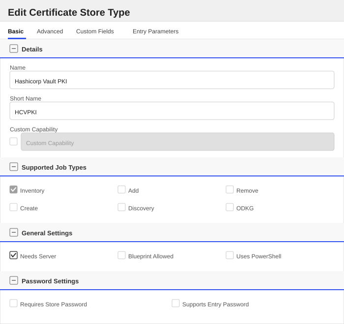

   ##### Advanced Tab
   | Attribute | Value | Description |
   | --------- | ----- | ----- |
   | Supports Custom Alias | Forbidden | Determines if an individual entry within a store can have a custom Alias. |
   | Private Key Handling | Forbidden | This determines if Keyfactor can send the private key associated with a certificate to the store. |
   | PFX Password Style | Default | 'Default' - PFX password is randomly generated, 'Custom' - PFX password may be specified when the enrollment job is created (Requires the Allow Custom Password application setting to be enabled.) |

   The Advanced tab should look like this:

   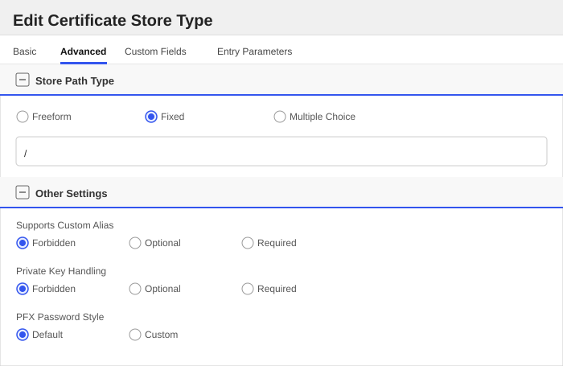

   > For Keyfactor **Command versions 24.4 and later**, a Certificate Format dropdown is available with PFX and PEM options. Ensure that **PFX** is selected, as this determines the format of new and renewed certificates sent to the Orchestrator during a Management job. Currently, all Keyfactor-supported Orchestrator extensions support only PFX.

   ##### Custom Fields Tab
   Custom fields operate at the certificate store level and are used to control how the orchestrator connects to the remote target server containing the certificate store to be managed. The following custom fields should be added to the store type:

   | Name | Display Name | Description | Type | Default Value/Options | Required |
   | ---- | ------------ | ---- | --------------------- | -------- | ----------- |
   | ServerUsername | Server Username | The base URI (and port) to the instance of Hashicorp Vault ex: https://localhost:8200 | Secret |  | ✅ Checked |
   | ServerPassword | Server Password | Vault token that will be used by the Orchestrator integration for authenticating and performing operations in the Vault instance. Required unless 'Use OAuth 2.0 (Client Credentials)' is enabled. | Secret |  | 🔲 Unchecked |
   | UseOAuth | Use OAuth 2.0 (Client Credentials) | Enables OAuth 2.0 Client Credentials authentication: the orchestrator obtains a JWT from the configured IdP (e.g. PingFederate, Microsoft Entra ID) and exchanges it for a short-lived Vault token via Vault's JWT auth method, instead of using a static 'Server Password' Vault token. | Bool | false | 🔲 Unchecked |
   | ClientId | Client ID | The OAuth 2.0 Client ID registered with your IdP. Only used when 'Use OAuth 2.0 (Client Credentials)' is enabled. | Secret |  | 🔲 Unchecked |
   | ClientSecret | Client Secret | The OAuth 2.0 Client Secret for the above Client ID. Only used when 'Use OAuth 2.0 (Client Credentials)' is enabled. | Secret |  | 🔲 Unchecked |
   | OAuthUrl | OAuth Token Endpoint | The IdP's OAuth 2.0 token endpoint URL used to obtain a JWT via the Client Credentials grant. Only used when 'Use OAuth 2.0 (Client Credentials)' is enabled. | String |  | 🔲 Unchecked |
   | Scope | OAuth Scope | Optional OAuth 2.0 scope to request from the IdP (e.g. Entra ID typically needs 'api://<app-id-uri>/.default'). Only used when 'Use OAuth 2.0 (Client Credentials)' is enabled. | String |  | 🔲 Unchecked |
   | VaultRoleName | Vault Role Name | The name of the Vault role, configured under the JWT auth mount (e.g. 'auth/jwt/role/<name>'), to authenticate against using the JWT obtained from the IdP. Only used when 'Use OAuth 2.0 (Client Credentials)' is enabled. | String |  | 🔲 Unchecked |
   | AuthMountPoint | JWT Auth Mount Point | The mount point of Vault's JWT auth method used to exchange the IdP-issued JWT for a Vault token. Only used when 'Use OAuth 2.0 (Client Credentials)' is enabled. | String | jwt/ | 🔲 Unchecked |
   | MountPoint | Mount Point | This is the mount point of the instance of the PKI or Keyfactor secrets engine plugin.  If using enterprise namespaces: <namespace>/<mount point> | String |  | ✅ Checked |
   | PassphrasePath | Passphrase Path | This is the path to the secret that contains the passphrase to the cert store file.  If empty or omitted, assume the secret is named 'passphrase' on the same level as the certificate store secret. | String |  | 🔲 Unchecked |

   The Custom Fields tab should look like this:

   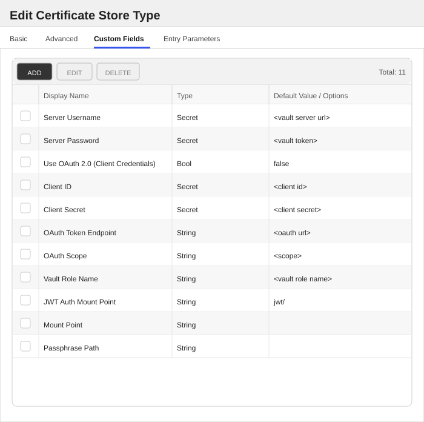

   ###### Server Username
   The base URI (and port) to the instance of Hashicorp Vault ex: https://localhost:8200


   > [!IMPORTANT]
   > This field is created by the `Needs Server` on the Basic tab, do not create this field manually.


   ###### Server Password
   Vault token that will be used by the Orchestrator integration for authenticating and performing operations in the Vault instance. Required unless 'Use OAuth 2.0 (Client Credentials)' is enabled.


   > [!IMPORTANT]
   > This field is created by the `Needs Server` on the Basic tab, do not create this field manually.


   ###### Use OAuth 2.0 (Client Credentials)
   Enables OAuth 2.0 Client Credentials authentication: the orchestrator obtains a JWT from the configured IdP (e.g. PingFederate, Microsoft Entra ID) and exchanges it for a short-lived Vault token via Vault's JWT auth method, instead of using a static 'Server Password' Vault token.

   
   


   ###### Client ID
   The OAuth 2.0 Client ID registered with your IdP. Only used when 'Use OAuth 2.0 (Client Credentials)' is enabled.

   
   


   ###### Client Secret
   The OAuth 2.0 Client Secret for the above Client ID. Only used when 'Use OAuth 2.0 (Client Credentials)' is enabled.

   
   


   ###### OAuth Token Endpoint
   The IdP's OAuth 2.0 token endpoint URL used to obtain a JWT via the Client Credentials grant. Only used when 'Use OAuth 2.0 (Client Credentials)' is enabled.

   
   


   ###### OAuth Scope
   Optional OAuth 2.0 scope to request from the IdP (e.g. Entra ID typically needs 'api://<app-id-uri>/.default'). Only used when 'Use OAuth 2.0 (Client Credentials)' is enabled.

   
   


   ###### Vault Role Name
   The name of the Vault role, configured under the JWT auth mount (e.g. 'auth/jwt/role/<name>'), to authenticate against using the JWT obtained from the IdP. Only used when 'Use OAuth 2.0 (Client Credentials)' is enabled.

   
   


   ###### JWT Auth Mount Point
   The mount point of Vault's JWT auth method used to exchange the IdP-issued JWT for a Vault token. Only used when 'Use OAuth 2.0 (Client Credentials)' is enabled.

   
   


   ###### Mount Point
   This is the mount point of the instance of the PKI or Keyfactor secrets engine plugin.  If using enterprise namespaces: <namespace>/<mount point>

   
   


   ###### Passphrase Path
   This is the path to the secret that contains the passphrase to the cert store file.  If empty or omitted, assume the secret is named 'passphrase' on the same level as the certificate store secret.

   
   


   </details>
</details>

### HCVKVPEM

<details><summary>Click to expand details</summary>

The Hashicorp Vault Key-Value PEM Certificate Store manages certificates in the PEM format that are stored in the Hashicorp Vault Key-Value secrets engine.
As of version 4.0+ of this integration, each HCVKVPEM certificate store maps to a single certificate secret (plus an optional, separate private key secret) — the same "one store, one secret" model already used by HCVKVJKS, HCVKVP12, and HCVKVPFX — rather than a folder that could contain many certificate entries across sub-paths.

> :warning: **Breaking change note for existing HCVKVPEM stores (upgrading from a version prior to 4.0):** `StorePath` used to be a folder path that could contain many certificates, optionally including sub-paths (via the now-removed `SubfolderInventory` field). It now points directly to the single secret containing the certificate. The private key, which used to live as a `private_key` property alongside `certificate` in that same secret, is now read from a separate secret referenced by the new `PrivateKeyPath` field. Existing HCVKVPEM certificate stores must be reconfigured after upgrading — there is no automatic migration.

#### Hashicorp Vault Key-Value PEM Requirements

#### Secret naming

A certificate store is comprised of one or two secret entries:
- The certificate, at the path configured in `StorePath`.
- Optionally, a secret containing the PEM-encoded private key, at the path configured in `PrivateKeyPath`. Omit `PrivateKeyPath` entirely for certificate-only stores (e.g. a CA trust chain) that have no private key — unlike the other Key-Value store types, no sibling-secret convention (such as a secret named `passphrase` at the same level) is assumed when it's omitted.

This is what allows a PEM certificate and its private key to each be created as their own secret containing a single key-value pair — useful when your secret-management tooling only supports creating secrets with a single key-value pair per secret, which the old combined-secret shape did not allow.

Additionally, we can read the certificate and/or private key from a JSON secret that contains the value on a specific property.
To indicate the property name that should be used to retrieve the value, add a "?" at the end of the path, followed by the property name.

**examples:**

StorePath = `kv-v2/mycerts/mycert_pem?certData`
> This path indicates that the secret containing the certificate is named "mycert_pem" and is a JSON secret with the `certData` property containing the PEM-formatted certificate.
>

StorePath = `kv-v2/mycerts/mycert_pem`
> This path indicates that the entire secret value is the PEM-formatted certificate.

> Generally, the paths to the certificate and private key secrets should be in the following format
> `<namespace>/<mount point>/<path-to-secret>?<json property name>`
> if namespaces are not used, that section can be omitted.

This convention applies to both `StorePath` and `PrivateKeyPath`.

#### Supported Operations

| Operation    | Is Supported |
|--------------|--------------|
| Add          | ✅ Checked |
| Remove       | ✅ Checked |
| Discovery    | ✅ Checked |
| Reenrollment | 🔲 Unchecked |
| Create       | ✅ Checked |

#### Store Type Creation

##### Using kfutil:
`kfutil` is a custom CLI for the Keyfactor Command API and can be used to create certificate store types.
For more information on [kfutil](https://github.com/Keyfactor/kfutil) check out the [docs](https://github.com/Keyfactor/kfutil?tab=readme-ov-file#quickstart)

   <details><summary>Click to expand HCVKVPEM kfutil details</summary>

   ##### Using online definition from GitHub:
   This will reach out to GitHub and pull the latest store-type definition
   ```shell
   # Hashicorp Vault Key-Value PEM
   kfutil store-types create HCVKVPEM
   ```

   ##### Offline creation using integration-manifest file:
   If required, it is possible to create store types from the [integration-manifest.json](./integration-manifest.json) included in this repo.
   You would first download the [integration-manifest.json](./integration-manifest.json) and then run the following command
   in your offline environment.
   ```shell
   kfutil store-types create --from-file integration-manifest.json
   ```
   </details>

#### Manual Creation
Below are instructions on how to create the HCVKVPEM store type manually in
the Keyfactor Command Portal

   <details><summary>Click to expand manual HCVKVPEM details</summary>

   Create a store type called `HCVKVPEM` with the attributes in the tables below:

   ##### Basic Tab
   | Attribute | Value | Description |
   | --------- | ----- | ----- |
   | Name | Hashicorp Vault Key-Value PEM | Display name for the store type (may be customized) |
   | Short Name | HCVKVPEM | Short display name for the store type |
   | Capability | HCVKVPEM | Store type name orchestrator will register with. Check the box to allow entry of value |
   | Supports Add | ✅ Checked | Indicates that the Store Type supports Management Add |
   | Supports Remove | ✅ Checked | Indicates that the Store Type supports Management Remove |
   | Supports Discovery | ✅ Checked | Indicates that the Store Type supports Discovery |
   | Supports Reenrollment | 🔲 Unchecked | Indicates that the Store Type supports Reenrollment |
   | Supports Create | ✅ Checked | Indicates that the Store Type supports store creation |
   | Needs Server | ✅ Checked | Determines if a target server name is required when creating store |
   | Blueprint Allowed | 🔲 Unchecked | Determines if store type may be included in an Orchestrator blueprint |
   | Uses PowerShell | 🔲 Unchecked | Determines if underlying implementation is PowerShell |
   | Requires Store Password | 🔲 Unchecked | Enables users to optionally specify a store password when defining a Certificate Store. |
   | Supports Entry Password | 🔲 Unchecked | Determines if an individual entry within a store can have a password. |

   The Basic tab should look like this:

   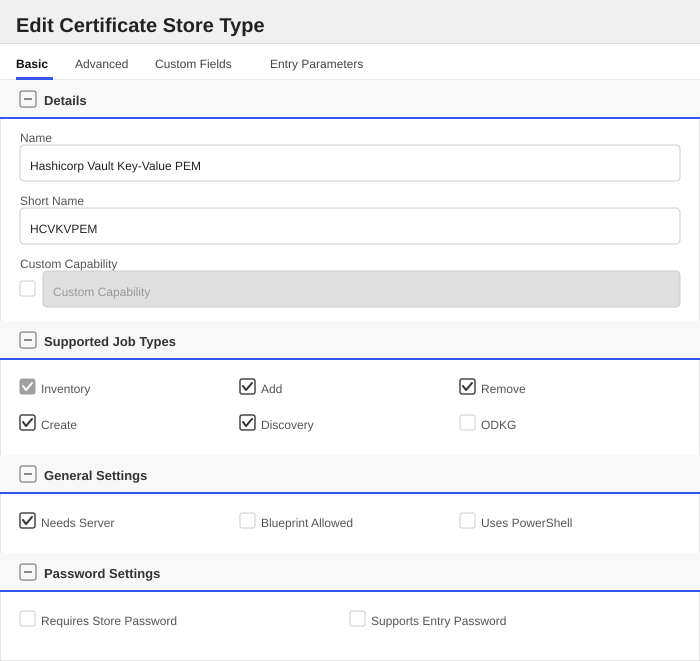

   ##### Advanced Tab
   | Attribute | Value | Description |
   | --------- | ----- | ----- |
   | Supports Custom Alias | Required | Determines if an individual entry within a store can have a custom Alias. |
   | Private Key Handling | Optional | This determines if Keyfactor can send the private key associated with a certificate to the store. |
   | PFX Password Style | Default | 'Default' - PFX password is randomly generated, 'Custom' - PFX password may be specified when the enrollment job is created (Requires the Allow Custom Password application setting to be enabled.) |

   The Advanced tab should look like this:

   

   > For Keyfactor **Command versions 24.4 and later**, a Certificate Format dropdown is available with PFX and PEM options. Ensure that **PFX** is selected, as this determines the format of new and renewed certificates sent to the Orchestrator during a Management job. Currently, all Keyfactor-supported Orchestrator extensions support only PFX.

   ##### Custom Fields Tab
   Custom fields operate at the certificate store level and are used to control how the orchestrator connects to the remote target server containing the certificate store to be managed. The following custom fields should be added to the store type:

   | Name | Display Name | Description | Type | Default Value/Options | Required |
   | ---- | ------------ | ---- | --------------------- | -------- | ----------- |
   | ServerUsername | Server Username | The base URI (and port) to the instance of Hashicorp Vault ex: https://localhost:8200 | Secret |  | ✅ Checked |
   | ServerPassword | Server Password | Vault token that will be used by the Orchestrator integration for authenticating and performing operations in the Vault instance. Required unless 'Use OAuth 2.0 (Client Credentials)' is enabled. | Secret |  | 🔲 Unchecked |
   | UseOAuth | Use OAuth 2.0 (Client Credentials) | Enables OAuth 2.0 Client Credentials authentication: the orchestrator obtains a JWT from the configured IdP (e.g. PingFederate, Microsoft Entra ID) and exchanges it for a short-lived Vault token via Vault's JWT auth method, instead of using a static 'Server Password' Vault token. | Bool | false | 🔲 Unchecked |
   | ClientId | Client ID | The OAuth 2.0 Client ID registered with your IdP. Only used when 'Use OAuth 2.0 (Client Credentials)' is enabled. | Secret |  | 🔲 Unchecked |
   | ClientSecret | Client Secret | The OAuth 2.0 Client Secret for the above Client ID. Only used when 'Use OAuth 2.0 (Client Credentials)' is enabled. | Secret |  | 🔲 Unchecked |
   | OAuthUrl | OAuth Token Endpoint | The IdP's OAuth 2.0 token endpoint URL used to obtain a JWT via the Client Credentials grant. Only used when 'Use OAuth 2.0 (Client Credentials)' is enabled. | String |  | 🔲 Unchecked |
   | Scope | OAuth Scope | Optional OAuth 2.0 scope to request from the IdP (e.g. Entra ID typically needs 'api://<app-id-uri>/.default'). Only used when 'Use OAuth 2.0 (Client Credentials)' is enabled. | String |  | 🔲 Unchecked |
   | VaultRoleName | Vault Role Name | The name of the Vault role, configured under the JWT auth mount (e.g. 'auth/jwt/role/<name>'), to authenticate against using the JWT obtained from the IdP. Only used when 'Use OAuth 2.0 (Client Credentials)' is enabled. | String |  | 🔲 Unchecked |
   | AuthMountPoint | JWT Auth Mount Point | The mount point of Vault's JWT auth method used to exchange the IdP-issued JWT for a Vault token. Only used when 'Use OAuth 2.0 (Client Credentials)' is enabled. | String | jwt/ | 🔲 Unchecked |
   | IncludeCertChain | Include Certificate Chain | Should the certificate chain be included when performing an enrollment? | Bool | false | 🔲 Unchecked |
   | MountPoint | Mount Point | The base mount point of the secrets engine.  If using Vault Namespaces, include the namespace; ie. <namespace>/<mount point> | String |  | 🔲 Unchecked |
   | PrivateKeyPath | Private Key Path | This is the path to the secret that contains the PEM-encoded private key. Optional — omit for CA trust chain / certificate-only PEM stores that have no private key. Unlike other Key-Value store types, no sibling-secret convention is assumed when this is omitted. | String |  | 🔲 Unchecked |

   The Custom Fields tab should look like this:

   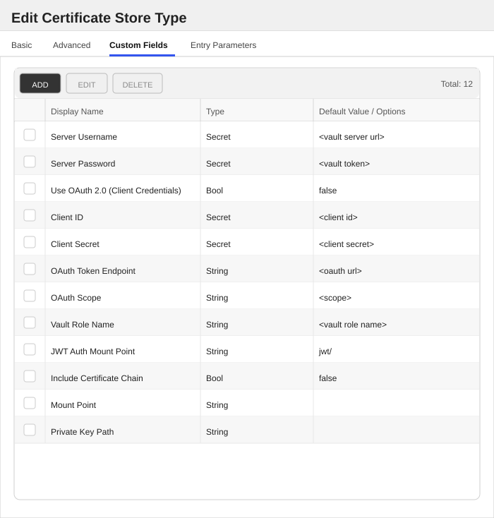

   ###### Server Username
   The base URI (and port) to the instance of Hashicorp Vault ex: https://localhost:8200


   > [!IMPORTANT]
   > This field is created by the `Needs Server` on the Basic tab, do not create this field manually.


   ###### Server Password
   Vault token that will be used by the Orchestrator integration for authenticating and performing operations in the Vault instance. Required unless 'Use OAuth 2.0 (Client Credentials)' is enabled.


   > [!IMPORTANT]
   > This field is created by the `Needs Server` on the Basic tab, do not create this field manually.


   ###### Use OAuth 2.0 (Client Credentials)
   Enables OAuth 2.0 Client Credentials authentication: the orchestrator obtains a JWT from the configured IdP (e.g. PingFederate, Microsoft Entra ID) and exchanges it for a short-lived Vault token via Vault's JWT auth method, instead of using a static 'Server Password' Vault token.

   
   


   ###### Client ID
   The OAuth 2.0 Client ID registered with your IdP. Only used when 'Use OAuth 2.0 (Client Credentials)' is enabled.

   
   


   ###### Client Secret
   The OAuth 2.0 Client Secret for the above Client ID. Only used when 'Use OAuth 2.0 (Client Credentials)' is enabled.

   
   


   ###### OAuth Token Endpoint
   The IdP's OAuth 2.0 token endpoint URL used to obtain a JWT via the Client Credentials grant. Only used when 'Use OAuth 2.0 (Client Credentials)' is enabled.

   
   


   ###### OAuth Scope
   Optional OAuth 2.0 scope to request from the IdP (e.g. Entra ID typically needs 'api://<app-id-uri>/.default'). Only used when 'Use OAuth 2.0 (Client Credentials)' is enabled.

   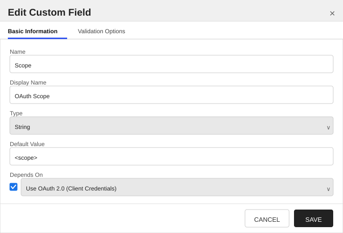
   


   ###### Vault Role Name
   The name of the Vault role, configured under the JWT auth mount (e.g. 'auth/jwt/role/<name>'), to authenticate against using the JWT obtained from the IdP. Only used when 'Use OAuth 2.0 (Client Credentials)' is enabled.

   
   


   ###### JWT Auth Mount Point
   The mount point of Vault's JWT auth method used to exchange the IdP-issued JWT for a Vault token. Only used when 'Use OAuth 2.0 (Client Credentials)' is enabled.

   
   


   ###### Include Certificate Chain
   Should the certificate chain be included when performing an enrollment?

   
   


   ###### Mount Point
   The base mount point of the secrets engine.  If using Vault Namespaces, include the namespace; ie. <namespace>/<mount point>

   
   


   ###### Private Key Path
   This is the path to the secret that contains the PEM-encoded private key. Optional — omit for CA trust chain / certificate-only PEM stores that have no private key. Unlike other Key-Value store types, no sibling-secret convention is assumed when this is omitted.

   
   


   </details>
</details>

### HCVKVJKS

<details><summary>Click to expand details</summary>

The Hashicorp Vault Key-Value JKS Certificate Store manages certificates in the JKS format that are stored in the Hashicorp Vault Key-Value secrets engine.
Each JKS file stored as a secret in the Key-Value secrets engine is treated as its own certificate store.  This file should be a valid JKS certificate store, and contain a collection of one or more certificates.
The inventory job will catalog the certificates contained within the store.  Add/Remove operations will add and remove certificates

#### Hashicorp Vault Key-Value JKS Requirements

#### Secret naming

In order to be managed by this orchestrator extension, a certificate store is comprised of two secret entries:
- The certificate with the naming convention `<certificate name>_jks`
- A secret containing the store passphrase located on the same level.  This should be named `passphrase`

This is the convention followed by the certificate store if the full path to the secret is not provided, and no passphrase path is provided.


**As of version 3.2+ of this integration, any secret name can be used, and the passphrase path can be anywhere within an accessable area of the KeyValue secrets engine.**

Additionally, we can read the certificate store and/or passphrase secret from a JSON secret that contains the value on a specific property.
The way to indicate the property name that should be used to retreive the value of the certificate store or passphrase, add a "?" at the end of the path, followed by the property name.

**examples:** 

StorePath = `kv-v2/mycerts/myjkscertstore?certData`
> This path indicates that the secret containing the certificate store data is named "myjkscertstore" and is a JSON secret with the `certData` property containing the Base64 encoded certificate store.
>

StorePath = `kv-v2/mycerts/myjkscertstore`
> This path indicates that the entire secret value is the base64 encoded certificate store

> Generally, the paths to the certificate store data and passphrase should be in the following format
> `<mount point>/<path-to-secret>?<json property name>`


This convention applies to both the Store Path and Passphrase Path.

#### Base64 encoding

Certificates should be stored in a base64 encoded format.  
One method to encode a binary certificate store is to use the following command in a windows powershell or linux/macOs terminal window:

`c:\> cat <cert store file path> | base64`

#### Supported Operations

| Operation    | Is Supported |
|--------------|--------------|
| Add          | ✅ Checked |
| Remove       | ✅ Checked |
| Discovery    | ✅ Checked |
| Reenrollment | 🔲 Unchecked |
| Create       | ✅ Checked |

#### Store Type Creation

##### Using kfutil:
`kfutil` is a custom CLI for the Keyfactor Command API and can be used to create certificate store types.
For more information on [kfutil](https://github.com/Keyfactor/kfutil) check out the [docs](https://github.com/Keyfactor/kfutil?tab=readme-ov-file#quickstart)

   <details><summary>Click to expand HCVKVJKS kfutil details</summary>

   ##### Using online definition from GitHub:
   This will reach out to GitHub and pull the latest store-type definition
   ```shell
   # Hashicorp Vault Key-Value JKS
   kfutil store-types create HCVKVJKS
   ```

   ##### Offline creation using integration-manifest file:
   If required, it is possible to create store types from the [integration-manifest.json](./integration-manifest.json) included in this repo.
   You would first download the [integration-manifest.json](./integration-manifest.json) and then run the following command
   in your offline environment.
   ```shell
   kfutil store-types create --from-file integration-manifest.json
   ```
   </details>

#### Manual Creation
Below are instructions on how to create the HCVKVJKS store type manually in
the Keyfactor Command Portal

   <details><summary>Click to expand manual HCVKVJKS details</summary>

   Create a store type called `HCVKVJKS` with the attributes in the tables below:

   ##### Basic Tab
   | Attribute | Value | Description |
   | --------- | ----- | ----- |
   | Name | Hashicorp Vault Key-Value JKS | Display name for the store type (may be customized) |
   | Short Name | HCVKVJKS | Short display name for the store type |
   | Capability | HCVKVJKS | Store type name orchestrator will register with. Check the box to allow entry of value |
   | Supports Add | ✅ Checked | Indicates that the Store Type supports Management Add |
   | Supports Remove | ✅ Checked | Indicates that the Store Type supports Management Remove |
   | Supports Discovery | ✅ Checked | Indicates that the Store Type supports Discovery |
   | Supports Reenrollment | 🔲 Unchecked | Indicates that the Store Type supports Reenrollment |
   | Supports Create | ✅ Checked | Indicates that the Store Type supports store creation |
   | Needs Server | ✅ Checked | Determines if a target server name is required when creating store |
   | Blueprint Allowed | 🔲 Unchecked | Determines if store type may be included in an Orchestrator blueprint |
   | Uses PowerShell | 🔲 Unchecked | Determines if underlying implementation is PowerShell |
   | Requires Store Password | 🔲 Unchecked | Enables users to optionally specify a store password when defining a Certificate Store. |
   | Supports Entry Password | 🔲 Unchecked | Determines if an individual entry within a store can have a password. |

   The Basic tab should look like this:

   

   ##### Advanced Tab
   | Attribute | Value | Description |
   | --------- | ----- | ----- |
   | Supports Custom Alias | Required | Determines if an individual entry within a store can have a custom Alias. |
   | Private Key Handling | Optional | This determines if Keyfactor can send the private key associated with a certificate to the store. |
   | PFX Password Style | Default | 'Default' - PFX password is randomly generated, 'Custom' - PFX password may be specified when the enrollment job is created (Requires the Allow Custom Password application setting to be enabled.) |

   The Advanced tab should look like this:

   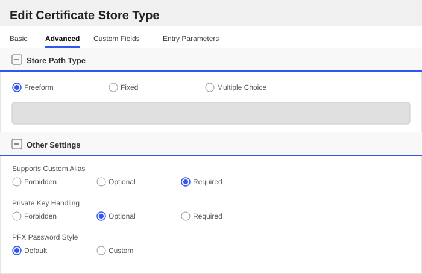

   > For Keyfactor **Command versions 24.4 and later**, a Certificate Format dropdown is available with PFX and PEM options. Ensure that **PFX** is selected, as this determines the format of new and renewed certificates sent to the Orchestrator during a Management job. Currently, all Keyfactor-supported Orchestrator extensions support only PFX.

   ##### Custom Fields Tab
   Custom fields operate at the certificate store level and are used to control how the orchestrator connects to the remote target server containing the certificate store to be managed. The following custom fields should be added to the store type:

   | Name | Display Name | Description | Type | Default Value/Options | Required |
   | ---- | ------------ | ---- | --------------------- | -------- | ----------- |
   | ServerUsername | Server Username | The base URI (and port) to the instance of Hashicorp Vault ex: https://localhost:8200 | Secret |  | ✅ Checked |
   | ServerPassword | Server Password | Vault token that will be used by the Orchestrator integration for authenticating and performing operations in the Vault instance. Required unless 'Use OAuth 2.0 (Client Credentials)' is enabled. | Secret |  | 🔲 Unchecked |
   | UseOAuth | Use OAuth 2.0 (Client Credentials) | Enables OAuth 2.0 Client Credentials authentication: the orchestrator obtains a JWT from the configured IdP (e.g. PingFederate, Microsoft Entra ID) and exchanges it for a short-lived Vault token via Vault's JWT auth method, instead of using a static 'Server Password' Vault token. | Bool | false | 🔲 Unchecked |
   | ClientId | Client ID | The OAuth 2.0 Client ID registered with your IdP. Only used when 'Use OAuth 2.0 (Client Credentials)' is enabled. | Secret |  | 🔲 Unchecked |
   | ClientSecret | Client Secret | The OAuth 2.0 Client Secret for the above Client ID. Only used when 'Use OAuth 2.0 (Client Credentials)' is enabled. | Secret |  | 🔲 Unchecked |
   | OAuthUrl | OAuth Token Endpoint | The IdP's OAuth 2.0 token endpoint URL used to obtain a JWT via the Client Credentials grant. Only used when 'Use OAuth 2.0 (Client Credentials)' is enabled. | String |  | 🔲 Unchecked |
   | Scope | OAuth Scope | Optional OAuth 2.0 scope to request from the IdP (e.g. Entra ID typically needs 'api://<app-id-uri>/.default'). Only used when 'Use OAuth 2.0 (Client Credentials)' is enabled. | String |  | 🔲 Unchecked |
   | VaultRoleName | Vault Role Name | The name of the Vault role, configured under the JWT auth mount (e.g. 'auth/jwt/role/<name>'), to authenticate against using the JWT obtained from the IdP. Only used when 'Use OAuth 2.0 (Client Credentials)' is enabled. | String |  | 🔲 Unchecked |
   | AuthMountPoint | JWT Auth Mount Point | The mount point of Vault's JWT auth method used to exchange the IdP-issued JWT for a Vault token. Only used when 'Use OAuth 2.0 (Client Credentials)' is enabled. | String | jwt/ | 🔲 Unchecked |
   | IncludeCertChain | Include Certificate Chain | Should the certificate chain be included when performing an enrollment? | Bool | false | 🔲 Unchecked |
   | MountPoint | Mount Point | The base mount point of the secrets engine.  If using Vault Namespaces, include the namespace; ie. <namespace>/<mount point> | String |  | 🔲 Unchecked |
   | PassphrasePath | Passphrase Path | This is the path to the secret that contains the passphrase to the cert store file.  If empty or omitted, assume the secret is named 'passphrase' on the same level as the certificate store secret. | String |  | 🔲 Unchecked |

   The Custom Fields tab should look like this:

   

   ###### Server Username
   The base URI (and port) to the instance of Hashicorp Vault ex: https://localhost:8200


   > [!IMPORTANT]
   > This field is created by the `Needs Server` on the Basic tab, do not create this field manually.


   ###### Server Password
   Vault token that will be used by the Orchestrator integration for authenticating and performing operations in the Vault instance. Required unless 'Use OAuth 2.0 (Client Credentials)' is enabled.


   > [!IMPORTANT]
   > This field is created by the `Needs Server` on the Basic tab, do not create this field manually.


   ###### Use OAuth 2.0 (Client Credentials)
   Enables OAuth 2.0 Client Credentials authentication: the orchestrator obtains a JWT from the configured IdP (e.g. PingFederate, Microsoft Entra ID) and exchanges it for a short-lived Vault token via Vault's JWT auth method, instead of using a static 'Server Password' Vault token.

   
   


   ###### Client ID
   The OAuth 2.0 Client ID registered with your IdP. Only used when 'Use OAuth 2.0 (Client Credentials)' is enabled.

   
   


   ###### Client Secret
   The OAuth 2.0 Client Secret for the above Client ID. Only used when 'Use OAuth 2.0 (Client Credentials)' is enabled.

   
   


   ###### OAuth Token Endpoint
   The IdP's OAuth 2.0 token endpoint URL used to obtain a JWT via the Client Credentials grant. Only used when 'Use OAuth 2.0 (Client Credentials)' is enabled.

   
   


   ###### OAuth Scope
   Optional OAuth 2.0 scope to request from the IdP (e.g. Entra ID typically needs 'api://<app-id-uri>/.default'). Only used when 'Use OAuth 2.0 (Client Credentials)' is enabled.

   
   


   ###### Vault Role Name
   The name of the Vault role, configured under the JWT auth mount (e.g. 'auth/jwt/role/<name>'), to authenticate against using the JWT obtained from the IdP. Only used when 'Use OAuth 2.0 (Client Credentials)' is enabled.

   
   


   ###### JWT Auth Mount Point
   The mount point of Vault's JWT auth method used to exchange the IdP-issued JWT for a Vault token. Only used when 'Use OAuth 2.0 (Client Credentials)' is enabled.

   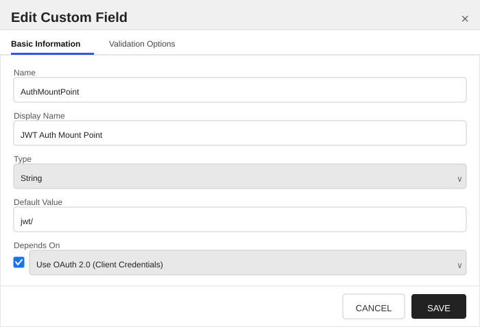
   


   ###### Include Certificate Chain
   Should the certificate chain be included when performing an enrollment?

   
   


   ###### Mount Point
   The base mount point of the secrets engine.  If using Vault Namespaces, include the namespace; ie. <namespace>/<mount point>

   
   


   ###### Passphrase Path
   This is the path to the secret that contains the passphrase to the cert store file.  If empty or omitted, assume the secret is named 'passphrase' on the same level as the certificate store secret.

   
   


   </details>
</details>

### HCVKVP12

<details><summary>Click to expand details</summary>

The Hashicorp Vault Key-Value PKCS12 Certificate Store manages certificates in the PKCS12 format that are stored in the Hashicorp Vault Key-Value secrets engine.
Each PKCS12 file stored as a secret in the Key-Value secrets engine is treated as its own certificate store.  This file should be a valid PKCS12 certificate store, and contain a collection of one or more certificates.
The inventory job will catalog the certificates contained within the store.  Add/Remove operations will add and remove certificates

#### Hashicorp Vault Key-Value PKCS12 Requirements

#### Secret naming

In ordered to be managed by this orchestrator extension, a certificate store is comprised of two secret entries:
- The certificate with the naming convention `<certificate name>_p12`
- A secret containing the store passphrase located on the same level.  This should be named `passphrase`

This is the convention followed by the certificate store if the full path to the secret is not provided, and no passphrase path is provided.


**As of version 3.2+ of this integration, any secret name can be used, and the passphrase path can be anywhere within an accessable area of the KeyValue secrets engine.**

Additionally, we can read the certificate store and/or passphrase secret from a JSON secret that contains the value on a specific property.
The way to indicate the property name that should be used to retreive the value of the certificate store or passphrase, add a "?" at the end of the path, followed by the property name.

**examples:** 

StorePath = `kv-v2/mycerts/myjkscertstore?certData`
> This path indicates that the secret containing the certificate store data is named "myjkscertstore" and is a JSON secret with the `certData` property containing the Base64 encoded certificate store.
>

StorePath = `kv-v2/mycerts/myjkscertstore`
> This path indicates that the entire secret value is the base64 encoded certificate store

> Generally, the paths to the certificate store data and passphrase should be in the following format
> `<namespace>/<mount point>/<path-to-secret>?<json property name>`
> if namespaces are not used, that section can be omitted.

This convention applies to both the Store Path and Passphrase Path.

#### Base64 encoding

Certificates should be stored in a base64 encoded format.  
One method to encode a binary certificate store is to use the following command in a windows powershell or linux/macOs terminal window:

`c:\> cat <cert store file path> | base64`

#### Supported Operations

| Operation    | Is Supported |
|--------------|--------------|
| Add          | ✅ Checked |
| Remove       | ✅ Checked |
| Discovery    | ✅ Checked |
| Reenrollment | 🔲 Unchecked |
| Create       | ✅ Checked |

#### Store Type Creation

##### Using kfutil:
`kfutil` is a custom CLI for the Keyfactor Command API and can be used to create certificate store types.
For more information on [kfutil](https://github.com/Keyfactor/kfutil) check out the [docs](https://github.com/Keyfactor/kfutil?tab=readme-ov-file#quickstart)

   <details><summary>Click to expand HCVKVP12 kfutil details</summary>

   ##### Using online definition from GitHub:
   This will reach out to GitHub and pull the latest store-type definition
   ```shell
   # Hashicorp Vault Key-Value PKCS12
   kfutil store-types create HCVKVP12
   ```

   ##### Offline creation using integration-manifest file:
   If required, it is possible to create store types from the [integration-manifest.json](./integration-manifest.json) included in this repo.
   You would first download the [integration-manifest.json](./integration-manifest.json) and then run the following command
   in your offline environment.
   ```shell
   kfutil store-types create --from-file integration-manifest.json
   ```
   </details>

#### Manual Creation
Below are instructions on how to create the HCVKVP12 store type manually in
the Keyfactor Command Portal

   <details><summary>Click to expand manual HCVKVP12 details</summary>

   Create a store type called `HCVKVP12` with the attributes in the tables below:

   ##### Basic Tab
   | Attribute | Value | Description |
   | --------- | ----- | ----- |
   | Name | Hashicorp Vault Key-Value PKCS12 | Display name for the store type (may be customized) |
   | Short Name | HCVKVP12 | Short display name for the store type |
   | Capability | HCVKVP12 | Store type name orchestrator will register with. Check the box to allow entry of value |
   | Supports Add | ✅ Checked | Indicates that the Store Type supports Management Add |
   | Supports Remove | ✅ Checked | Indicates that the Store Type supports Management Remove |
   | Supports Discovery | ✅ Checked | Indicates that the Store Type supports Discovery |
   | Supports Reenrollment | 🔲 Unchecked | Indicates that the Store Type supports Reenrollment |
   | Supports Create | ✅ Checked | Indicates that the Store Type supports store creation |
   | Needs Server | ✅ Checked | Determines if a target server name is required when creating store |
   | Blueprint Allowed | 🔲 Unchecked | Determines if store type may be included in an Orchestrator blueprint |
   | Uses PowerShell | 🔲 Unchecked | Determines if underlying implementation is PowerShell |
   | Requires Store Password | 🔲 Unchecked | Enables users to optionally specify a store password when defining a Certificate Store. |
   | Supports Entry Password | 🔲 Unchecked | Determines if an individual entry within a store can have a password. |

   The Basic tab should look like this:

   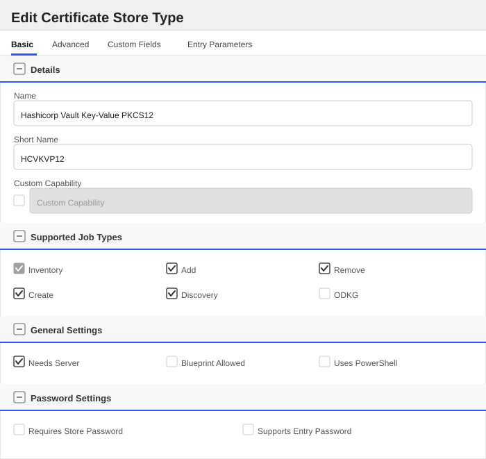

   ##### Advanced Tab
   | Attribute | Value | Description |
   | --------- | ----- | ----- |
   | Supports Custom Alias | Required | Determines if an individual entry within a store can have a custom Alias. |
   | Private Key Handling | Optional | This determines if Keyfactor can send the private key associated with a certificate to the store. |
   | PFX Password Style | Default | 'Default' - PFX password is randomly generated, 'Custom' - PFX password may be specified when the enrollment job is created (Requires the Allow Custom Password application setting to be enabled.) |

   The Advanced tab should look like this:

   

   > For Keyfactor **Command versions 24.4 and later**, a Certificate Format dropdown is available with PFX and PEM options. Ensure that **PFX** is selected, as this determines the format of new and renewed certificates sent to the Orchestrator during a Management job. Currently, all Keyfactor-supported Orchestrator extensions support only PFX.

   ##### Custom Fields Tab
   Custom fields operate at the certificate store level and are used to control how the orchestrator connects to the remote target server containing the certificate store to be managed. The following custom fields should be added to the store type:

   | Name | Display Name | Description | Type | Default Value/Options | Required |
   | ---- | ------------ | ---- | --------------------- | -------- | ----------- |
   | ServerUsername | Server Username | The base URI (and port) to the instance of Hashicorp Vault ex: https://localhost:8200 | Secret |  | ✅ Checked |
   | ServerPassword | Server Password | Vault token that will be used by the Orchestrator integration for authenticating and performing operations in the Vault instance. Required unless 'Use OAuth 2.0 (Client Credentials)' is enabled. | Secret |  | 🔲 Unchecked |
   | UseOAuth | Use OAuth 2.0 (Client Credentials) | Enables OAuth 2.0 Client Credentials authentication: the orchestrator obtains a JWT from the configured IdP (e.g. PingFederate, Microsoft Entra ID) and exchanges it for a short-lived Vault token via Vault's JWT auth method, instead of using a static 'Server Password' Vault token. | Bool | false | 🔲 Unchecked |
   | ClientId | Client ID | The OAuth 2.0 Client ID registered with your IdP. Only used when 'Use OAuth 2.0 (Client Credentials)' is enabled. | Secret |  | 🔲 Unchecked |
   | ClientSecret | Client Secret | The OAuth 2.0 Client Secret for the above Client ID. Only used when 'Use OAuth 2.0 (Client Credentials)' is enabled. | Secret |  | 🔲 Unchecked |
   | OAuthUrl | OAuth Token Endpoint | The IdP's OAuth 2.0 token endpoint URL used to obtain a JWT via the Client Credentials grant. Only used when 'Use OAuth 2.0 (Client Credentials)' is enabled. | String |  | 🔲 Unchecked |
   | Scope | OAuth Scope | Optional OAuth 2.0 scope to request from the IdP (e.g. Entra ID typically needs 'api://<app-id-uri>/.default'). Only used when 'Use OAuth 2.0 (Client Credentials)' is enabled. | String |  | 🔲 Unchecked |
   | VaultRoleName | Vault Role Name | The name of the Vault role, configured under the JWT auth mount (e.g. 'auth/jwt/role/<name>'), to authenticate against using the JWT obtained from the IdP. Only used when 'Use OAuth 2.0 (Client Credentials)' is enabled. | String |  | 🔲 Unchecked |
   | AuthMountPoint | JWT Auth Mount Point | The mount point of Vault's JWT auth method used to exchange the IdP-issued JWT for a Vault token. Only used when 'Use OAuth 2.0 (Client Credentials)' is enabled. | String | jwt/ | 🔲 Unchecked |
   | IncludeCertChain | Include Certificate Chain | Should the certificate chain be included when performing an enrollment? | Bool | false | 🔲 Unchecked |
   | MountPoint | Mount Point | The base mount point of the secrets engine.  If using Vault Namespaces, include the namespace; ie. <namespace>/<mount point> | String |  | 🔲 Unchecked |
   | PassphrasePath | Passphrase Path | This is the path to the secret that contains the passphrase to the cert store file.  If empty or omitted, assume the secret is named 'passphrase' on the same level as the certificate store secret. | String |  | 🔲 Unchecked |

   The Custom Fields tab should look like this:

   

   ###### Server Username
   The base URI (and port) to the instance of Hashicorp Vault ex: https://localhost:8200


   > [!IMPORTANT]
   > This field is created by the `Needs Server` on the Basic tab, do not create this field manually.


   ###### Server Password
   Vault token that will be used by the Orchestrator integration for authenticating and performing operations in the Vault instance. Required unless 'Use OAuth 2.0 (Client Credentials)' is enabled.


   > [!IMPORTANT]
   > This field is created by the `Needs Server` on the Basic tab, do not create this field manually.


   ###### Use OAuth 2.0 (Client Credentials)
   Enables OAuth 2.0 Client Credentials authentication: the orchestrator obtains a JWT from the configured IdP (e.g. PingFederate, Microsoft Entra ID) and exchanges it for a short-lived Vault token via Vault's JWT auth method, instead of using a static 'Server Password' Vault token.

   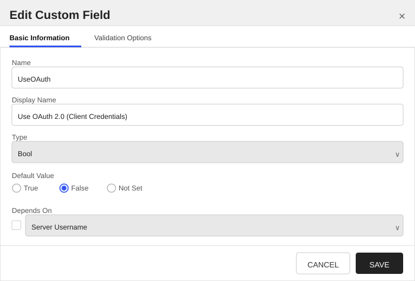
   


   ###### Client ID
   The OAuth 2.0 Client ID registered with your IdP. Only used when 'Use OAuth 2.0 (Client Credentials)' is enabled.

   
   


   ###### Client Secret
   The OAuth 2.0 Client Secret for the above Client ID. Only used when 'Use OAuth 2.0 (Client Credentials)' is enabled.

   
   


   ###### OAuth Token Endpoint
   The IdP's OAuth 2.0 token endpoint URL used to obtain a JWT via the Client Credentials grant. Only used when 'Use OAuth 2.0 (Client Credentials)' is enabled.

   
   


   ###### OAuth Scope
   Optional OAuth 2.0 scope to request from the IdP (e.g. Entra ID typically needs 'api://<app-id-uri>/.default'). Only used when 'Use OAuth 2.0 (Client Credentials)' is enabled.

   
   


   ###### Vault Role Name
   The name of the Vault role, configured under the JWT auth mount (e.g. 'auth/jwt/role/<name>'), to authenticate against using the JWT obtained from the IdP. Only used when 'Use OAuth 2.0 (Client Credentials)' is enabled.

   
   


   ###### JWT Auth Mount Point
   The mount point of Vault's JWT auth method used to exchange the IdP-issued JWT for a Vault token. Only used when 'Use OAuth 2.0 (Client Credentials)' is enabled.

   
   


   ###### Include Certificate Chain
   Should the certificate chain be included when performing an enrollment?

   
   


   ###### Mount Point
   The base mount point of the secrets engine.  If using Vault Namespaces, include the namespace; ie. <namespace>/<mount point>

   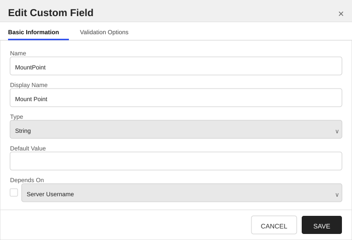
   


   ###### Passphrase Path
   This is the path to the secret that contains the passphrase to the cert store file.  If empty or omitted, assume the secret is named 'passphrase' on the same level as the certificate store secret.

   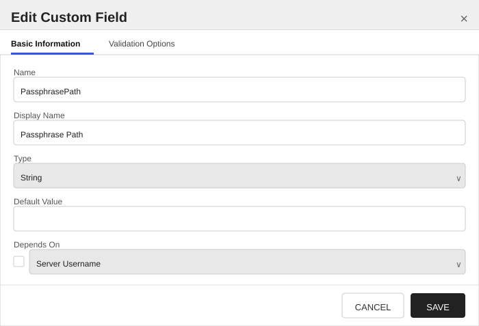
   


   </details>
</details>

### HCVKVPFX

<details><summary>Click to expand details</summary>

The Hashicorp Vault Key-Value PFX Certificate Store manages certificates in the PFX format that are stored in the Hashicorp Vault Key-Value secrets engine.
Each PFX file stored as a secret in the Key-Value secrets engine is treated as its own certificate store.  This file should be a valid PFX certificate store, and contain a collection of one or more certificates.
The inventory job will catalog the certificates contained within the store.  Add/Remove operations will add and remove certificates

#### Hashicorp Vault Key-Value PFX Requirements

#### Secret naming

In ordered to be managed by this orchestrator extension, a certificate store is comprised of two secret entries:
- The certificate with the naming convention `<certificate name>_pfx`
- A secret containing the store passphrase located on the same level.  This should be named `passphrase`

This is the convention followed by the certificate store if the full path to the secret is not provided, and no passphrase path is provided.

**As of version 3.2+ of this integration, any secret name can be used, and the passphrase path can be anywhere within an accessable area of the KeyValue secrets engine.**

Additionally, we can read the certificate store and/or passphrase secret from a JSON secret that contains the value on a specific property.
The way to indicate the property name that should be used to retreive the value of the certificate store or passphrase, add a "?" at the end of the path, followed by the property name.

**examples:** 

StorePath = `kv-v2/mycerts/myjkscertstore?certData`
> This path indicates that the secret containing the certificate store data is named "myjkscertstore" and is a JSON secret with the `certData` property containing the Base64 encoded certificate store.
>

StorePath = `kv-v2/mycerts/myjkscertstore`
> This path indicates that the entire secret value is the base64 encoded certificate store

> Generally, the paths to the certificate store data and passphrase should be in the following format
> `<namespace>/<mount point>/<path-to-secret>?<json property name>`
> if namespaces are not used, that section can be omitted.

This convention applies to both the Store Path and Passphrase Path.

#### Base64 encoding

Certificates should be stored in a base64 encoded format.  
One method to encode a binary certificate store is to use the following command in a windows powershell or linux/macOs terminal window:

`c:\> cat <cert store file path> | base64`

#### Supported Operations

| Operation    | Is Supported |
|--------------|--------------|
| Add          | ✅ Checked |
| Remove       | ✅ Checked |
| Discovery    | ✅ Checked |
| Reenrollment | 🔲 Unchecked |
| Create       | ✅ Checked |

#### Store Type Creation

##### Using kfutil:
`kfutil` is a custom CLI for the Keyfactor Command API and can be used to create certificate store types.
For more information on [kfutil](https://github.com/Keyfactor/kfutil) check out the [docs](https://github.com/Keyfactor/kfutil?tab=readme-ov-file#quickstart)

   <details><summary>Click to expand HCVKVPFX kfutil details</summary>

   ##### Using online definition from GitHub:
   This will reach out to GitHub and pull the latest store-type definition
   ```shell
   # Hashicorp Vault Key-Value PFX
   kfutil store-types create HCVKVPFX
   ```

   ##### Offline creation using integration-manifest file:
   If required, it is possible to create store types from the [integration-manifest.json](./integration-manifest.json) included in this repo.
   You would first download the [integration-manifest.json](./integration-manifest.json) and then run the following command
   in your offline environment.
   ```shell
   kfutil store-types create --from-file integration-manifest.json
   ```
   </details>

#### Manual Creation
Below are instructions on how to create the HCVKVPFX store type manually in
the Keyfactor Command Portal

   <details><summary>Click to expand manual HCVKVPFX details</summary>

   Create a store type called `HCVKVPFX` with the attributes in the tables below:

   ##### Basic Tab
   | Attribute | Value | Description |
   | --------- | ----- | ----- |
   | Name | Hashicorp Vault Key-Value PFX | Display name for the store type (may be customized) |
   | Short Name | HCVKVPFX | Short display name for the store type |
   | Capability | HCVKVPFX | Store type name orchestrator will register with. Check the box to allow entry of value |
   | Supports Add | ✅ Checked | Indicates that the Store Type supports Management Add |
   | Supports Remove | ✅ Checked | Indicates that the Store Type supports Management Remove |
   | Supports Discovery | ✅ Checked | Indicates that the Store Type supports Discovery |
   | Supports Reenrollment | 🔲 Unchecked | Indicates that the Store Type supports Reenrollment |
   | Supports Create | ✅ Checked | Indicates that the Store Type supports store creation |
   | Needs Server | ✅ Checked | Determines if a target server name is required when creating store |
   | Blueprint Allowed | 🔲 Unchecked | Determines if store type may be included in an Orchestrator blueprint |
   | Uses PowerShell | 🔲 Unchecked | Determines if underlying implementation is PowerShell |
   | Requires Store Password | 🔲 Unchecked | Enables users to optionally specify a store password when defining a Certificate Store. |
   | Supports Entry Password | 🔲 Unchecked | Determines if an individual entry within a store can have a password. |

   The Basic tab should look like this:

   

   ##### Advanced Tab
   | Attribute | Value | Description |
   | --------- | ----- | ----- |
   | Supports Custom Alias | Required | Determines if an individual entry within a store can have a custom Alias. |
   | Private Key Handling | Optional | This determines if Keyfactor can send the private key associated with a certificate to the store. |
   | PFX Password Style | Default | 'Default' - PFX password is randomly generated, 'Custom' - PFX password may be specified when the enrollment job is created (Requires the Allow Custom Password application setting to be enabled.) |

   The Advanced tab should look like this:

   

   > For Keyfactor **Command versions 24.4 and later**, a Certificate Format dropdown is available with PFX and PEM options. Ensure that **PFX** is selected, as this determines the format of new and renewed certificates sent to the Orchestrator during a Management job. Currently, all Keyfactor-supported Orchestrator extensions support only PFX.

   ##### Custom Fields Tab
   Custom fields operate at the certificate store level and are used to control how the orchestrator connects to the remote target server containing the certificate store to be managed. The following custom fields should be added to the store type:

   | Name | Display Name | Description | Type | Default Value/Options | Required |
   | ---- | ------------ | ---- | --------------------- | -------- | ----------- |
   | ServerUsername | Server Username | The base URI (and port) to the instance of Hashicorp Vault ex: https://localhost:8200 | Secret |  | ✅ Checked |
   | ServerPassword | Server Password | Vault token that will be used by the Orchestrator integration for authenticating and performing operations in the Vault instance. Required unless 'Use OAuth 2.0 (Client Credentials)' is enabled. | Secret |  | 🔲 Unchecked |
   | UseOAuth | Use OAuth 2.0 (Client Credentials) | Enables OAuth 2.0 Client Credentials authentication: the orchestrator obtains a JWT from the configured IdP (e.g. PingFederate, Microsoft Entra ID) and exchanges it for a short-lived Vault token via Vault's JWT auth method, instead of using a static 'Server Password' Vault token. | Bool | false | 🔲 Unchecked |
   | ClientId | Client ID | The OAuth 2.0 Client ID registered with your IdP. Only used when 'Use OAuth 2.0 (Client Credentials)' is enabled. | Secret |  | 🔲 Unchecked |
   | ClientSecret | Client Secret | The OAuth 2.0 Client Secret for the above Client ID. Only used when 'Use OAuth 2.0 (Client Credentials)' is enabled. | Secret |  | 🔲 Unchecked |
   | OAuthUrl | OAuth Token Endpoint | The IdP's OAuth 2.0 token endpoint URL used to obtain a JWT via the Client Credentials grant. Only used when 'Use OAuth 2.0 (Client Credentials)' is enabled. | String |  | 🔲 Unchecked |
   | Scope | OAuth Scope | Optional OAuth 2.0 scope to request from the IdP (e.g. Entra ID typically needs 'api://<app-id-uri>/.default'). Only used when 'Use OAuth 2.0 (Client Credentials)' is enabled. | String |  | 🔲 Unchecked |
   | VaultRoleName | Vault Role Name | The name of the Vault role, configured under the JWT auth mount (e.g. 'auth/jwt/role/<name>'), to authenticate against using the JWT obtained from the IdP. Only used when 'Use OAuth 2.0 (Client Credentials)' is enabled. | String |  | 🔲 Unchecked |
   | AuthMountPoint | JWT Auth Mount Point | The mount point of Vault's JWT auth method used to exchange the IdP-issued JWT for a Vault token. Only used when 'Use OAuth 2.0 (Client Credentials)' is enabled. | String | jwt/ | 🔲 Unchecked |
   | IncludeCertChain | Include Certificate Chain | Should the certificate chain be included when performing an enrollment? | Bool | false | 🔲 Unchecked |
   | MountPoint | Mount Point | The base mount point of the secrets engine.  If using Vault Namespaces, include the namespace; ie. <namespace>/<mount point> | String |  | 🔲 Unchecked |
   | PassphrasePath | Passphrase Path | This is the path to the secret that contains the passphrase to the cert store file.  If empty or omitted, assume the secret is named 'passphrase' on the same level as the certificate store secret. | String |  | 🔲 Unchecked |

   The Custom Fields tab should look like this:

   

   ###### Server Username
   The base URI (and port) to the instance of Hashicorp Vault ex: https://localhost:8200


   > [!IMPORTANT]
   > This field is created by the `Needs Server` on the Basic tab, do not create this field manually.


   ###### Server Password
   Vault token that will be used by the Orchestrator integration for authenticating and performing operations in the Vault instance. Required unless 'Use OAuth 2.0 (Client Credentials)' is enabled.


   > [!IMPORTANT]
   > This field is created by the `Needs Server` on the Basic tab, do not create this field manually.


   ###### Use OAuth 2.0 (Client Credentials)
   Enables OAuth 2.0 Client Credentials authentication: the orchestrator obtains a JWT from the configured IdP (e.g. PingFederate, Microsoft Entra ID) and exchanges it for a short-lived Vault token via Vault's JWT auth method, instead of using a static 'Server Password' Vault token.

   
   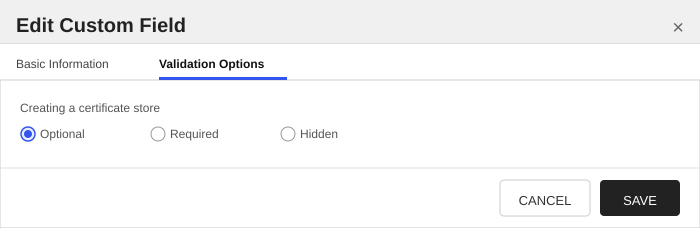


   ###### Client ID
   The OAuth 2.0 Client ID registered with your IdP. Only used when 'Use OAuth 2.0 (Client Credentials)' is enabled.

   
   


   ###### Client Secret
   The OAuth 2.0 Client Secret for the above Client ID. Only used when 'Use OAuth 2.0 (Client Credentials)' is enabled.

   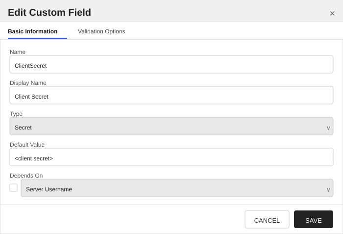
   


   ###### OAuth Token Endpoint
   The IdP's OAuth 2.0 token endpoint URL used to obtain a JWT via the Client Credentials grant. Only used when 'Use OAuth 2.0 (Client Credentials)' is enabled.

   
   


   ###### OAuth Scope
   Optional OAuth 2.0 scope to request from the IdP (e.g. Entra ID typically needs 'api://<app-id-uri>/.default'). Only used when 'Use OAuth 2.0 (Client Credentials)' is enabled.

   
   


   ###### Vault Role Name
   The name of the Vault role, configured under the JWT auth mount (e.g. 'auth/jwt/role/<name>'), to authenticate against using the JWT obtained from the IdP. Only used when 'Use OAuth 2.0 (Client Credentials)' is enabled.

   
   


   ###### JWT Auth Mount Point
   The mount point of Vault's JWT auth method used to exchange the IdP-issued JWT for a Vault token. Only used when 'Use OAuth 2.0 (Client Credentials)' is enabled.

   
   


   ###### Include Certificate Chain
   Should the certificate chain be included when performing an enrollment?

   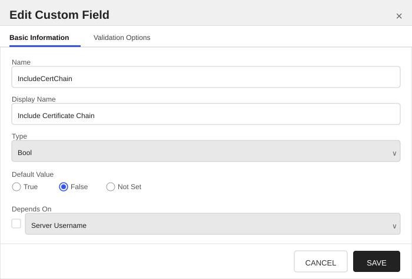
   


   ###### Mount Point
   The base mount point of the secrets engine.  If using Vault Namespaces, include the namespace; ie. <namespace>/<mount point>

   
   


   ###### Passphrase Path
   This is the path to the secret that contains the passphrase to the cert store file.  If empty or omitted, assume the secret is named 'passphrase' on the same level as the certificate store secret.

   
   


   </details>
</details>


## Installation

1. **Download the latest Hashicorp Vault Universal Orchestrator extension from GitHub.**

    Navigate to the [Hashicorp Vault Universal Orchestrator extension GitHub version page](https://github.com/Keyfactor/hashicorp-vault-orchestrator/releases/latest). Refer to the compatibility matrix below to determine which asset should be downloaded. Then, click the corresponding asset to download the zip archive.

   | Universal Orchestrator Version | Latest .NET version installed on the Universal Orchestrator server | `rollForward` condition in `Orchestrator.runtimeconfig.json` | `hashicorp-vault-orchestrator` .NET version to download |
   | --------- | ----------- | ----------- | ----------- |
   | Older than `11.0.0` | | | `net6.0` |
   | Between `11.0.0` and `11.5.1` (inclusive) | `net6.0` | | `net6.0` |
   | Between `11.0.0` and `11.5.1` (inclusive) | `net8.0` | `Disable` | `net6.0` |
   | Between `11.0.0` and `11.5.1` (inclusive) | `net8.0` | `LatestMajor` | `net8.0` |
   | `11.6` _and_ newer | `net8.0` | | `net8.0` |
   | `25.5` _and_ newer | `net10.0` | | `net10.0` |

    Unzip the archive containing extension assemblies to a known location.

    > **Note** If you don't see an asset with a corresponding .NET version, you should always assume that it was compiled for `net10.0`.

2. **Locate the Universal Orchestrator extensions directory.**

    * **Default on Windows** - `C:\Program Files\Keyfactor\Keyfactor Orchestrator\extensions`
    * **Default on Linux** - `/opt/keyfactor/orchestrator/extensions`

3. **Create a new directory for the Hashicorp Vault Universal Orchestrator extension inside the extensions directory.**

    Create a new directory called `hashicorp-vault-orchestrator`.
    > The directory name does not need to match any names used elsewhere; it just has to be unique within the extensions directory.

4. **Copy the contents of the downloaded and unzipped assemblies from __step 2__ to the `hashicorp-vault-orchestrator` directory.**

5. **Restart the Universal Orchestrator service.**

    Refer to [Starting/Restarting the Universal Orchestrator service](https://software.keyfactor.com/Core-OnPrem/Current/Content/InstallingAgents/NetCoreOrchestrator/StarttheService.htm).

6. **(optional) PAM Integration**

    The Hashicorp Vault Universal Orchestrator extension is compatible with all supported Keyfactor PAM extensions to resolve PAM-eligible secrets. PAM extensions running on Universal Orchestrators enable secure retrieval of secrets from a connected PAM provider.

    To configure a PAM provider, [reference the Keyfactor Integration Catalog](https://keyfactor.github.io/integrations-catalog/content/pam) to select an extension and follow the associated instructions to install it on the Universal Orchestrator (remote).

> The above installation steps can be supplemented by the [official Command documentation](https://software.keyfactor.com/Core-OnPrem/Current/Content/InstallingAgents/NetCoreOrchestrator/CustomExtensions.htm?Highlight=extensions).

## Post Installation

### Enroll a certificate via the platform
> Enrollment via the platform is supported by one of the Key-Value store types (HCVKV***).  Only inventory is supported for HCVPKI.

After following the steps to create the store type and certificate store in the Keyfactor Command platform you can enroll a certificate and store it in Vault using the plugin.

1. Navigate to `Enrollment > PFX Enrollment` from the main menu.
1. Fill in some values for the new certificate, then select the "Install into certificate stores" radio button.


1. Select the certificate store we created


1. **Be sure to fill out the Alias!**  This will be the key used to reference the cert in the KeyValue secrets engine.
1. Click "Enroll"

### Vault CLI verification

1. Open a terminal window on the Vault host.

- Make sure the vault is unsealed first

1. Type `vault kv list kv/cert-store` (where "kv/cert-store" is `<mount point>/<store path>`)

- You should see the alias of the newly enrolled certificate


1. To view the details of the certificate, run the command:

- `vault kv get kv/cert-store/testcert.kftrain.lab` where `testcert.kftrain.lab` is the alias you provided.
- You should see the values output in the terminal window


## Defining Certificate Stores

The Hashicorp Vault Universal Orchestrator extension implements 5 Certificate Store Types, each of which implements different functionality. Refer to the individual instructions below for each Certificate Store Type that you deemed necessary for your use case from the installation section.

<details><summary>Hashicorp Vault PKI (HCVPKI)</summary>

### Store Creation

#### Manually with the Command UI

<details><summary>Click to expand details</summary>

1. **Navigate to the _Certificate Stores_ page in Keyfactor Command.**

    Log into Keyfactor Command, toggle the _Locations_ dropdown, and click _Certificate Stores_.

2. **Add a Certificate Store.**

    Click the Add button to add a new Certificate Store. Use the table below to populate the **Attributes** in the **Add** form.

   | Attribute | Description |
   | --------- | ----------- |
   | Category | Select "Hashicorp Vault PKI" or the customized certificate store name from the previous step. |
   | Container | Optional container to associate certificate store with. |
   | Client Machine | This can be any value to help uniquely identify the store.  It is not used by this integration. |
   | Store Path | For HCVPKI, this will be '/' |
   | Store Password | Vault token that will be used for authenticating |
   | Orchestrator | Select an approved orchestrator capable of managing `HCVPKI` certificates. Specifically, one with the `HCVPKI` capability. |
   | ServerUsername | The base URI (and port) to the instance of Hashicorp Vault ex: https://localhost:8200 |
   | ServerPassword | Vault token that will be used by the Orchestrator integration for authenticating and performing operations in the Vault instance. Required unless 'Use OAuth 2.0 (Client Credentials)' is enabled. |
   | UseOAuth | Enables OAuth 2.0 Client Credentials authentication: the orchestrator obtains a JWT from the configured IdP (e.g. PingFederate, Microsoft Entra ID) and exchanges it for a short-lived Vault token via Vault's JWT auth method, instead of using a static 'Server Password' Vault token. |
   | ClientId | The OAuth 2.0 Client ID registered with your IdP. Only used when 'Use OAuth 2.0 (Client Credentials)' is enabled. |
   | ClientSecret | The OAuth 2.0 Client Secret for the above Client ID. Only used when 'Use OAuth 2.0 (Client Credentials)' is enabled. |
   | OAuthUrl | The IdP's OAuth 2.0 token endpoint URL used to obtain a JWT via the Client Credentials grant. Only used when 'Use OAuth 2.0 (Client Credentials)' is enabled. |
   | Scope | Optional OAuth 2.0 scope to request from the IdP (e.g. Entra ID typically needs 'api://<app-id-uri>/.default'). Only used when 'Use OAuth 2.0 (Client Credentials)' is enabled. |
   | VaultRoleName | The name of the Vault role, configured under the JWT auth mount (e.g. 'auth/jwt/role/<name>'), to authenticate against using the JWT obtained from the IdP. Only used when 'Use OAuth 2.0 (Client Credentials)' is enabled. |
   | AuthMountPoint | The mount point of Vault's JWT auth method used to exchange the IdP-issued JWT for a Vault token. Only used when 'Use OAuth 2.0 (Client Credentials)' is enabled. |
   | MountPoint | This is the mount point of the instance of the PKI or Keyfactor secrets engine plugin.  If using enterprise namespaces: <namespace>/<mount point> |
   | PassphrasePath | This is the path to the secret that contains the passphrase to the cert store file.  If empty or omitted, assume the secret is named 'passphrase' on the same level as the certificate store secret. |

</details>

#### Using kfutil CLI

<details><summary>Click to expand details</summary>

1. **Generate a CSV template for the HCVPKI certificate store**

    ```shell
    kfutil stores import generate-template --store-type-name HCVPKI --outpath HCVPKI.csv
    ```
2. **Populate the generated CSV file**

    Open the CSV file, and reference the table below to populate parameters for each **Attribute**.

   | Attribute | Description |
   | --------- | ----------- |
   | Category | Select "Hashicorp Vault PKI" or the customized certificate store name from the previous step. |
   | Container | Optional container to associate certificate store with. |
   | Client Machine | This can be any value to help uniquely identify the store.  It is not used by this integration. |
   | Store Path | For HCVPKI, this will be '/' |
   | Store Password | Vault token that will be used for authenticating |
   | Orchestrator | Select an approved orchestrator capable of managing `HCVPKI` certificates. Specifically, one with the `HCVPKI` capability. |
   | Properties.ServerUsername | The base URI (and port) to the instance of Hashicorp Vault ex: https://localhost:8200 |
   | Properties.ServerPassword | Vault token that will be used by the Orchestrator integration for authenticating and performing operations in the Vault instance. Required unless 'Use OAuth 2.0 (Client Credentials)' is enabled. |
   | Properties.UseOAuth | Enables OAuth 2.0 Client Credentials authentication: the orchestrator obtains a JWT from the configured IdP (e.g. PingFederate, Microsoft Entra ID) and exchanges it for a short-lived Vault token via Vault's JWT auth method, instead of using a static 'Server Password' Vault token. |
   | Properties.ClientId | The OAuth 2.0 Client ID registered with your IdP. Only used when 'Use OAuth 2.0 (Client Credentials)' is enabled. |
   | Properties.ClientSecret | The OAuth 2.0 Client Secret for the above Client ID. Only used when 'Use OAuth 2.0 (Client Credentials)' is enabled. |
   | Properties.OAuthUrl | The IdP's OAuth 2.0 token endpoint URL used to obtain a JWT via the Client Credentials grant. Only used when 'Use OAuth 2.0 (Client Credentials)' is enabled. |
   | Properties.Scope | Optional OAuth 2.0 scope to request from the IdP (e.g. Entra ID typically needs 'api://<app-id-uri>/.default'). Only used when 'Use OAuth 2.0 (Client Credentials)' is enabled. |
   | Properties.VaultRoleName | The name of the Vault role, configured under the JWT auth mount (e.g. 'auth/jwt/role/<name>'), to authenticate against using the JWT obtained from the IdP. Only used when 'Use OAuth 2.0 (Client Credentials)' is enabled. |
   | Properties.AuthMountPoint | The mount point of Vault's JWT auth method used to exchange the IdP-issued JWT for a Vault token. Only used when 'Use OAuth 2.0 (Client Credentials)' is enabled. |
   | Properties.MountPoint | This is the mount point of the instance of the PKI or Keyfactor secrets engine plugin.  If using enterprise namespaces: <namespace>/<mount point> |
   | Properties.PassphrasePath | This is the path to the secret that contains the passphrase to the cert store file.  If empty or omitted, assume the secret is named 'passphrase' on the same level as the certificate store secret. |

3. **Import the CSV file to create the certificate stores**

    ```shell
    kfutil stores import csv --store-type-name HCVPKI --file HCVPKI.csv
    ```

</details>

#### PAM Provider Eligible Fields
<details><summary>Attributes eligible for retrieval by a PAM Provider on the Universal Orchestrator</summary>

If a PAM provider was installed _on the Universal Orchestrator_ in the [Installation](#Installation) section, the following parameters can be configured for retrieval _on the Universal Orchestrator_.

   | Attribute | Description |
   | --------- | ----------- |
   | ServerUsername | The base URI (and port) to the instance of Hashicorp Vault ex: https://localhost:8200 |
   | ServerPassword | Vault token that will be used by the Orchestrator integration for authenticating and performing operations in the Vault instance. Required unless 'Use OAuth 2.0 (Client Credentials)' is enabled. |
   | ClientId | The OAuth 2.0 Client ID registered with your IdP. Only used when 'Use OAuth 2.0 (Client Credentials)' is enabled. |
   | ClientSecret | The OAuth 2.0 Client Secret for the above Client ID. Only used when 'Use OAuth 2.0 (Client Credentials)' is enabled. |

Please refer to the **Universal Orchestrator (remote)** usage section ([PAM providers on the Keyfactor Integration Catalog](https://keyfactor.github.io/integrations-catalog/content/pam)) for your selected PAM provider for instructions on how to load attributes orchestrator-side.
> Any secret can be rendered by a PAM provider _installed on the Keyfactor Command server_. The above parameters are specific to attributes that can be fetched by an installed PAM provider running on the Universal Orchestrator server itself.

</details>

> The content in this section can be supplemented by the [official Command documentation](https://software.keyfactor.com/Core-OnPrem/Current/Content/ReferenceGuide/Certificate%20Stores.htm?Highlight=certificate%20store).

### The Hashicorp PKI and Keyfactor Plugin secrets engines

Both the [Hashicorp PKI](https://developer.hashicorp.com/vault/api-docs/secret/pki) and [Keyfactor Secrets](https://github.com/Keyfactor/hashicorp-vault-secretsengine) Engine plugins are designed to allow managing certifications directly on the Hashicorp Vault instance.
The store type for the PKI and/or the Keyfactor secrets engine is the same; `HCVPKI`.

[View the repository on Github](https://github.com/Keyfactor/hashicorp-vault-secretsengine) for more information about the Hashicorp Vault Keyfactor Secrets Engine plugin.

[View the Hashicorp documentation](https://developer.hashicorp.com/vault/api-docs/secret/pki) for more information on the Hashicorp Vault PKI Secrets Engine

### Configuration in Keyfactor Command

##### Add the Store Type

- Add a new Certificate Store Type via the Command User Interface
  - Log into Keyfactor as Administrator or a user with permissions to add certificate store types.
  - Click on the gear icon in the top right and then navigate to the "Certificate Store Types"
  - Click "Add" and enter the following information on the first tab:


- **Name:** "Hashicorp Vault PKI" (or another preferred name)
- **Short Name:** "HCVPKI"
- **Supported Job Types:** "Inventory"
- **Needs Server** - should be checked (true).

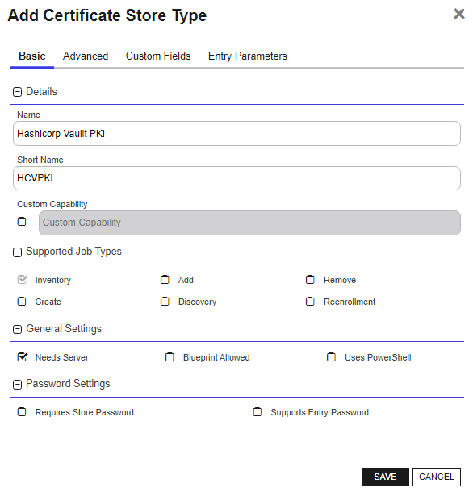

- Set the following values on the "Advanced" tab:
  - **Store Path Type** - "Fixed"
  - **_Value_** - "/"
    - The cert store inventories all certificates in the PKI or Keyfactor secrets engine, so we set it to the root path
  - **Supports Custom Alias** - "Optional"
  - **Private Key Handling** - "Optional"

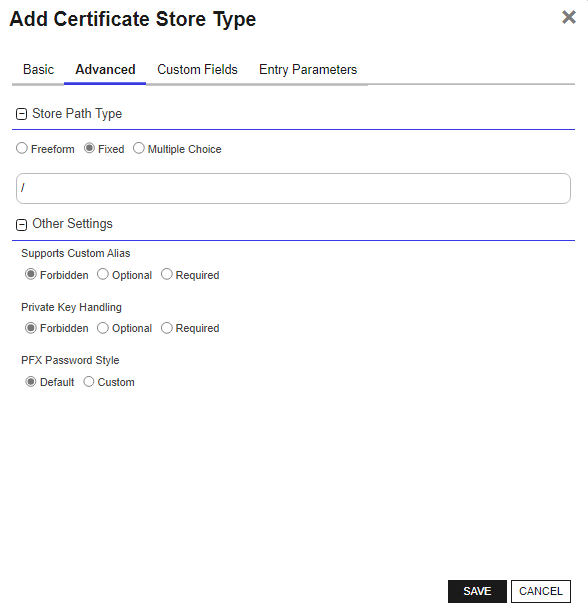

- Click the "Custom Fields" tab to add the following field:
  - **MountPoint** - type: *string*
  


- Click **Save** to save the new Store Type.

1. Add the Hashicorp Vault Certificate Store

- Navigate to **Locations** > **Certificate Stores** from the main menu
- Click **ADD** to open the new Certificate Store Dialog

##### Add the Certificate Store

In Keyfactor Command create a new Certificate Store similar to the one below:


- **Client Machine** - Enter an identifier for the client machine.  This could be the Orchestrator host name, or anything else useful.  This value is not used by the extension.
- **Store Path** - defaults to "/"  
- **Mount Point** - This is the mount point name for the instance of the PKI or Keyfactor secrets engine plugin.
  - If using the PKI plugin, the default in Hashicorp is "pki".  If using the Keyfactor plugin, the default is "keyfactor".
  - It is possible to have multiple instances of the Keyfactor plugin running simultaneously, so be sure this corresponds to the one you would like to manage.

##### Set the server username and password (values hidden)

- The **SERVER USERNAME** should be the full URL to the instance of Vault that will be accessible by the orchestrator. (example: `http://127.0.0.1:8200`)
- The **SERVER PASSWORD** should be the Vault token that will be used for authenticating.

At this point, the certificate store should be created and ready to peform inventory on your certificates stored via the Keyfactor or PKI secrets engine plugin for Hashicorp Vault.

</details>

<details><summary>Hashicorp Vault Key-Value PEM (HCVKVPEM)</summary>

### Store Creation

#### Manually with the Command UI

<details><summary>Click to expand details</summary>

1. **Navigate to the _Certificate Stores_ page in Keyfactor Command.**

    Log into Keyfactor Command, toggle the _Locations_ dropdown, and click _Certificate Stores_.

2. **Add a Certificate Store.**

    Click the Add button to add a new Certificate Store. Use the table below to populate the **Attributes** in the **Add** form.

   | Attribute | Description |
   | --------- | ----------- |
   | Category | Select "Hashicorp Vault Key-Value PEM" or the customized certificate store name from the previous step. |
   | Container | Optional container to associate certificate store with. |
   | Client Machine | This can be any value to help uniquely identify the store.  It is not used by this integration. |
   | Store Path | This is the path to the secret containing the certificate. |
   | Store Password | Vault token that will be used for authenticating |
   | Orchestrator | Select an approved orchestrator capable of managing `HCVKVPEM` certificates. Specifically, one with the `HCVKVPEM` capability. |
   | ServerUsername | The base URI (and port) to the instance of Hashicorp Vault ex: https://localhost:8200 |
   | ServerPassword | Vault token that will be used by the Orchestrator integration for authenticating and performing operations in the Vault instance. Required unless 'Use OAuth 2.0 (Client Credentials)' is enabled. |
   | UseOAuth | Enables OAuth 2.0 Client Credentials authentication: the orchestrator obtains a JWT from the configured IdP (e.g. PingFederate, Microsoft Entra ID) and exchanges it for a short-lived Vault token via Vault's JWT auth method, instead of using a static 'Server Password' Vault token. |
   | ClientId | The OAuth 2.0 Client ID registered with your IdP. Only used when 'Use OAuth 2.0 (Client Credentials)' is enabled. |
   | ClientSecret | The OAuth 2.0 Client Secret for the above Client ID. Only used when 'Use OAuth 2.0 (Client Credentials)' is enabled. |
   | OAuthUrl | The IdP's OAuth 2.0 token endpoint URL used to obtain a JWT via the Client Credentials grant. Only used when 'Use OAuth 2.0 (Client Credentials)' is enabled. |
   | Scope | Optional OAuth 2.0 scope to request from the IdP (e.g. Entra ID typically needs 'api://<app-id-uri>/.default'). Only used when 'Use OAuth 2.0 (Client Credentials)' is enabled. |
   | VaultRoleName | The name of the Vault role, configured under the JWT auth mount (e.g. 'auth/jwt/role/<name>'), to authenticate against using the JWT obtained from the IdP. Only used when 'Use OAuth 2.0 (Client Credentials)' is enabled. |
   | AuthMountPoint | The mount point of Vault's JWT auth method used to exchange the IdP-issued JWT for a Vault token. Only used when 'Use OAuth 2.0 (Client Credentials)' is enabled. |
   | IncludeCertChain | Should the certificate chain be included when performing an enrollment? |
   | MountPoint | The base mount point of the secrets engine.  If using Vault Namespaces, include the namespace; ie. <namespace>/<mount point> |
   | PrivateKeyPath | This is the path to the secret that contains the PEM-encoded private key. Optional — omit for CA trust chain / certificate-only PEM stores that have no private key. Unlike other Key-Value store types, no sibling-secret convention is assumed when this is omitted. |

</details>

#### Using kfutil CLI

<details><summary>Click to expand details</summary>

1. **Generate a CSV template for the HCVKVPEM certificate store**

    ```shell
    kfutil stores import generate-template --store-type-name HCVKVPEM --outpath HCVKVPEM.csv
    ```
2. **Populate the generated CSV file**

    Open the CSV file, and reference the table below to populate parameters for each **Attribute**.

   | Attribute | Description |
   | --------- | ----------- |
   | Category | Select "Hashicorp Vault Key-Value PEM" or the customized certificate store name from the previous step. |
   | Container | Optional container to associate certificate store with. |
   | Client Machine | This can be any value to help uniquely identify the store.  It is not used by this integration. |
   | Store Path | This is the path to the secret containing the certificate. |
   | Store Password | Vault token that will be used for authenticating |
   | Orchestrator | Select an approved orchestrator capable of managing `HCVKVPEM` certificates. Specifically, one with the `HCVKVPEM` capability. |
   | Properties.ServerUsername | The base URI (and port) to the instance of Hashicorp Vault ex: https://localhost:8200 |
   | Properties.ServerPassword | Vault token that will be used by the Orchestrator integration for authenticating and performing operations in the Vault instance. Required unless 'Use OAuth 2.0 (Client Credentials)' is enabled. |
   | Properties.UseOAuth | Enables OAuth 2.0 Client Credentials authentication: the orchestrator obtains a JWT from the configured IdP (e.g. PingFederate, Microsoft Entra ID) and exchanges it for a short-lived Vault token via Vault's JWT auth method, instead of using a static 'Server Password' Vault token. |
   | Properties.ClientId | The OAuth 2.0 Client ID registered with your IdP. Only used when 'Use OAuth 2.0 (Client Credentials)' is enabled. |
   | Properties.ClientSecret | The OAuth 2.0 Client Secret for the above Client ID. Only used when 'Use OAuth 2.0 (Client Credentials)' is enabled. |
   | Properties.OAuthUrl | The IdP's OAuth 2.0 token endpoint URL used to obtain a JWT via the Client Credentials grant. Only used when 'Use OAuth 2.0 (Client Credentials)' is enabled. |
   | Properties.Scope | Optional OAuth 2.0 scope to request from the IdP (e.g. Entra ID typically needs 'api://<app-id-uri>/.default'). Only used when 'Use OAuth 2.0 (Client Credentials)' is enabled. |
   | Properties.VaultRoleName | The name of the Vault role, configured under the JWT auth mount (e.g. 'auth/jwt/role/<name>'), to authenticate against using the JWT obtained from the IdP. Only used when 'Use OAuth 2.0 (Client Credentials)' is enabled. |
   | Properties.AuthMountPoint | The mount point of Vault's JWT auth method used to exchange the IdP-issued JWT for a Vault token. Only used when 'Use OAuth 2.0 (Client Credentials)' is enabled. |
   | Properties.IncludeCertChain | Should the certificate chain be included when performing an enrollment? |
   | Properties.MountPoint | The base mount point of the secrets engine.  If using Vault Namespaces, include the namespace; ie. <namespace>/<mount point> |
   | Properties.PrivateKeyPath | This is the path to the secret that contains the PEM-encoded private key. Optional — omit for CA trust chain / certificate-only PEM stores that have no private key. Unlike other Key-Value store types, no sibling-secret convention is assumed when this is omitted. |

3. **Import the CSV file to create the certificate stores**

    ```shell
    kfutil stores import csv --store-type-name HCVKVPEM --file HCVKVPEM.csv
    ```

</details>

#### PAM Provider Eligible Fields
<details><summary>Attributes eligible for retrieval by a PAM Provider on the Universal Orchestrator</summary>

If a PAM provider was installed _on the Universal Orchestrator_ in the [Installation](#Installation) section, the following parameters can be configured for retrieval _on the Universal Orchestrator_.

   | Attribute | Description |
   | --------- | ----------- |
   | ServerUsername | The base URI (and port) to the instance of Hashicorp Vault ex: https://localhost:8200 |
   | ServerPassword | Vault token that will be used by the Orchestrator integration for authenticating and performing operations in the Vault instance. Required unless 'Use OAuth 2.0 (Client Credentials)' is enabled. |
   | ClientId | The OAuth 2.0 Client ID registered with your IdP. Only used when 'Use OAuth 2.0 (Client Credentials)' is enabled. |
   | ClientSecret | The OAuth 2.0 Client Secret for the above Client ID. Only used when 'Use OAuth 2.0 (Client Credentials)' is enabled. |

Please refer to the **Universal Orchestrator (remote)** usage section ([PAM providers on the Keyfactor Integration Catalog](https://keyfactor.github.io/integrations-catalog/content/pam)) for your selected PAM provider for instructions on how to load attributes orchestrator-side.
> Any secret can be rendered by a PAM provider _installed on the Keyfactor Command server_. The above parameters are specific to attributes that can be fetched by an installed PAM provider running on the Universal Orchestrator server itself.

</details>

> The content in this section can be supplemented by the [official Command documentation](https://software.keyfactor.com/Core-OnPrem/Current/Content/ReferenceGuide/Certificate%20Stores.htm?Highlight=certificate%20store).

### Configuration in Keyfactor Command

#### Create the Store Type

Here are the steps for manually creating the store type in Keyfactor Command.

- Log into Keyfactor Command as Administrator or a user with permissions to add certificate store types.
- Click on the gear icon in the top right and then navigate to the "Certificate Store Types"
- Click "Add" and enter the following information:

- Set the following values in the "Basic" tab:
  - **Name:** "Hashicorp PEM Certificate Store" (or another preferred name)
  - **Short Name:** "HCVKVPEM"
  - **Supported Job Types** - "Inventory", "Add", "Remove", "Discovery"
  - **Needs Server** - should be checked (true).

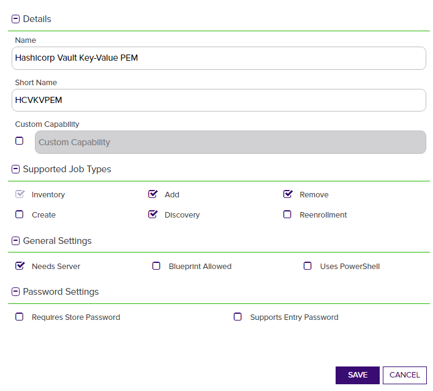

- Click the "Advanced" tab and update the following:
  - **Supports Custom Alias** - "Required"
  - **Private Key Handling** - "Optional"

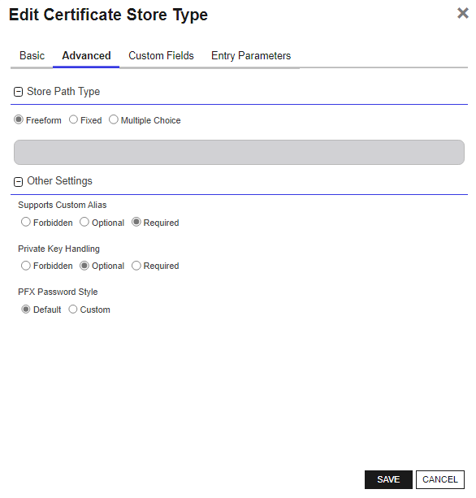

- Click the "Custom Fields" tab to add the following custom fields:
  - **MountPoint** - Type: *string*
  - **IncludeCertChain** - Type: *bool* (If true, the available intermediate certificates will also be written to Vault during enrollment)
  - **PrivateKeyPath** - Type: *string* (The path to the secret containing the PEM-encoded private key. Optional — omit for certificate-only / CA trust chain stores with no private key)


- Click **Save** to save the new Store Type.

##### Create a Certificate Store

- Navigate to **Locations** > **Certificate Stores** from the main menu
- Click **ADD** to open the new Certificate Store Dialog

Create a new Certificate Store that resembles the one below:


- **Client Machine** - Enter an identifier for the client machine.  This could be the Orchestrator host name, or anything else useful.  This value is not used by the extension.
- **Store Path** - This is the path to the secret containing the certificate.
  - example: `kv-v2\kf-secrets\mycert_pem`
- **Mount Point** - This is the mount point name for the instance of the Key Value secrets engine.
  - If left blank, will default to "kv-v2".
  - If your organization utilizes Vault enterprise namespaces, you should include the namespace here.
- **Private Key Path** - The path to the secret (and optional JSON property) where the PEM-encoded private key is located. Leave blank for certificate-only stores with no private key.

##### Set the server username and password

- **SERVER USERNAME** should be the full URL to the instance of Vault that will be accessible by the orchestrator. (example: `http://127.0.0.1:8200`)
- **SERVER PASSWORD** should be the Vault token that will be used for authenticating.

At this point, the certificate store should be created and ready to perform inventory on your certificate stored in the Key-Value secrets engine.

</details>

<details><summary>Hashicorp Vault Key-Value JKS (HCVKVJKS)</summary>

### Store Creation

#### Manually with the Command UI

<details><summary>Click to expand details</summary>

1. **Navigate to the _Certificate Stores_ page in Keyfactor Command.**

    Log into Keyfactor Command, toggle the _Locations_ dropdown, and click _Certificate Stores_.

2. **Add a Certificate Store.**

    Click the Add button to add a new Certificate Store. Use the table below to populate the **Attributes** in the **Add** form.

   | Attribute | Description |
   | --------- | ----------- |
   | Category | Select "Hashicorp Vault Key-Value JKS" or the customized certificate store name from the previous step. |
   | Container | Optional container to associate certificate store with. |
   | Client Machine | This can be any value to help uniquely identify the store.  It is not used by this integration. |
   | Store Path | This is the path to the secret containing the store. |
   | Store Password | Vault token that will be used for authenticating |
   | Orchestrator | Select an approved orchestrator capable of managing `HCVKVJKS` certificates. Specifically, one with the `HCVKVJKS` capability. |
   | ServerUsername | The base URI (and port) to the instance of Hashicorp Vault ex: https://localhost:8200 |
   | ServerPassword | Vault token that will be used by the Orchestrator integration for authenticating and performing operations in the Vault instance. Required unless 'Use OAuth 2.0 (Client Credentials)' is enabled. |
   | UseOAuth | Enables OAuth 2.0 Client Credentials authentication: the orchestrator obtains a JWT from the configured IdP (e.g. PingFederate, Microsoft Entra ID) and exchanges it for a short-lived Vault token via Vault's JWT auth method, instead of using a static 'Server Password' Vault token. |
   | ClientId | The OAuth 2.0 Client ID registered with your IdP. Only used when 'Use OAuth 2.0 (Client Credentials)' is enabled. |
   | ClientSecret | The OAuth 2.0 Client Secret for the above Client ID. Only used when 'Use OAuth 2.0 (Client Credentials)' is enabled. |
   | OAuthUrl | The IdP's OAuth 2.0 token endpoint URL used to obtain a JWT via the Client Credentials grant. Only used when 'Use OAuth 2.0 (Client Credentials)' is enabled. |
   | Scope | Optional OAuth 2.0 scope to request from the IdP (e.g. Entra ID typically needs 'api://<app-id-uri>/.default'). Only used when 'Use OAuth 2.0 (Client Credentials)' is enabled. |
   | VaultRoleName | The name of the Vault role, configured under the JWT auth mount (e.g. 'auth/jwt/role/<name>'), to authenticate against using the JWT obtained from the IdP. Only used when 'Use OAuth 2.0 (Client Credentials)' is enabled. |
   | AuthMountPoint | The mount point of Vault's JWT auth method used to exchange the IdP-issued JWT for a Vault token. Only used when 'Use OAuth 2.0 (Client Credentials)' is enabled. |
   | IncludeCertChain | Should the certificate chain be included when performing an enrollment? |
   | MountPoint | The base mount point of the secrets engine.  If using Vault Namespaces, include the namespace; ie. <namespace>/<mount point> |
   | PassphrasePath | This is the path to the secret that contains the passphrase to the cert store file.  If empty or omitted, assume the secret is named 'passphrase' on the same level as the certificate store secret. |

</details>

#### Using kfutil CLI

<details><summary>Click to expand details</summary>

1. **Generate a CSV template for the HCVKVJKS certificate store**

    ```shell
    kfutil stores import generate-template --store-type-name HCVKVJKS --outpath HCVKVJKS.csv
    ```
2. **Populate the generated CSV file**

    Open the CSV file, and reference the table below to populate parameters for each **Attribute**.

   | Attribute | Description |
   | --------- | ----------- |
   | Category | Select "Hashicorp Vault Key-Value JKS" or the customized certificate store name from the previous step. |
   | Container | Optional container to associate certificate store with. |
   | Client Machine | This can be any value to help uniquely identify the store.  It is not used by this integration. |
   | Store Path | This is the path to the secret containing the store. |
   | Store Password | Vault token that will be used for authenticating |
   | Orchestrator | Select an approved orchestrator capable of managing `HCVKVJKS` certificates. Specifically, one with the `HCVKVJKS` capability. |
   | Properties.ServerUsername | The base URI (and port) to the instance of Hashicorp Vault ex: https://localhost:8200 |
   | Properties.ServerPassword | Vault token that will be used by the Orchestrator integration for authenticating and performing operations in the Vault instance. Required unless 'Use OAuth 2.0 (Client Credentials)' is enabled. |
   | Properties.UseOAuth | Enables OAuth 2.0 Client Credentials authentication: the orchestrator obtains a JWT from the configured IdP (e.g. PingFederate, Microsoft Entra ID) and exchanges it for a short-lived Vault token via Vault's JWT auth method, instead of using a static 'Server Password' Vault token. |
   | Properties.ClientId | The OAuth 2.0 Client ID registered with your IdP. Only used when 'Use OAuth 2.0 (Client Credentials)' is enabled. |
   | Properties.ClientSecret | The OAuth 2.0 Client Secret for the above Client ID. Only used when 'Use OAuth 2.0 (Client Credentials)' is enabled. |
   | Properties.OAuthUrl | The IdP's OAuth 2.0 token endpoint URL used to obtain a JWT via the Client Credentials grant. Only used when 'Use OAuth 2.0 (Client Credentials)' is enabled. |
   | Properties.Scope | Optional OAuth 2.0 scope to request from the IdP (e.g. Entra ID typically needs 'api://<app-id-uri>/.default'). Only used when 'Use OAuth 2.0 (Client Credentials)' is enabled. |
   | Properties.VaultRoleName | The name of the Vault role, configured under the JWT auth mount (e.g. 'auth/jwt/role/<name>'), to authenticate against using the JWT obtained from the IdP. Only used when 'Use OAuth 2.0 (Client Credentials)' is enabled. |
   | Properties.AuthMountPoint | The mount point of Vault's JWT auth method used to exchange the IdP-issued JWT for a Vault token. Only used when 'Use OAuth 2.0 (Client Credentials)' is enabled. |
   | Properties.IncludeCertChain | Should the certificate chain be included when performing an enrollment? |
   | Properties.MountPoint | The base mount point of the secrets engine.  If using Vault Namespaces, include the namespace; ie. <namespace>/<mount point> |
   | Properties.PassphrasePath | This is the path to the secret that contains the passphrase to the cert store file.  If empty or omitted, assume the secret is named 'passphrase' on the same level as the certificate store secret. |

3. **Import the CSV file to create the certificate stores**

    ```shell
    kfutil stores import csv --store-type-name HCVKVJKS --file HCVKVJKS.csv
    ```

</details>

#### PAM Provider Eligible Fields
<details><summary>Attributes eligible for retrieval by a PAM Provider on the Universal Orchestrator</summary>

If a PAM provider was installed _on the Universal Orchestrator_ in the [Installation](#Installation) section, the following parameters can be configured for retrieval _on the Universal Orchestrator_.

   | Attribute | Description |
   | --------- | ----------- |
   | ServerUsername | The base URI (and port) to the instance of Hashicorp Vault ex: https://localhost:8200 |
   | ServerPassword | Vault token that will be used by the Orchestrator integration for authenticating and performing operations in the Vault instance. Required unless 'Use OAuth 2.0 (Client Credentials)' is enabled. |
   | ClientId | The OAuth 2.0 Client ID registered with your IdP. Only used when 'Use OAuth 2.0 (Client Credentials)' is enabled. |
   | ClientSecret | The OAuth 2.0 Client Secret for the above Client ID. Only used when 'Use OAuth 2.0 (Client Credentials)' is enabled. |

Please refer to the **Universal Orchestrator (remote)** usage section ([PAM providers on the Keyfactor Integration Catalog](https://keyfactor.github.io/integrations-catalog/content/pam)) for your selected PAM provider for instructions on how to load attributes orchestrator-side.
> Any secret can be rendered by a PAM provider _installed on the Keyfactor Command server_. The above parameters are specific to attributes that can be fetched by an installed PAM provider running on the Universal Orchestrator server itself.

</details>

> The content in this section can be supplemented by the [official Command documentation](https://software.keyfactor.com/Core-OnPrem/Current/Content/ReferenceGuide/Certificate%20Stores.htm?Highlight=certificate%20store).

### Configuration in Keyfactor Command

#### Create the Store Type

Here are the steps for manually creating the store type in Keyfactor Command.

- Log into Keyfactor Command as Administrator or a user with permissions to add certificate store types.
- Click on the gear icon in the top right and then navigate to the "Certificate Store Types"
- Click "Add" and enter the following information:

- Set the following values in the "Basic" tab:
  - **Name:** "Hashicorp Vault Java Keystore" (or another preferred name)
  - **Short Name:** "HCVKVJKS"
  - **Supported Job Types** - "Inventory", "Add", "Remove", "Discovery"
  - **Needs Server** - should be checked (true).

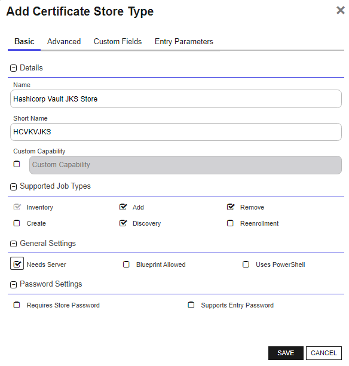

- Set the following values on the "Advanced" tab:
  - **Supports Custom Alias** - "Required"
  - **Private Key Handling** - "Optional"


- Click the "Custom Fields" tab to add the following custom fields:
  - **MountPoint** - Type: *string*  
  - **IncludeCertChain** - Type: *bool* (If true, the available intermediate certificates will also be written to Vault during enrollment)
  - **PassphrasePath** - Type: *string* (If the passphrase is in a location other than in a secret named 'passphrase' at the same level as the cert store, provide the path here) 

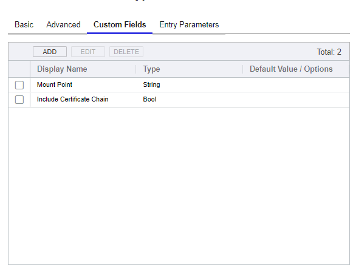

**Note**
The 3 highlighted fields above will be added automatically by the platform, you will not need to include them when creating the certificate store type.

- Click **Save** to save the new Store Type.

##### Create the Certificate Store

- Navigate to **Locations** > **Certificate Stores** from the main menu
- Click **ADD** to open the new Certificate Store Dialog

In Keyfactor Command create a new Certificate Store that resembles the one below:

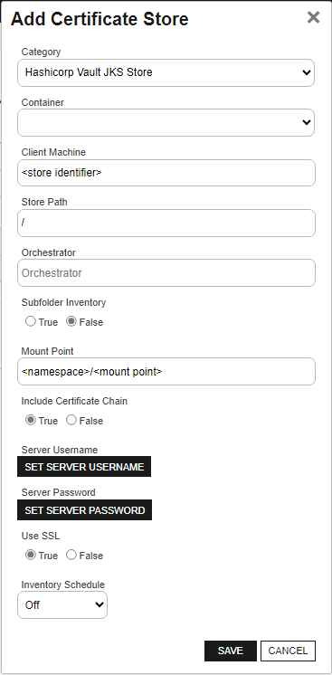

- **Client Machine** - Enter an identifier for the client machine.  This could be the Orchestrator host name, or anything else useful.  This value is not used by the extension.
- **Store Path** - This is the path after mount point where the certs will be stored.
  - example: `kv-v2\kf-secrets\mystore_jks` 
- **Mount Point** - This is the mount point name for the instance of the Key Value secrets engine.  
  - If left blank, will default to "kv-v2".
  - If your organization utilizes Vault enterprise namespaces, you should include the namespace here.
- **Passphrase Path** - The path to the secret (and optional JSON property) where the certificate store passphrase is located.

##### Set the server username and password

- **SERVER USERNAME** should be the full URL to the instance of Vault that will be accessible by the orchestrator. (example: `http://127.0.0.1:8200`)
- **SERVER PASSWORD** should be the Vault token that will be used for authenticating.

</details>

<details><summary>Hashicorp Vault Key-Value PKCS12 (HCVKVP12)</summary>

### Store Creation

#### Manually with the Command UI

<details><summary>Click to expand details</summary>

1. **Navigate to the _Certificate Stores_ page in Keyfactor Command.**

    Log into Keyfactor Command, toggle the _Locations_ dropdown, and click _Certificate Stores_.

2. **Add a Certificate Store.**

    Click the Add button to add a new Certificate Store. Use the table below to populate the **Attributes** in the **Add** form.

   | Attribute | Description |
   | --------- | ----------- |
   | Category | Select "Hashicorp Vault Key-Value PKCS12" or the customized certificate store name from the previous step. |
   | Container | Optional container to associate certificate store with. |
   | Client Machine | This can be any value to help uniquely identify the store.  It is not used by this integration. |
   | Store Path | This is the path to the secret containing the store. |
   | Store Password | Vault token that will be used for authenticating |
   | Orchestrator | Select an approved orchestrator capable of managing `HCVKVP12` certificates. Specifically, one with the `HCVKVP12` capability. |
   | ServerUsername | The base URI (and port) to the instance of Hashicorp Vault ex: https://localhost:8200 |
   | ServerPassword | Vault token that will be used by the Orchestrator integration for authenticating and performing operations in the Vault instance. Required unless 'Use OAuth 2.0 (Client Credentials)' is enabled. |
   | UseOAuth | Enables OAuth 2.0 Client Credentials authentication: the orchestrator obtains a JWT from the configured IdP (e.g. PingFederate, Microsoft Entra ID) and exchanges it for a short-lived Vault token via Vault's JWT auth method, instead of using a static 'Server Password' Vault token. |
   | ClientId | The OAuth 2.0 Client ID registered with your IdP. Only used when 'Use OAuth 2.0 (Client Credentials)' is enabled. |
   | ClientSecret | The OAuth 2.0 Client Secret for the above Client ID. Only used when 'Use OAuth 2.0 (Client Credentials)' is enabled. |
   | OAuthUrl | The IdP's OAuth 2.0 token endpoint URL used to obtain a JWT via the Client Credentials grant. Only used when 'Use OAuth 2.0 (Client Credentials)' is enabled. |
   | Scope | Optional OAuth 2.0 scope to request from the IdP (e.g. Entra ID typically needs 'api://<app-id-uri>/.default'). Only used when 'Use OAuth 2.0 (Client Credentials)' is enabled. |
   | VaultRoleName | The name of the Vault role, configured under the JWT auth mount (e.g. 'auth/jwt/role/<name>'), to authenticate against using the JWT obtained from the IdP. Only used when 'Use OAuth 2.0 (Client Credentials)' is enabled. |
   | AuthMountPoint | The mount point of Vault's JWT auth method used to exchange the IdP-issued JWT for a Vault token. Only used when 'Use OAuth 2.0 (Client Credentials)' is enabled. |
   | IncludeCertChain | Should the certificate chain be included when performing an enrollment? |
   | MountPoint | The base mount point of the secrets engine.  If using Vault Namespaces, include the namespace; ie. <namespace>/<mount point> |
   | PassphrasePath | This is the path to the secret that contains the passphrase to the cert store file.  If empty or omitted, assume the secret is named 'passphrase' on the same level as the certificate store secret. |

</details>

#### Using kfutil CLI

<details><summary>Click to expand details</summary>

1. **Generate a CSV template for the HCVKVP12 certificate store**

    ```shell
    kfutil stores import generate-template --store-type-name HCVKVP12 --outpath HCVKVP12.csv
    ```
2. **Populate the generated CSV file**

    Open the CSV file, and reference the table below to populate parameters for each **Attribute**.

   | Attribute | Description |
   | --------- | ----------- |
   | Category | Select "Hashicorp Vault Key-Value PKCS12" or the customized certificate store name from the previous step. |
   | Container | Optional container to associate certificate store with. |
   | Client Machine | This can be any value to help uniquely identify the store.  It is not used by this integration. |
   | Store Path | This is the path to the secret containing the store. |
   | Store Password | Vault token that will be used for authenticating |
   | Orchestrator | Select an approved orchestrator capable of managing `HCVKVP12` certificates. Specifically, one with the `HCVKVP12` capability. |
   | Properties.ServerUsername | The base URI (and port) to the instance of Hashicorp Vault ex: https://localhost:8200 |
   | Properties.ServerPassword | Vault token that will be used by the Orchestrator integration for authenticating and performing operations in the Vault instance. Required unless 'Use OAuth 2.0 (Client Credentials)' is enabled. |
   | Properties.UseOAuth | Enables OAuth 2.0 Client Credentials authentication: the orchestrator obtains a JWT from the configured IdP (e.g. PingFederate, Microsoft Entra ID) and exchanges it for a short-lived Vault token via Vault's JWT auth method, instead of using a static 'Server Password' Vault token. |
   | Properties.ClientId | The OAuth 2.0 Client ID registered with your IdP. Only used when 'Use OAuth 2.0 (Client Credentials)' is enabled. |
   | Properties.ClientSecret | The OAuth 2.0 Client Secret for the above Client ID. Only used when 'Use OAuth 2.0 (Client Credentials)' is enabled. |
   | Properties.OAuthUrl | The IdP's OAuth 2.0 token endpoint URL used to obtain a JWT via the Client Credentials grant. Only used when 'Use OAuth 2.0 (Client Credentials)' is enabled. |
   | Properties.Scope | Optional OAuth 2.0 scope to request from the IdP (e.g. Entra ID typically needs 'api://<app-id-uri>/.default'). Only used when 'Use OAuth 2.0 (Client Credentials)' is enabled. |
   | Properties.VaultRoleName | The name of the Vault role, configured under the JWT auth mount (e.g. 'auth/jwt/role/<name>'), to authenticate against using the JWT obtained from the IdP. Only used when 'Use OAuth 2.0 (Client Credentials)' is enabled. |
   | Properties.AuthMountPoint | The mount point of Vault's JWT auth method used to exchange the IdP-issued JWT for a Vault token. Only used when 'Use OAuth 2.0 (Client Credentials)' is enabled. |
   | Properties.IncludeCertChain | Should the certificate chain be included when performing an enrollment? |
   | Properties.MountPoint | The base mount point of the secrets engine.  If using Vault Namespaces, include the namespace; ie. <namespace>/<mount point> |
   | Properties.PassphrasePath | This is the path to the secret that contains the passphrase to the cert store file.  If empty or omitted, assume the secret is named 'passphrase' on the same level as the certificate store secret. |

3. **Import the CSV file to create the certificate stores**

    ```shell
    kfutil stores import csv --store-type-name HCVKVP12 --file HCVKVP12.csv
    ```

</details>

#### PAM Provider Eligible Fields
<details><summary>Attributes eligible for retrieval by a PAM Provider on the Universal Orchestrator</summary>

If a PAM provider was installed _on the Universal Orchestrator_ in the [Installation](#Installation) section, the following parameters can be configured for retrieval _on the Universal Orchestrator_.

   | Attribute | Description |
   | --------- | ----------- |
   | ServerUsername | The base URI (and port) to the instance of Hashicorp Vault ex: https://localhost:8200 |
   | ServerPassword | Vault token that will be used by the Orchestrator integration for authenticating and performing operations in the Vault instance. Required unless 'Use OAuth 2.0 (Client Credentials)' is enabled. |
   | ClientId | The OAuth 2.0 Client ID registered with your IdP. Only used when 'Use OAuth 2.0 (Client Credentials)' is enabled. |
   | ClientSecret | The OAuth 2.0 Client Secret for the above Client ID. Only used when 'Use OAuth 2.0 (Client Credentials)' is enabled. |

Please refer to the **Universal Orchestrator (remote)** usage section ([PAM providers on the Keyfactor Integration Catalog](https://keyfactor.github.io/integrations-catalog/content/pam)) for your selected PAM provider for instructions on how to load attributes orchestrator-side.
> Any secret can be rendered by a PAM provider _installed on the Keyfactor Command server_. The above parameters are specific to attributes that can be fetched by an installed PAM provider running on the Universal Orchestrator server itself.

</details>

> The content in this section can be supplemented by the [official Command documentation](https://software.keyfactor.com/Core-OnPrem/Current/Content/ReferenceGuide/Certificate%20Stores.htm?Highlight=certificate%20store).

### Configuration in Keyfactor Command

#### Create the Store Type

Here are the steps for manually creating the store type in Keyfactor Command.

- Log into Keyfactor Command as Administrator or a user with permissions to add certificate store types.
- Click on the gear icon in the top right and then navigate to the "Certificate Store Types"
- Click "Add" and enter the following information:

- Set the following values in the "Basic" tab:
  - **Name:** "Hashicorp PKCS12 Certificate Store" (or another preferred name)
  - **Short Name:** "HCVKVP12"
  - **Supported Job Types** - "Inventory", "Add", "Remove", "Discovery"
  - **Needs Server** - should be checked (true).

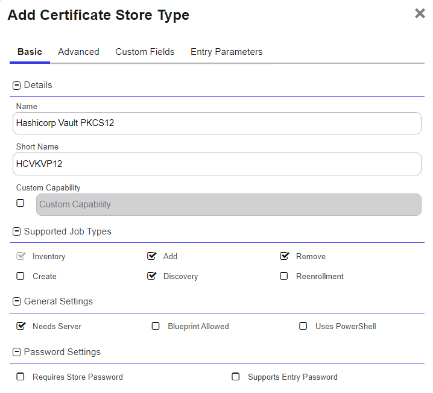

- Click the "Advanced" tab and update the following:
  - **Supports Custom Alias** - "Required"
  - **Private Key Handling** - "Optional"


- Click the "Custom Fields" tab to add the following custom fields:
  - **MountPoint** - Type: *string*
  - **IncludeCertChain** - Type: *bool* (If true, the available intermediate certificates will also be written to Vault during enrollment)
  - **PassphrasePath** - Type: *string* (If the passphrase is in a location other than in a secret named 'passphrase' at the same level as the cert store, provide the path here) 


**Note**
The 3 highlighted fields above will be added automatically by the platform, you will not need to include them when creating the certificate store type.

- Click **Save** to save the new Store Type.

##### Create a Certificate Store

- Navigate to **Locations** > **Certificate Stores** from the main menu
- Click **ADD** to open the new Certificate Store Dialog

Create a new Certificate Store that resembles the one below:

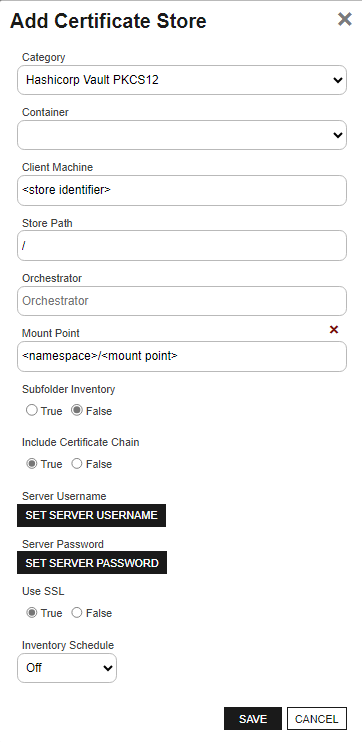

- **Client Machine** - Enter an identifier for the client machine.  This could be the Orchestrator host name, or anything else useful.  This value is not used by the extension.
- **Store Path** - This is the path after mount point where the certs will be stored.
  - example: `kv-v2\kf-secrets\mystore_p12`
- **Mount Point** - This is the mount point name for the instance of the Key Value secrets engine.  
  - If left blank, will default to "kv-v2".
  - If your organization utilizes Vault enterprise namespaces, you should include the namespace here.
 - **Passphrase Path** - The path to the secret (and optional JSON property) where the certificate store passphrase is located.

##### Set the server username and password

- **SERVER USERNAME** should be the full URL to the instance of Vault that will be accessible by the orchestrator. (example: `http://127.0.0.1:8200`)
- **SERVER PASSWORD** should be the Vault token that will be used for authenticating.

At this point, the certificate store should be created and ready to peform inventory on your certificates stored in PKCS12 certificate store files on the Key-Value secrets engine.

</details>

<details><summary>Hashicorp Vault Key-Value PFX (HCVKVPFX)</summary>

### Store Creation

#### Manually with the Command UI

<details><summary>Click to expand details</summary>

1. **Navigate to the _Certificate Stores_ page in Keyfactor Command.**

    Log into Keyfactor Command, toggle the _Locations_ dropdown, and click _Certificate Stores_.

2. **Add a Certificate Store.**

    Click the Add button to add a new Certificate Store. Use the table below to populate the **Attributes** in the **Add** form.

   | Attribute | Description |
   | --------- | ----------- |
   | Category | Select "Hashicorp Vault Key-Value PFX" or the customized certificate store name from the previous step. |
   | Container | Optional container to associate certificate store with. |
   | Client Machine | This can be any value to help uniquely identify the store.  It is not used by this integration. |
   | Store Path | This is the path to the secret containing the store. |
   | Store Password | Vault token that will be used for authenticating |
   | Orchestrator | Select an approved orchestrator capable of managing `HCVKVPFX` certificates. Specifically, one with the `HCVKVPFX` capability. |
   | ServerUsername | The base URI (and port) to the instance of Hashicorp Vault ex: https://localhost:8200 |
   | ServerPassword | Vault token that will be used by the Orchestrator integration for authenticating and performing operations in the Vault instance. Required unless 'Use OAuth 2.0 (Client Credentials)' is enabled. |
   | UseOAuth | Enables OAuth 2.0 Client Credentials authentication: the orchestrator obtains a JWT from the configured IdP (e.g. PingFederate, Microsoft Entra ID) and exchanges it for a short-lived Vault token via Vault's JWT auth method, instead of using a static 'Server Password' Vault token. |
   | ClientId | The OAuth 2.0 Client ID registered with your IdP. Only used when 'Use OAuth 2.0 (Client Credentials)' is enabled. |
   | ClientSecret | The OAuth 2.0 Client Secret for the above Client ID. Only used when 'Use OAuth 2.0 (Client Credentials)' is enabled. |
   | OAuthUrl | The IdP's OAuth 2.0 token endpoint URL used to obtain a JWT via the Client Credentials grant. Only used when 'Use OAuth 2.0 (Client Credentials)' is enabled. |
   | Scope | Optional OAuth 2.0 scope to request from the IdP (e.g. Entra ID typically needs 'api://<app-id-uri>/.default'). Only used when 'Use OAuth 2.0 (Client Credentials)' is enabled. |
   | VaultRoleName | The name of the Vault role, configured under the JWT auth mount (e.g. 'auth/jwt/role/<name>'), to authenticate against using the JWT obtained from the IdP. Only used when 'Use OAuth 2.0 (Client Credentials)' is enabled. |
   | AuthMountPoint | The mount point of Vault's JWT auth method used to exchange the IdP-issued JWT for a Vault token. Only used when 'Use OAuth 2.0 (Client Credentials)' is enabled. |
   | IncludeCertChain | Should the certificate chain be included when performing an enrollment? |
   | MountPoint | The base mount point of the secrets engine.  If using Vault Namespaces, include the namespace; ie. <namespace>/<mount point> |
   | PassphrasePath | This is the path to the secret that contains the passphrase to the cert store file.  If empty or omitted, assume the secret is named 'passphrase' on the same level as the certificate store secret. |

</details>

#### Using kfutil CLI

<details><summary>Click to expand details</summary>

1. **Generate a CSV template for the HCVKVPFX certificate store**

    ```shell
    kfutil stores import generate-template --store-type-name HCVKVPFX --outpath HCVKVPFX.csv
    ```
2. **Populate the generated CSV file**

    Open the CSV file, and reference the table below to populate parameters for each **Attribute**.

   | Attribute | Description |
   | --------- | ----------- |
   | Category | Select "Hashicorp Vault Key-Value PFX" or the customized certificate store name from the previous step. |
   | Container | Optional container to associate certificate store with. |
   | Client Machine | This can be any value to help uniquely identify the store.  It is not used by this integration. |
   | Store Path | This is the path to the secret containing the store. |
   | Store Password | Vault token that will be used for authenticating |
   | Orchestrator | Select an approved orchestrator capable of managing `HCVKVPFX` certificates. Specifically, one with the `HCVKVPFX` capability. |
   | Properties.ServerUsername | The base URI (and port) to the instance of Hashicorp Vault ex: https://localhost:8200 |
   | Properties.ServerPassword | Vault token that will be used by the Orchestrator integration for authenticating and performing operations in the Vault instance. Required unless 'Use OAuth 2.0 (Client Credentials)' is enabled. |
   | Properties.UseOAuth | Enables OAuth 2.0 Client Credentials authentication: the orchestrator obtains a JWT from the configured IdP (e.g. PingFederate, Microsoft Entra ID) and exchanges it for a short-lived Vault token via Vault's JWT auth method, instead of using a static 'Server Password' Vault token. |
   | Properties.ClientId | The OAuth 2.0 Client ID registered with your IdP. Only used when 'Use OAuth 2.0 (Client Credentials)' is enabled. |
   | Properties.ClientSecret | The OAuth 2.0 Client Secret for the above Client ID. Only used when 'Use OAuth 2.0 (Client Credentials)' is enabled. |
   | Properties.OAuthUrl | The IdP's OAuth 2.0 token endpoint URL used to obtain a JWT via the Client Credentials grant. Only used when 'Use OAuth 2.0 (Client Credentials)' is enabled. |
   | Properties.Scope | Optional OAuth 2.0 scope to request from the IdP (e.g. Entra ID typically needs 'api://<app-id-uri>/.default'). Only used when 'Use OAuth 2.0 (Client Credentials)' is enabled. |
   | Properties.VaultRoleName | The name of the Vault role, configured under the JWT auth mount (e.g. 'auth/jwt/role/<name>'), to authenticate against using the JWT obtained from the IdP. Only used when 'Use OAuth 2.0 (Client Credentials)' is enabled. |
   | Properties.AuthMountPoint | The mount point of Vault's JWT auth method used to exchange the IdP-issued JWT for a Vault token. Only used when 'Use OAuth 2.0 (Client Credentials)' is enabled. |
   | Properties.IncludeCertChain | Should the certificate chain be included when performing an enrollment? |
   | Properties.MountPoint | The base mount point of the secrets engine.  If using Vault Namespaces, include the namespace; ie. <namespace>/<mount point> |
   | Properties.PassphrasePath | This is the path to the secret that contains the passphrase to the cert store file.  If empty or omitted, assume the secret is named 'passphrase' on the same level as the certificate store secret. |

3. **Import the CSV file to create the certificate stores**

    ```shell
    kfutil stores import csv --store-type-name HCVKVPFX --file HCVKVPFX.csv
    ```

</details>

#### PAM Provider Eligible Fields
<details><summary>Attributes eligible for retrieval by a PAM Provider on the Universal Orchestrator</summary>

If a PAM provider was installed _on the Universal Orchestrator_ in the [Installation](#Installation) section, the following parameters can be configured for retrieval _on the Universal Orchestrator_.

   | Attribute | Description |
   | --------- | ----------- |
   | ServerUsername | The base URI (and port) to the instance of Hashicorp Vault ex: https://localhost:8200 |
   | ServerPassword | Vault token that will be used by the Orchestrator integration for authenticating and performing operations in the Vault instance. Required unless 'Use OAuth 2.0 (Client Credentials)' is enabled. |
   | ClientId | The OAuth 2.0 Client ID registered with your IdP. Only used when 'Use OAuth 2.0 (Client Credentials)' is enabled. |
   | ClientSecret | The OAuth 2.0 Client Secret for the above Client ID. Only used when 'Use OAuth 2.0 (Client Credentials)' is enabled. |

Please refer to the **Universal Orchestrator (remote)** usage section ([PAM providers on the Keyfactor Integration Catalog](https://keyfactor.github.io/integrations-catalog/content/pam)) for your selected PAM provider for instructions on how to load attributes orchestrator-side.
> Any secret can be rendered by a PAM provider _installed on the Keyfactor Command server_. The above parameters are specific to attributes that can be fetched by an installed PAM provider running on the Universal Orchestrator server itself.

</details>

> The content in this section can be supplemented by the [official Command documentation](https://software.keyfactor.com/Core-OnPrem/Current/Content/ReferenceGuide/Certificate%20Stores.htm?Highlight=certificate%20store).

### Configuration in Keyfactor Command

#### Create the Store Type

Here are the steps for manually creating the store type in Keyfactor Command.

- Log into Keyfactor Command as Administrator or a user with permissions to add certificate store types.
- Click on the gear icon in the top right and then navigate to the "Certificate Store Types"
- Click "Add" and enter the following information:

- Set the following values in the "Basic" tab:
  - **Name:** "Hashicorp PFX Certificate Store" (or another preferred name)
  - **Short Name:** "HCVKVPFX"
  - **Supported Job Types** - "Inventory", "Add", "Remove", "Discovery"
  - **Needs Server** - should be checked (true).


- Click the "Advanced" tab and update the following:
  - **Supports Custom Alias** - "Required"
  - **Private Key Handling** - "Optional"


- Click the "Custom Fields" tab to add the following custom fields:
  - **MountPoint** - Type: *string*
  - **IncludeCertChain** - Type: *bool* (If true, the available intermediate certificates will also be written to Vault during enrollment)
  - **PassphrasePath** - Type: *string* (If the passphrase is in a location other than in a secret named 'passphrase' at the same level as the cert store, provide the path here) 


**Note**
The 3 highlighted fields above will be added automatically by the platform, you will not need to include them when creating the certificate store type.

- Click **Save** to save the new Store Type.

##### Create a Certificate Store

- Navigate to **Locations** > **Certificate Stores** from the main menu
- Click **ADD** to open the new Certificate Store Dialog

Create a new Certificate Store that resembles the one below:

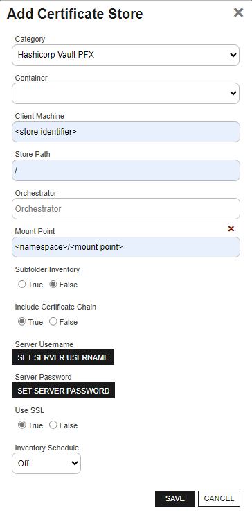

- **Client Machine** - Enter an identifier for the client machine.  This could be the Orchestrator host name, or anything else useful.  This value is not used by the extension.
- **Store Path** - This is the path to the secret containing the store.
  - example: `kv-v2\kf-secrets\mystore_pfx`
- **Mount Point** - This is the mount point name for the instance of the Key Value secrets engine.  
  - If left blank, will default to "kv-v2".
  - If your organization utilizes Vault enterprise namespaces, you should include the namespace here.
- **Passphrase Path** - The path to the secret (and optional JSON property) where the certificate store passphrase is located.

##### Set the server username and password

- **SERVER USERNAME** should be the full URL to the instance of Vault that will be accessible by the orchestrator. (example: `http://127.0.0.1:8200`)
- **SERVER PASSWORD** should be the Vault token that will be used for authenticating.

At this point, the certificate store should be created and ready to peform inventory on your certificates stored in PFX certificate store files on the Key-Value secrets engine.

</details>

## Discovering Certificate Stores with the Discovery Job

<details><summary>Hashicorp Vault Key-Value PEM</summary>
### Hashicorp Vault Key-Value PEM Discovery Job

When the discovery job is executed, it will scan the provided vault path, and any sub-paths contained within it.
The certificate store entry is returned from a discovery job when..

1. A secret entry is found with a key ending in the configured Discovery Suffix (defaults to `_pem`; see below).
1. The entry for the certificate contains the PEM formatted certificate file.

**Note**: Key/Value secrets that do not include a key ending in the Discovery Suffix will be ignored during discovery.

Set the following fields to configure a discovery job for PEM Certificate Stores:
- **Client Machine** - any string; it is unused by the Discovery job
- **SERVER USERNAME** - the full URL to the instance of Vault
- **SERVER PASSWORD** - the Vault Token to be used by the Orchestrator for authenticating into Vault
- **Directories to Search** - used to restrict the certificate store search to a sub-path within the Secrets Engine
- **Extensions** - The namespace (if used) and mount-point of the secrets engine to search.
- **Discovery Suffix** (custom job property) - Overrides the default secret-key-name suffix (`_pem`) Discovery uses to identify candidate PEM certificate secrets. Use this if your organization's secret-naming convention doesn't end in `_pem`.

> :warning: *If your mount point is different than the default "kv-v2" and/or enterprise namespaces are used, you should enter the mount point and namespace into the "Extensions" field in order for discovery to work.  Also, if you need to scope discovery to a sub-path rather than the root of the engine mount point, enter that in the "Directories to search" field.*


**Note**: The discovery job will return a collection of secret paths beneath the provided root path whose keys end in the configured Discovery Suffix.

</details>
<details><summary>Hashicorp Vault Key-Value JKS</summary>
### Hashicorp Vault Key-Value JKS Discovery Job

When the discovery job is executed, it will scan the provided vault path, and any sub-paths contained within it.  
The certificate store entry is returned from a discovery job when.. 

1. A secret entry is found that includes the `_jks` suffix.
1. There is an entry named `passphrase` that contains the password for the store on the same level.
1. The entry for the certificate contain the base64 encoded certificate file.

> :warning: 
> While any secret and passphrase location can be used, the discovery job can only discover certificate stores that follow the default convention.
> If you store your certificate stores and passphrases with another convention, the discovery job will not work in that case.


Set the following fields to configure a discovery job for JKS Certificate Stores:
- **Client Machine** - any string; it is unused by the Discovery job
- **SERVER USERNAME** - the full URL to the instance of Vault
- **SERVER PASSWORD** - the Vault Token to be used by the Orchestrator for authenticating into Vault
- **Directories to Search** - used to restrict the certificate store search to a sub-path within the Secrets Engine
- **Extensions** - The namespace (if used) and mount-point of the secrets engine to search.
- **Discovery Suffix** (custom job property) - Overrides the default secret-key-name suffix (`_jks`) Discovery uses to identify candidate JKS certificate secrets. Use this if your organization's secret-naming convention doesn't end in `_jks`.

> :warning: *If your mount point is different than the default "kv-v2" and/or enterprise namespaces are used, you should enter the mount point and namespace into the "Extensions" field in order for discovery to work.  Also, if you need to scope discovery to a sub-path rather than the root of the engine mount point, enter that in the "Directories to search" field.*


**Note**: The image shows an example configuration for a Discovery job with the HCVKVPEM store type, but the same approach is used across all of the store types.

</details>
<details><summary>Hashicorp Vault Key-Value PKCS12</summary>
### Hashicorp Vault Key-Value PKCS12 Discovery Job

When the discovery job is executed, it will scan the provided vault path, and any sub-paths contained within it.  
The certificate store entry is returned from a discovery job when.. 

1. A secret entry is found that includes the `_p12` suffix.
1. There is an entry named `passphrase` that contains the password for the store on the same level.
1. The entry for the certificate contain the base64 encoded certificate file.

> :warning: 
> While any secret and passphrase location can be used, the discovery job can only discover certificate stores that follow the default convention.
> If you store your certificate stores and passphrases with another convention, the discovery job will not work in that case.


Set the following fields to configure a discovery job for PKCS12 Certificate Stores:
- **Client Machine** - any string; it is unused by the Discovery job
- **SERVER USERNAME** - the full URL to the instance of Vault
- **SERVER PASSWORD** - the Vault Token to be used by the Orchestrator for authenticating into Vault
- **Directories to Search** - used to restrict the certificate store search to a sub-path within the Secrets Engine
- **Extensions** - The namespace (if used) and mount-point of the secrets engine to search.
- **Discovery Suffix** (custom job property) - Overrides the default secret-key-name suffix (`_p12`) Discovery uses to identify candidate PKCS12 certificate secrets. Use this if your organization's secret-naming convention doesn't end in `_p12`.

> :warning: *If your mount point is different than the default "kv-v2" and/or enterprise namespaces are used, you should enter the mount point and namespace into the "Extensions" field in order for discovery to work.  Also, if you need to scope discovery to a sub-path rather than the root of the engine mount point, enter that in the "Directories to search" field.*


**Note**: The image shows an example configuration for a Discovery job with the HCVKVPEM store type, but the same approach is used across all of the store types.

</details>
<details><summary>Hashicorp Vault Key-Value PFX</summary>
### Hashicorp Vault Key-Value PFX Discovery Job

When the discovery job is executed, it will scan the provided vault path, and any sub-paths contained within it.  
The certificate store entry is returned from a discovery job when.. 

1. A secret entry is found that includes the `_pfx` suffix.
1. There is an entry named `passphrase` that contains the password for the store on the same level.
1. The entry for the certificate contain the base64 encoded certificate file.

> :warning: 
> While any secret and passphrase location can be used, the discovery job can only discover certificate stores that follow the default convention.
> If you store your certificate stores and passphrases with another convention, the discovery job will not work in that case.

Set the following fields to configure a discovery job for PFX Certificate Stores:
- **Client Machine** - any string; it is unused by the Discovery job
- **SERVER USERNAME** - the full URL to the instance of Vault
- **SERVER PASSWORD** - the Vault Token to be used by the Orchestrator for authenticating into Vault
- **Directories to Search** - used to restrict the certificate store search to a sub-path within the Secrets Engine
- **Extensions** - The namespace (if used) and mount-point of the secrets engine to search.
- **Discovery Suffix** (custom job property) - Overrides the default secret-key-name suffix (`_pfx`) Discovery uses to identify candidate PFX certificate secrets. Use this if your organization's secret-naming convention doesn't end in `_pfx`.

> :warning: *If your mount point is different than the default "kv-v2" and/or enterprise namespaces are used, you should enter the mount point and namespace into the "Extensions" field in order for discovery to work.  Also, if you need to scope discovery to a sub-path rather than the root of the engine mount point, enter that in the "Directories to search" field.*


**Note**: The image shows an example configuration for a Discovery job with the HCVKVPEM store type, but the same approach is used across all of the store types.

</details>

## Use Cases

This integration supports the following Hashicorp Secrets Engines:
- **PKI**
- **Key-Value**
- [**Keyfactor**](https://github.com/Keyfactor/hashicorp-vault-secretsengine)

## The Key-Value Secrets Engine

For the Key-Value secrets engine, we have 4 store types that can be used.

- [*HCVKVJKS*](hcvkvjks.md) - For JKS certificate files, treats each file as it's own store.
- [*HCVKVPFX*](hcvkvpfx.md) - For PFX certificate files, treats each file as it's own store.
- [*HCVKVP12*](hcvkvp12.md) - For PKCS12 certificate files, treats each file as it's own store.
- [*HCVKVPEM*](hcvkvpem.md) - For PEM encoded certificates, treats each certificate secret as its own store, with an optional separate secret for the private key.

## The PKI and Keyfactor Secrets Engines

This integration supports performing an Inventory of certificates that exist either on the Keyfactor or PKI secrets engines.

- [*HCVPKI*](hcvpki.md) - For either the Vault PKI or Keyfactor Secrets engines

## Extension Configuration

### On the Orchestrator Agent Machine

1. Stop the Orchestrator service.
    - The service will be called "KeyfactorOrchestrator-Default" by default.
2. Navigate to the "extensions" sub-folder of your Orchestrator installation directory
    - example: `C:\Program Files\Keyfactor\Keyfactor Orchestrator\extensions`
3. Create a new folder called "HCV" (the name of the folder is not important)
4. Extract the contents of the release zip file into this folder.
5. Re-start the Orchestrator service.

### In the Keyfactor Platform

Follow the instructions for the specific store type to..
- Create the Store type definition in the Keyfactor Command Platform
- Create the certificate store definition in the Keyfactor Command Platform
- Discover Certificate stores

## OAuth 2.0 (Client Credentials) Authentication

As an alternative to the static `Server Password` Vault token, every store type supports non-interactive machine-to-machine authentication via OAuth 2.0 Client Credentials: the orchestrator obtains a JWT from a third-party IdP (e.g. PingFederate, Microsoft Entra ID) and exchanges it for a short-lived Vault token using Vault's [JWT auth method](https://developer.hashicorp.com/vault/docs/auth/jwt). Enable it by setting `Use OAuth 2.0 (Client Credentials)` to `true` and providing `Client ID`, `Client Secret`, `OAuth Token Endpoint`, `Vault Role Name`, and (if not using Vault's default `jwt/` mount) `JWT Auth Mount Point`. `Server Password` can then be left blank.

This depends on prerequisites the extension does not configure — set these up before configuring the certificate store:

1. **Vault must already trust the IdP.** A Vault administrator has to enable and configure the JWT auth method (`vault auth enable jwt`, then `vault write auth/jwt/config oidc_discovery_url=<IdP issuer> ...` or `jwt_validation_pubkeys=...`) and define a role (`vault write auth/jwt/role/<name> role_type=jwt bound_audiences=... user_claim=... policies=...`) that matches the audience/claims the IdP will issue. This extension only ever calls the resulting `auth/<mount>/login` endpoint — it never configures Vault's trust relationship with the IdP.
2. **The IdP's Client Credentials grant must return a real signed JWT, not an opaque access token.** Vault's JWT auth method can only validate a cryptographically signed JWT against the configured discovery/JWKS endpoint; an opaque token gives it nothing to verify, and the login will fail regardless of how correctly everything else is configured. Whether a given IdP issues a JWT for this grant depends on how its administrator configured the target API/audience — verify this with a manual token request against the IdP before troubleshooting anything on the Vault or Keyfactor side.
3. **Client ID/Secret are sent as OAuth 2.0 POST body parameters (`client_secret_post`), not HTTP Basic auth.** This matches Microsoft Entra ID's documented default and is accepted by PingFederate; if a specific IdP requires HTTP Basic auth instead, that is not currently supported and would need a code change.
4. **`Scope` is IdP-specific and often required.** For example, Microsoft Entra ID app-only access typically needs `scope=api://<app-id-uri>/.default` to receive a JWT for the right audience; other IdPs may not need it at all.

## Notes / Future Enhancements

### Versioning

The version number of a the Hashicorp Vault Orchestrator Extension can be verified by right clicking on the `Keyfactor.Extensions.Orchestrator.HCV.dll` file in the extensions installation folder, selecting Properties, and then clicking on the Details tab.

### Keyfactor Version Supported

This integration was built on the .NET Core 3.1 target framework and are compatible for use with the Keyfactor Universal Orchestrator and the latest version of the Keyfactor platform.

## Security Considerations

1. It is not necessary to use the Vault root token when creating a Certificate Store for HashicorpVault.  We recommend creating a token with policies that reflect the minimum path and permissions necessary to perform the intended operations.
1. The capabilities required to perform all operations on a cert store within vault are `["read", "list", "create", "update", "patch", "delete"]`
1. These capabilities should apply to the parent folder on file stores.
1. The token will also need `"list"` capability on the `<mount point>/metadata` path to perform basic operations.

- For the Key-Value stores we operate on a single version of the Key Value secret (no versioning capabilities through the Orchesterator Extension / Keyfactor).

## License

Apache License 2.0, see [LICENSE](LICENSE).

## Related Integrations

See all [Keyfactor Universal Orchestrator extensions](https://github.com/orgs/Keyfactor/repositories?q=orchestrator).
