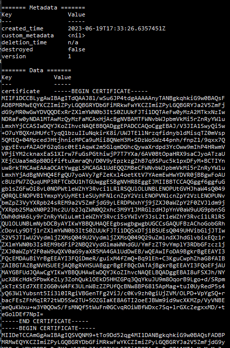

# Orchestrator Extension for Hashicorp Vault

The Hashicorp Vault Orchestrator extension allows you store certificates in Hashicorp Vault KeyValue secrets engine. 

#### Integration status: Pilot - Ready for use in test environments. Not for use in production.

## About the Keyfactor Universal Orchestrator Capability

This repository contains a Universal Orchestrator Extension which is a plugin to the Keyfactor Universal Orchestrator. Within the Keyfactor Platform, Orchestrators are used to manage “certificate stores” &mdash; collections of certificates and roots of trust that are found within and used by various applications.

The Universal Orchestrator is part of the Keyfactor software distribution and is available via the Keyfactor customer portal. For general instructions on installing Capabilities, see the “Keyfactor Command Orchestrator Installation and Configuration Guide” section of the Keyfactor documentation. For configuration details of this specific Capability, see below in this readme.

The Universal Orchestrator is the successor to the Windows Orchestrator. This Capability plugin only works with the Universal Orchestrator and does not work with the Windows Orchestrator.

---

## Platform Specific Notes

The Keyfactor Universal Orchestrator may be installed on either Windows or Linux based platforms. The certificate operations supported by a capability may vary based what platform the capability is installed on. The table below indicates what capabilities are supported based on which platform the encompassing Universal Orchestrator is running.
| Operation | Win | Linux |
|-----|-----|------|
|Supports Management Add|&check; |&check; |
|Supports Management Remove|&check; |&check; |
|Supports Create Store|&check; |&check; |
|Supports Discovery|&check; |&check; |
|Supports Renrollment|  |  |
|Supports Inventory|&check; |&check; |

---

<!-- add integration specific information below -->

This integration for the Keyfactor Universal Orchestrator has been tested against Hashicorp Vault 1.10.  It utilizes the *Key/Value* secrets engine to store certificates issues via Keyfactor Command.

## Use Cases

The Hashicorp Vault Orchestrator Integration implements the following capabilities:

1. Discovery - Discover all sub-paths containing certificate.
1. Inventory - Return all certificates stored in a path.
1. Management (Add) - Add a certificate to a defined certificate store.
1. Management (Remove) - Remove a certificate from a defined certificate store.

## Versioning

The version number of a the Hashicorp Vault Orchestrator Extension can be verified by right clicking on the `Keyfactor.Extensions.Orchestrator.HCV.dll` file in the extensions installation folder, selecting Properties, and then clicking on the Details tab.

## Keyfactor Version Supported

This integration was built on the .NET Core 3.1 target framework and are compatible for use with the Keyfactor Universal Orchestrator.

## Security Considerations

1. It is not necessary to use the Vault root token when creating a Certificate Store for HashicorpVault.  We recommend creating a token with policies that reflect the minimum permissions necessary to perform the intended operations.
1. The certificates are stored in 3 fields in the Key Value store.  

- `PUBLIC_KEY` - The certificate public key
- `PRIVATE_KEY` - The certificate private key
- `KEY_SECRET` - The certificate private key password
  
## Extension Configuration

### On the Orchestrator Agent Machine

1. Stop the Orchestrator service.

- The service will be called "KeyfactorOrchestrator-Default" by default.

1. Navigate to the "extensions" sub-folder of your Orchestrator installation directory

- example: `C:\Program Files\Keyfactor\Keyfactor Orchestrator\extensions`

1. Create a new folder called "HCV" (the name of the folder is not important)
1. Extract the contents of the release zip file into this folder.
1. Re-start the Orchestrator service.

### In the Keyfactor Platform

1. Add a new Certificate Store Type

- Log into Keyfactor as Administrator or a user with permissions to add certificate store types.
- Click on the gear icon in the top right and then navigate to the "Certificate Store Types"
- Click "Add" and enter the following information on the first tab:

- Set the following values in the "Basic" tab:
  - **Name** - "Hashicorp Vault" (or another preferred name)
  - **Short Name** - "HCV"
  - **Supported Job Types** - "Inventory", "Add", "Remove", "Discovery"
  - **Supports Custom Alias** - "Optional"
  - **Private Key Handling** - "Optional"

- Click the "Custom Fields" tab to add the following custom fields:
  - **MountPoint** - type: *string*
  - **VaultServerUrl** - type: *string*, *required*
  - **VaultToken** - type: *string*, *required*

- Click **Save** to save the new Store Type.

1. Add the Hashicorp Vault Certificate Store

- Navigate to **Locations** > **Certificate Stores** from the main menu
- Click **ADD** to open the new Certificate Store Dialog

  

In Keyfactor Command create a new Certificate Store Type similar to the one below:

  

- **Client Machine** - Enter the URL for the Vault host machine
- **Store Path** - This is the path after mount point where the certs will be stored.
  - example: `kv-v2\kf-secrets\certname` would use the path "\kf-secrets"
- **Mount Point** - This is the mount point name for the instance of the Key Value secrets engine.  
  - If left blank, will default to "kv-v2".
- **Vault Token** - This is the access token that will be used by the orchestrator for requests to Vault.
- **Vault Server Url** - the full url and port of the Vault server instance

## Testing

### PFX Enrollment into Vault

At this point you should be able to enroll a certificate and store it in Vault using the plugin.

1. Navigate to `Enrollment > PFX Enrollment` from the main menu.
1. Fill in some values for the new certificate, then select the "Install into certificate stores" radio button.

1. Select the certificate store we created

1. **Be sure to fill out the Alias!**  This will be the key used to reference the cert in the KeyValue secrets engine.
1. Click "Enroll"

### Vault CLI verification

1. Open a terminal window on the Vault host.

- Make sure the vault is unsealed first

1. Type `vault kv list kv/cert-store` (where "kv/cert-store" is <mount point>/<store path>)

- You should see the alias of the newly enrolled certificate

1. To view the details of the certificate, run the command:

- `vault kv get kv/cert-store/testcert.kftrain.lab` where `testcert.kftrain.lab` is the alias you provided.
- You should see the values output in the terminal window

## Notes / Future Enhancements

- Currently we only operate on a single version of the Key Value secret (no versioning capabilities through the Orchesterator Extension / Keyfactor).
- Creating a new certificate store is done implicitly by adding a **store path** value that doesn't currently exist.  

