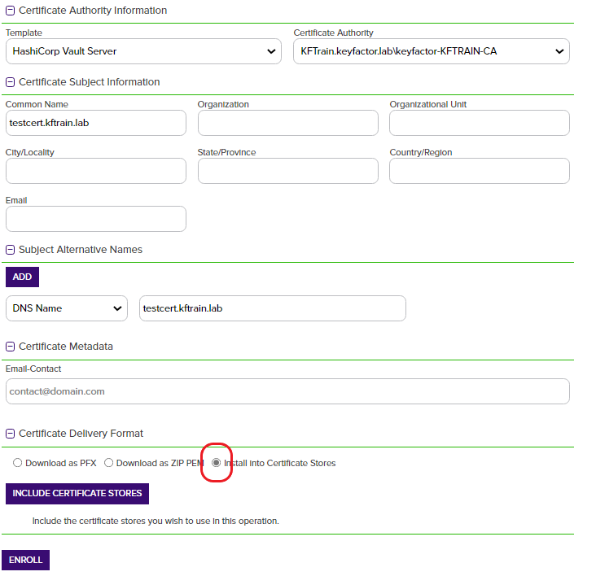
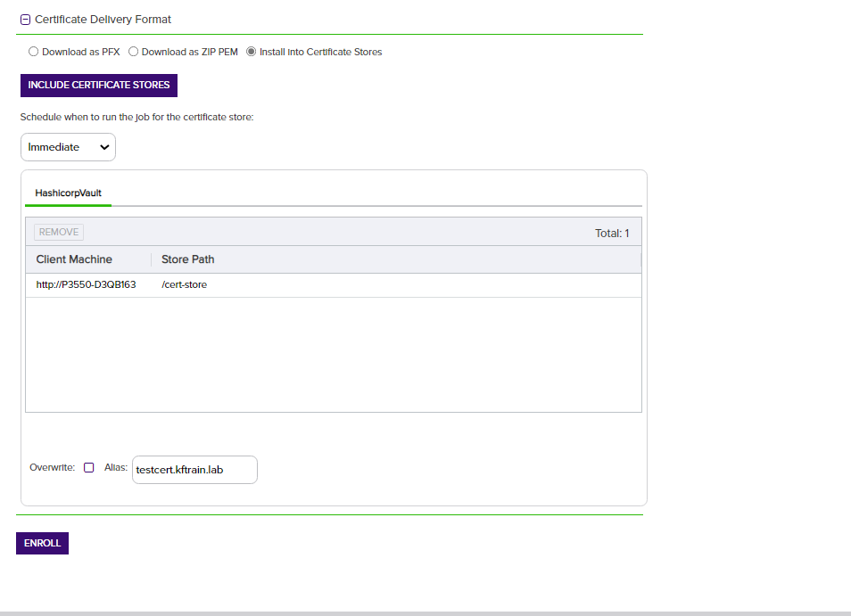
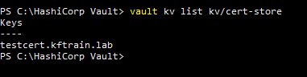
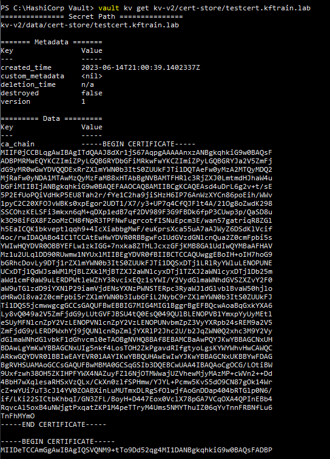

## Overview

This integration for the Keyfactor Universal Orchestrator has been tested against Hashicorp Vault 1.10+.  It utilizes the **Key-Value** secrets engine to store certificates issues via Keyfactor Command.

## Use Cases

This integration supports the following Hashicorp Secrets Engines:
- **PKI**
- **Key-Value**
- [**Keyfactor**](https://github.com/Keyfactor/hashicorp-vault-secretsengine)

## The Key-Value Secrets Engine

For the Key-Value secrets engine, we have 4 store types that can be used.  

- [*HCVKVJKS*](hcvkvjks.md) - For JKS certificate files, treats each file as it's own store.
- [*HCVKVPFX*](hcvkvpfx.md) - For PFX certificate files, treats each file as it's own store.
- [*HCVKVP12*](hcvkvp12.md) - For PKCS12 certificate files, treats each file as it's own store.
- [*HCVKVPEM*](hcvkvpem.md) - For PEM encoded certificates, treats each _path_ as it's own store.  Each certificate exists in a sub-path from the store path.

## The PKI and Keyfactor Secrets Engines

This integration supports performing an Inventory of certificates that exist either on the Keyfactor or PKI secrets engines.

- [*HCVPKI*](hcvpki.md) - For either the Vault PKI or Keyfactor Secrets engines

## Extension Configuration

### On the Orchestrator Agent Machine

1. Stop the Orchestrator service.
    - The service will be called "KeyfactorOrchestrator-Default" by default.
2. Navigate to the "extensions" sub-folder of your Orchestrator installation directory
    - example: `C:\Program Files\Keyfactor\Keyfactor Orchestrator\extensions`
3. Create a new folder called "HCV" (the name of the folder is not important)
4. Extract the contents of the release zip file into this folder.
5. Re-start the Orchestrator service.

### In the Keyfactor Platform

Follow the instructions for the specific store type to..
- Create the Store type definition in the Keyfactor Command Platform
- Create the certificate store definition in the Keyfactor Command Platform
- Discover Certificate stores

## Post Installation

### Enroll a certificate via the platform 
> Enrollment via the platform is supported by one of the Key-Value store types (HCVKV***).  Only inventory is supported for HCVPKI.

After following the steps to create the store type and certificate store in the Keyfactor Command platform you can enroll a certificate and store it in Vault using the plugin.

1. Navigate to `Enrollment > PFX Enrollment` from the main menu.
1. Fill in some values for the new certificate, then select the "Install into certificate stores" radio button.

1. Select the certificate store we created

1. **Be sure to fill out the Alias!**  This will be the key used to reference the cert in the KeyValue secrets engine.
1. Click "Enroll"

### Vault CLI verification

1. Open a terminal window on the Vault host.

- Make sure the vault is unsealed first

1. Type `vault kv list kv/cert-store` (where "kv/cert-store" is `<mount point>/<store path>`)

- You should see the alias of the newly enrolled certificate

1. To view the details of the certificate, run the command:

- `vault kv get kv/cert-store/testcert.kftrain.lab` where `testcert.kftrain.lab` is the alias you provided.
- You should see the values output in the terminal window

## Notes / Future Enhancements

### Versioning

The version number of a the Hashicorp Vault Orchestrator Extension can be verified by right clicking on the `Keyfactor.Extensions.Orchestrator.HCV.dll` file in the extensions installation folder, selecting Properties, and then clicking on the Details tab.

### Keyfactor Version Supported

This integration was built on the .NET Core 3.1 target framework and are compatible for use with the Keyfactor Universal Orchestrator and the latest version of the Keyfactor platform.

## Security Considerations

1. It is not necessary to use the Vault root token when creating a Certificate Store for HashicorpVault.  We recommend creating a token with policies that reflect the minimum path and permissions necessary to perform the intended operations.
1. The capabilities required to perform all operations on a cert store within vault are `["read", "list", "create", "update", "patch", "delete"]`
1. These capabilities should apply to the parent folder on file stores.
1. The token will also need `"list"` capability on the `<mount point>/metadata` path to perform basic operations.

- For the Key-Value stores we operate on a single version of the Key Value secret (no versioning capabilities through the Orchesterator Extension / Keyfactor).
