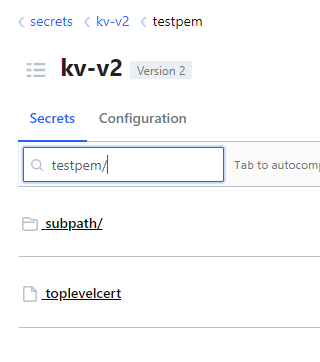
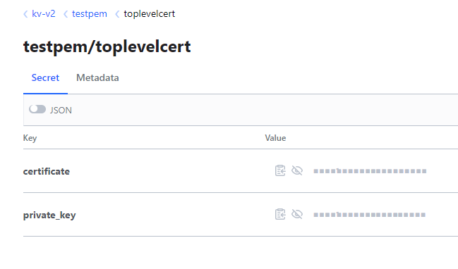
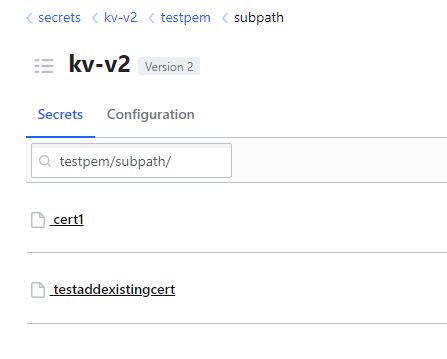
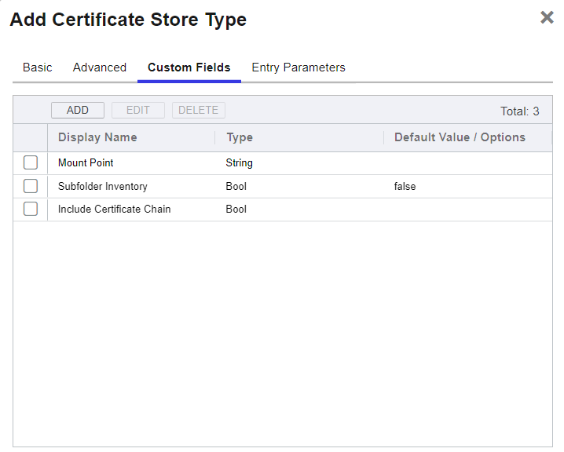
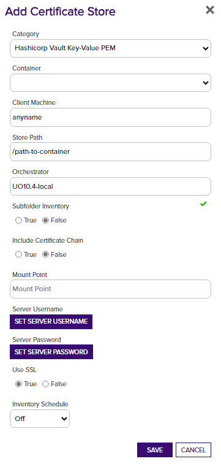

## Overview

The Hashicorp Vault Key-Value PEM Certificate Store manages certificates in the PEM format that are stored in the Hashicorp Vault Key-Value secrets engine.
This certificate store type differs from the other Key-Value store types (HCVKVJKS, HCVKVP12, HCVKVPFX) in that rather than a certificate store being defined as a single file,
these are defined as a single _path_ that may contain one or more separate PEM-formatted certificate secret entries.

### Important note on PEM (HCVKVPEM) Sub-Folder Inventory

> While HCVKVJKS, HCVKVPFX and HCVKVP12 point to a single file store, the HCVKVPEM is structured differently.   Each certificate and private key in a PEM store is in a specific sub-folder under the defined store path.
Consequently you are able to define a single HCVKVPEM store as the root path, and have any number of sub-paths beneath it.  These sub-paths could be their own certificate store defined in the platform, or logical containers that don't require a seperate store be set up for each in the Command platform.

> Example: 

 

> In the "testpem" path above, there exist both a secret entry (toplevelcert), with a properly formatted and named certificate, and a subpath/ path.

> The subpath/ path contains two certificate entries.

> - If we define our HCVKVPEM store in the platform to have the path "testpem/", and set "Sub-folder Inventory" to "False", then the inventory job should return the single "toplevelcert" entry.
> - If we define the store with "Sub-Folder Inventory" set to "True", then the inventory job should return 3 entries: "toplevelcert", "cert1", and "testaddexistingcert".
> - If we define another store with the path "testpem/subpath/", then it's inventory will contain "cert1" and "testaddexistingcert".  

:warning: _Avoid having the same certificate appearing in multiple stores by setting Sub-Folder inventory to "False" on any HCVKVPEM certificate stores where the path is a parent to another HCVKVPEM store's path that is defined in the platform._

### Create the Store Type

Here are the steps for manually creating the store type in Keyfactor Command.

- Log into Keyfactor Command as Administrator or a user with permissions to add certificate store types.
- Click on the gear icon in the top right and then navigate to the "Certificate Store Types"
- Click "Add" and enter the following information:

- Set the following values in the "Basic" tab:
  - **Name:** "Hashicorp PFX Certificate Store" (or another preferred name)
  - **Short Name:** "HCVKVPEM"
  - **Supported Job Types** - "Inventory", "Add", "Remove", "Discovery"
  - **Needs Server** - should be checked (true).

- Click the "Advanced" tab and update the following:
  - **Supports Custom Alias** - "Required" 
  - **Private Key Handling** - "Optional"

- Click the "Custom Fields" tab to add the following custom fields:
  - **MountPoint** - Type: *string*
  - **SubfolderInventory** - Type: *bool*, Default Value: *false*
  - **IncludeCertChain** - Type: *bool* (If true, the available intermediate certificates will also be written to Vault during enrollment)

- Click **Save** to save the new Store Type.

#### Create a Certificate Store

- Navigate to **Locations** > **Certificate Stores** from the main menu
- Click **ADD** to open the new Certificate Store Dialog

Create a new Certificate Store that resembles the one below:

- **Client Machine** - Enter an identifier for the client machine.  This could be the Orchestrator host name, or anything else useful.  This value is not used by the extension.
- **Store Path** - This is the path after mount point where the certificates will be stored.
  - example: `kv-v2\kf-secrets\myPEMcerts\`
- **Mount Point** - This is the mount point name for the instance of the Key Value secrets engine.  
  - If left blank, will default to "kv-v2".
  - If your organization utilizes Vault enterprise namespaces, you should include the namespace here.
- **Subfolder Inventory** - Set to 'True' if all of the certificates . The default, 'False' will inventory secrets stored at the root of the "Store Path", but will not look at secrets in subfolders. **Note** that there is a limit on the number of certificates that can be in a certificate store. In certain environments enabling Subfolder Inventory may exceed this limit and cause inventory job failure. Inventory job results are currently submitted to the Command platform as a single HTTP POST. There is not a specific limit on the number of certificates in a store, rather the limit is based on the size of the actual certificates and the HTTP POST size limit configured on the Command web server.

#### Set the server username and password

- **SERVER USERNAME** should be the full URL to the instance of Vault that will be accessible by the orchestrator. (example: `http://127.0.0.1:8200`)
- **SERVER PASSWORD** should be the Vault token that will be used for authenticating.

At this point, the certificate store should be created and ready to peform inventory on your certificates stored in PFX certificate store files on the Key-Value secrets engine.

## Discovery Job Configuration

When the discovery job is executed, it will scan the provided vault path, and any sub-paths contained within it.  
The certificate store entry is returned from a discovery job when.. 

1. A secret entry is found that includes the `certificate` suffix.
1. The entry for the certificate contain the base64 encoded PEM formatted certificate file.

**Note**: Key/Value secrets that do not include the expected keys or names do not end with "certificate" will be ignored during inventory scans.

Set the following fields to configure a discovery job for PFX Certificate Stores:
- **Client Machine** - any string; it is unused by the Discovery job
- **SERVER USERNAME** - the full URL to the instance of Vault
- **SERVER PASSWORD** - the Vault Token to be used by the Orchestrator for authenticating into Vault
- **Directories to Search** - used to restrict the certificate store search to a sub-path within the Secrets Engine
- **Extensions** - The namespace (if used) and mount-point of the secrets engine to search.

> :warning: *If your mount point is different than the default "kv-v2" and/or enterprise namespaces are used, you should enter the mount point and namespace into the "Extensions" field in order for discovery to work.  Also, if you need to scope discovery to a sub-path rather than the root of the engine mount point, enter that in the "Directories to search" field.*

**Note**: The discovery job will return a collection of any paths beneath the provided root path that contains valid PEM-formatted certificates with the secret name ending in "certificate".