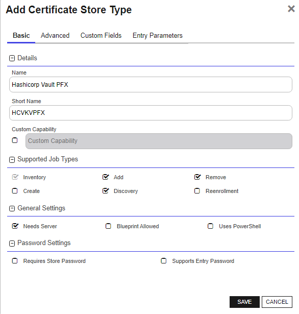
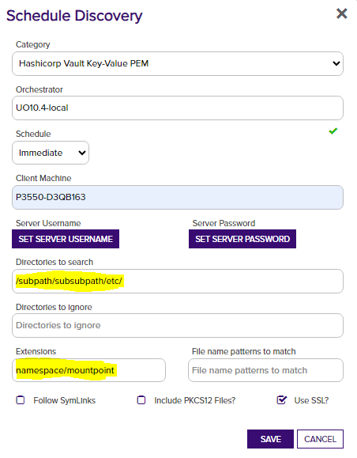

## Overview

The Hashicorp Vault Key-Value PFX Certificate Store manages certificates in the PFX format that are stored in the Hashicorp Vault Key-Value secrets engine.
Each PFX file stored as a secret in the Key-Value secrets engine is treated as its own certificate store.  This file should be a valid PFX certificate store, and contain a collection of one or more certificates.
The inventory job will catalog the certificates contained within the store.  Add/Remove operations will add and remove certificates 

## Requirements

### Secret naming

In ordered to be managed by this orchestrator extension, a certificate store is comprised of two secret entries:
- The certificate with the naming convention `<certificate name>_pfx`
- A secret containing the store passphrase located on the same level.  This should be named `passphrase`

This is the convention followed by the certificate store if the full path to the secret is not provided, and no passphrase path is provided.

**As of version 3.2+ of this integration, any secret name can be used, and the passphrase path can be anywhere within an accessable area of the KeyValue secrets engine.**

Additionally, we can read the certificate store and/or passphrase secret from a JSON secret that contains the value on a specific property.
The way to indicate the property name that should be used to retreive the value of the certificate store or passphrase, add a "?" at the end of the path, followed by the property name.

**examples:** 

StorePath = `kv-v2/mycerts/myjkscertstore?certData`
> This path indicates that the secret containing the certificate store data is named "myjkscertstore" and is a JSON secret with the `certData` property containing the Base64 encoded certificate store.
>

StorePath = `kv-v2/mycerts/myjkscertstore`
> This path indicates that the entire secret value is the base64 encoded certificate store

> Generally, the paths to the certificate store data and passphrase should be in the following format
> `<namespace>/<mount point>/<path-to-secret>?<json property name>`
> if namespaces are not used, that section can be omitted.

This convention applies to both the Store Path and Passphrase Path.

### Base64 encoding

Certificates should be stored in a base64 encoded format.  
One method to encode a binary certificate store is to use the following command in a windows powershell or linux/macOs terminal window:

`c:\> cat <cert store file path> | base64`

## Configuration in Keyfactor Command

### Create the Store Type

Here are the steps for manually creating the store type in Keyfactor Command.

- Log into Keyfactor Command as Administrator or a user with permissions to add certificate store types.
- Click on the gear icon in the top right and then navigate to the "Certificate Store Types"
- Click "Add" and enter the following information:

- Set the following values in the "Basic" tab:
  - **Name:** "Hashicorp PFX Certificate Store" (or another preferred name)
  - **Short Name:** "HCVKVPFX"
  - **Supported Job Types** - "Inventory", "Add", "Remove", "Discovery"
  - **Needs Server** - should be checked (true).

- Click the "Advanced" tab and update the following:
  - **Supports Custom Alias** - "Required"
  - **Private Key Handling** - "Optional"

- Click the "Custom Fields" tab to add the following custom fields:
  - **MountPoint** - Type: *string*
  - **IncludeCertChain** - Type: *bool* (If true, the available intermediate certificates will also be written to Vault during enrollment)
  - **PassphrasePath** - Type: *string* (If the passphrase is in a location other than in a secret named 'passphrase' at the same level as the cert store, provide the path here) 

**Note**
The 3 highlighted fields above will be added automatically by the platform, you will not need to include them when creating the certificate store type.

- Click **Save** to save the new Store Type.

#### Create a Certificate Store

- Navigate to **Locations** > **Certificate Stores** from the main menu
- Click **ADD** to open the new Certificate Store Dialog

Create a new Certificate Store that resembles the one below:

- **Client Machine** - Enter an identifier for the client machine.  This could be the Orchestrator host name, or anything else useful.  This value is not used by the extension.
- **Store Path** - This is the path to the secret containing the store.
  - example: `kv-v2\kf-secrets\mystore_pfx`
- **Mount Point** - This is the mount point name for the instance of the Key Value secrets engine.  
  - If left blank, will default to "kv-v2".
  - If your organization utilizes Vault enterprise namespaces, you should include the namespace here.
- **Passphrase Path** - The path to the secret (and optional JSON property) where the certificate store passphrase is located.

#### Set the server username and password

- **SERVER USERNAME** should be the full URL to the instance of Vault that will be accessible by the orchestrator. (example: `http://127.0.0.1:8200`)
- **SERVER PASSWORD** should be the Vault token that will be used for authenticating.

At this point, the certificate store should be created and ready to peform inventory on your certificates stored in PFX certificate store files on the Key-Value secrets engine.

## Discovery Job Configuration

When the discovery job is executed, it will scan the provided vault path, and any sub-paths contained within it.  
The certificate store entry is returned from a discovery job when.. 

1. A secret entry is found that includes the `_pfx` suffix.
1. There is an entry named `passphrase` that contains the password for the store on the same level.
1. The entry for the certificate contain the base64 encoded certificate file.

> :warning: 
> While any secret and passphrase location can be used, the discovery job can only discover certificate stores that follow the default convention.
> If you store your certificate stores and passphrases with another convention, the discovery job will not work in that case.

Set the following fields to configure a discovery job for PFX Certificate Stores:
- **Client Machine** - any string; it is unused by the Discovery job
- **SERVER USERNAME** - the full URL to the instance of Vault
- **SERVER PASSWORD** - the Vault Token to be used by the Orchestrator for authenticating into Vault
- **Directories to Search** - used to restrict the certificate store search to a sub-path within the Secrets Engine
- **Extensions** - The namespace (if used) and mount-point of the secrets engine to search.

> :warning: *If your mount point is different than the default "kv-v2" and/or enterprise namespaces are used, you should enter the mount point and namespace into the "Extensions" field in order for discovery to work.  Also, if you need to scope discovery to a sub-path rather than the root of the engine mount point, enter that in the "Directories to search" field.*

**Note**: The image shows an example configuration for a Discovery job with the HCVKVPEM store type, but the same approach is used across all of the store types.