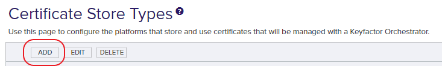
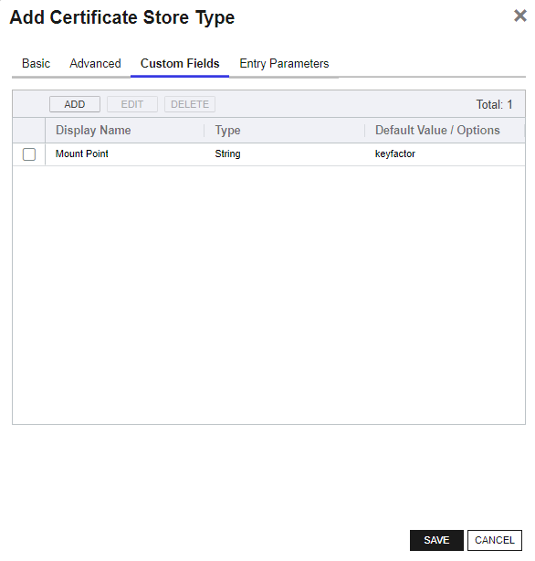

## Overview

The store type "HCVPKI" can perform inventory on certificates that exist in either the Hashicorp Vault PKI Secrets Engine, or the Keyfactor Secrets Engine.

- The [Hashicorp Vault PKI Secrets Engine](https://developer.hashicorp.com/vault/api-docs/secret/pki) is intended to allow for issuance and storage of certificates that rely on Certificate Authorities outside of Command; typically in Vault.
- The [Keyfactor Secrets Engine](https://github.com/Keyfactor/hashicorp-vault-secretsengine) is designed to support the same interface as the Hashicorp Vault PKI Secrets Engine to issue and enroll certificates using Certificate Authorities managed by Keyfactor Command.

## The Hashicorp PKI and Keyfactor Plugin secrets engines

Both the [Hashicorp PKI](https://developer.hashicorp.com/vault/api-docs/secret/pki) and [Keyfactor Secrets](https://github.com/Keyfactor/hashicorp-vault-secretsengine) Engine plugins are designed to allow managing certifications directly on the Hashicorp Vault instance.
The store type for the PKI and/or the Keyfactor secrets engine is the same; `HCVPKI`.

[View the repository on Github](https://github.com/Keyfactor/hashicorp-vault-secretsengine) for more information about the Hashicorp Vault Keyfactor Secrets Engine plugin.

[View the Hashicorp documentation](https://developer.hashicorp.com/vault/api-docs/secret/pki) for more information on the Hashicorp Vault PKI Secrets Engine

## Configuration in Keyfactor Command

#### Add the Store Type

- Add a new Certificate Store Type via the Command User Interface
  - Log into Keyfactor as Administrator or a user with permissions to add certificate store types.
  - Click on the gear icon in the top right and then navigate to the "Certificate Store Types"
  - Click "Add" and enter the following information on the first tab:

- **Name:** "Hashicorp Vault PKI" (or another preferred name)
- **Short Name:** "HCVPKI"
- **Supported Job Types:** "Inventory"
- **Needs Server** - should be checked (true).

- Set the following values on the "Advanced" tab:
  - **Store Path Type** - "Fixed"
  - **_Value_** - "/"
    - The cert store inventories all certificates in the PKI or Keyfactor secrets engine, so we set it to the root path
  - **Supports Custom Alias** - "Optional"
  - **Private Key Handling** - "Optional"

- Click the "Custom Fields" tab to add the following field:
  - **MountPoint** - type: *string*
  

- Click **Save** to save the new Store Type.

1. Add the Hashicorp Vault Certificate Store

- Navigate to **Locations** > **Certificate Stores** from the main menu
- Click **ADD** to open the new Certificate Store Dialog

#### Add the Certificate Store

In Keyfactor Command create a new Certificate Store similar to the one below:

- **Client Machine** - Enter an identifier for the client machine.  This could be the Orchestrator host name, or anything else useful.  This value is not used by the extension.
- **Store Path** - defaults to "/"  
- **Mount Point** - This is the mount point name for the instance of the PKI or Keyfactor secrets engine plugin.
  - If using the PKI plugin, the default in Hashicorp is "pki".  If using the Keyfactor plugin, the default is "keyfactor".
  - It is possible to have multiple instances of the Keyfactor plugin running simultaneously, so be sure this corresponds to the one you would like to manage.

#### Set the server username and password (values hidden)

- The **SERVER USERNAME** should be the full URL to the instance of Vault that will be accessible by the orchestrator. (example: `http://127.0.0.1:8200`)
- The **SERVER PASSWORD** should be the Vault token that will be used for authenticating.

At this point, the certificate store should be created and ready to peform inventory on your certificates stored via the Keyfactor or PKI secrets engine plugin for Hashicorp Vault.